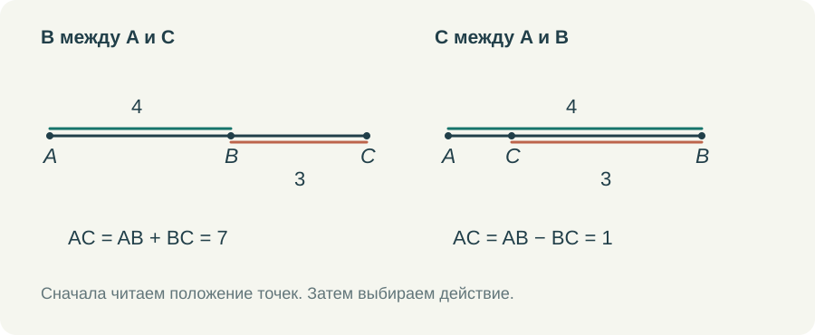

# С чего начинать геометрию в седьмом классе

Геометрия в седьмом классе начинается задолго до первой теоремы. Начинается она с того, понимает ли ребёнок, что изображено на рисунке, может ли назвать угол и знает ли, что именно ему сообщили в условии. Мне хочется удержать это простое обстоятельство, когда мы обсуждаем достоинства учебника и способы его дополнить.

Курс Л. С. Атанасяна я беру за основу своего курса для семиклассников. Меня устраивает возможность двигаться от первоначальных сведений к равенству треугольников и постепенно учиться доказательству. Но между прочитанным параграфом и самостоятельно решённой задачей нужно организовать работу. Особенно если ученик занимается дома, а спросить учителя прямо сейчас не может.

## Что стоит проверить прежде, чем идти дальше

Ученик мог изучать отрезки, углы, периметр и площадь несколько лет. Это ещё не сообщает мне, как он пользуется этими знаниями. Начать можно с коротких действий. Назвать отрезок по двум буквам. Найти вершину угла, записанного тремя буквами. Отметить точку между двумя другими точками. Объяснить, почему длины соседних частей можно сложить.

Пусть точка B находится между A и C, AB = 4 см, BC = 3 см. Получить AC = 7 см обычно нетрудно. Более содержательный вопрос: что изменится, если слова «B находится между A и C» убрать? Длины останутся теми же, но прежний вывод уже нельзя сделать без дополнительного условия. На прямой возможны разные расположения. Ученик впервые замечает, что в геометрии положение точек столь же существенно, как числа.

*Одни и те же длины AB и BC не определяют AC, пока мы не знаем порядок точек.*

Если ребёнок ошибся здесь, я не стала бы отправлять его перечитывать всю первую главу. Нужно вернуться к одной трудности: показать оба расположения, передвинуть точку, собрать целый отрезок из частей. Затем дать другой пример, уже без движения и без подсказки. Такой возврат занимает мало времени и имеет понятную цель.

С углами я поступаю сходным образом. В записи ∠ABC вершина — B. Из этой точки выходят стороны угла BA и BC. Полезно попросить ученика выбрать их на рисунке, а затем повернуть весь рисунок. Если ответ после поворота меняется, ребёнок ориентировался на положение картинки, а не на обозначение. Здесь нужны несколько коротких упражнений, а не ещё одно определение наизусть.

## Когда знакомое действие получает другой смысл

Линейка и транспортир остаются полезными. С их помощью можно построить рисунок, проверить собственную догадку, заметить неточность. Но в систематической геометрии появляется новое требование: объяснить результат из условия и уже известных свойств.

Допустим, два отрезка при измерении оказались по 5 см. Мы проверили два нарисованных отрезка с некоторой точностью. Если же точка M названа серединой AB, то AM = MB следует из определения середины. Можно сделать неаккуратный рисунок, и утверждение о геометрических отрезках всё равно останется верным. Эти два способа получить знание важно обсуждать рядом, на одном небольшом примере.

Мне не кажется разумным в первый день требовать от семиклассника взрослого понимания аксиоматического метода. Но уже можно спрашивать: «Откуда мы это знаем?» Из условия? Из определения? Только что измерили? Вывели из другого равенства? Когда эти вопросы возникают регулярно, слова «дано» и «доказать» перестают быть украшением тетради.

При этом я не хочу, чтобы ребёнок боялся своих наблюдений. Увидеть на рисунке возможное равенство — хороший шаг. Дальше надо найти основание. Если основания нет, можно проверить, не изменится ли картина в другом допустимом положении. Это полезнее, чем немедленно обрывать любое рассуждение словами «по рисунку нельзя».

## Как я соединяю учебник, видео и тренажёр

Для начала темы мне нужен один небольшой пример с ясным вопросом. В ролике показывается исходное условие, затем появляются обозначения и только после этого — решение. Выполненные шаги остаются на экране. Ученик должен иметь возможность вернуться глазами к строке AB + BC = AC, пока читает подстановку чисел ниже.

После просмотра я предлагаю сделать то же действие в тренажёре. Здесь ребёнок уже сам выбирает отрезки или стороны угла, вводит величину, проверяет ответ. Подсказка должна отвечать на конкретное затруднение. Если перепутана вершина угла, полезно выделить среднюю букву в его названии и попросить найти соответствующую точку. Готовое числовое решение в этот момент не поможет.

Затем нужен пример с другим расположением или другими обозначениями. Именно на нём становится видно, удалось ли понять действие. Повторить за роликом и самостоятельно узнать нужную связь — разные результаты. Оба имеют значение, но в отчёте учителю я хочу их различать.

Последняя часть работы — короткое решение на бумаге. Нарисовать схему, поставить буквы, записать одно равенство и пояснить его. Фотография такой работы часто сообщает больше, чем один правильный ответ: видны обозначения, способ записи, лишние линии, пропущенное условие. Электронная проверка и тетрадь здесь хорошо дополняют друг друга.

## Сколько времени оставлять на начало

Я не стала бы задавать всем одинаковое количество подготовительных занятий. Один ученик уверенно читает чертёж и быстро переходит к первым доказательствам. Другой вычисляет без ошибок, но путает луч и отрезок. Третьему мешают дроби, хотя геометрическую связь он понимает правильно. У этих детей разные ближайшие задачи.

Поэтому начало курса должно позволять свернуть к нужной теме и вернуться обратно. Возврат к единицам длины не означает, что семиклассник снова проходит весь пятый класс. Он разбирается с тем, что мешает сегодняшней задаче. В маршруте это должно быть видно: вот основной шаг, вот небольшая помощь, вот задача, к которой мы возвращаемся.

Для меня хороший итог первых занятий — когда ученик может сам объяснить небольшой чертёж. Назвать объекты, перечислить известное и сказать, чего пока не знает. С такой опорой уже можно открывать следующую тему.
