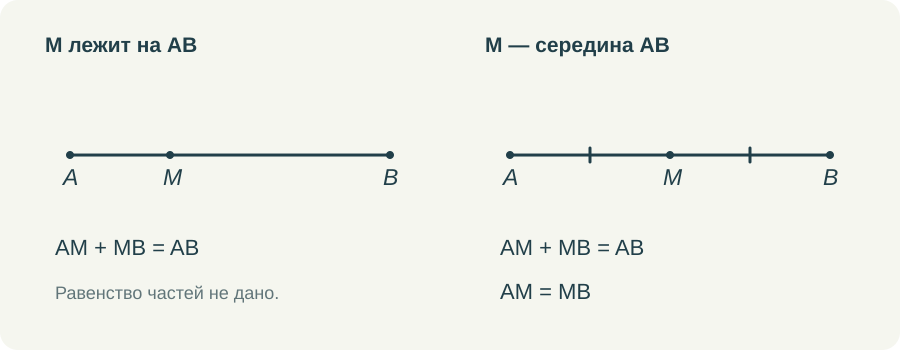

# Что дано, что определено, что ещё надо доказать

В геометрическом решении легко получить правильное число и при этом не понять, почему его разрешалось получить именно так. Особенно на первых темах, где рисунок кажется простым и почти всё хочется объявить очевидным. Поэтому я бы с самого начала учила разделять сведения, которые уже есть в задаче, и выводы, которые только предстоит сделать.

Речь не о том, чтобы каждую строку оформлять длинной ссылкой. Мне важно, чтобы ученик мог устно ответить на вопрос об основании. Если такой ответ есть, запись можно постепенно сокращать. Если его нет, аккуратно заполненные «Дано» и «Доказать» не спасают решение.

## Один отрезок и несколько разных утверждений

Возьмём AB и точку M. Если в условии сказано только, что M лежит на отрезке AB, известно равенство AM + MB = AB. Равенство AM = MB из этого не следует. На рисунке M может оказаться почти посередине, но это ещё ничего не добавляет к условию.

Теперь изменим условие: M — середина AB. Появляются сразу два сведения. Точка принадлежит отрезку и делит его на равные части. Если AB = 12 см, то AM = MB = 6 см. Здесь деление на два оправдано словом «середина», а не удачным расположением буквы на рисунке.

*Надпись «M ∈ AB» и слова «M — середина AB» сообщают разный объём сведений.*

Полезно дать обратную работу: убрать из текста слово «середина», оставить AM = MB и принадлежность M отрезку AB, затем попросить назвать положение M. Так определение начинает работать в обе стороны. Ребёнок не просто узнаёт знакомое слово, а связывает его с точным набором условий.

А если оставить только AM = MB? На плоскости точка M может находиться вне прямой AB. Например, быть вершиной равнобедренного треугольника с основанием AB. Поэтому принадлежность отрезку нельзя молча потерять. Подобные маленькие изменения условия хорошо показывают, зачем определения устроены именно так.

## Определение не является теоремой

Определяя биссектрису угла, мы договариваемся, какой луч так называется. Его положение внутри угла и равенство образованных углов входят в определение. Когда позднее выясняется, что биссектриса равнобедренного треугольника, проведённая к основанию, является также медианой и высотой, это уже новое утверждение. Его требуется доказать.

Для взрослого различие привычно. Ребёнок же может воспринять всё как один список свойств «красивой линии из вершины вниз». Поэтому я предпочитаю сначала показать обычный разносторонний треугольник, где три отрезка различны. Тогда совпадение в равнобедренном треугольнике действительно становится содержательным результатом.

Точно так же определение равнобедренного треугольника сообщает о двух равных сторонах. Равенство углов при основании в него не входит. На раннем этапе полезно даже временно закрыть подписи углов: мы знаем стороны и хотим получить утверждение об углах. Так яснее видна работа будущего доказательства.

## Что можно принять в начале курса

Доказательство не может ссылаться только на другие доказательства бесконечно. У курса есть исходные понятия и исходные свойства. Для школьника достаточно постепенно понимать, какими из них он уже вправе пользоваться. Не обязательно предварять каждую задачу полным перечнем аксиом.

Например, рассуждая об отрезке, мы используем возможность сложить длины его частей, если известен порядок точек. Работая с углом, пользуемся сложением величин частей, если луч действительно проходит внутри него. Важно проговорить условие применения свойства. Иначе из полезного правила получается привычка складывать любые два числа около рисунка.

Я не стала бы предъявлять учебнику претензию за то, что он не превращает первые страницы в университетский курс оснований геометрии. Это другой возраст и другая учебная задача. Но при объяснении можно сделать используемое основание заметным: назвать его в двух словах и показать, где именно оно понадобилось.

## Как научить видеть незаконный переход

Пусть на рисунке пересекаются две прямые. Один угол равен 65°. Ученик пишет, что вертикальный ему угол тоже равен 65°. Если теорема о вертикальных углах уже изучена, переход обоснован. Если мы как раз пытаемся её доказать, ссылаться на неё нельзя. Одинаковая запись может быть законной в одной задаче и преждевременной в другой.

Для доказательства можно обозначить общий смежный угол через x. Тогда каждый из двух интересующих нас углов равен 180° − x, откуда и получается их равенство. Здесь нет необходимости измерять оба угла или объявлять их равными по виду. Известное свойство смежных углов приводит к новому свойству вертикальных.

Такое рассуждение стоит разобрать медленно хотя бы один раз. Сначала выяснить, что разрешено использовать. Затем получить два выражения. После этого сравнить результаты. Готовую короткую запись ученик сможет составить позднее, когда поймёт, что именно в ней сокращено.

## Какие задания я хочу давать в тренажёре

Одного выбора правильного числа для этой темы мало. Нужны задания, где ученик выбирает основание: «по условию», «по определению», «из ранее доказанного свойства». Нужен и вариант «данных недостаточно». Он должен встречаться среди нормальных ответов, чтобы ребёнок не считал каждую картинку обещанием единственного числа.

Другой полезный формат — восстановить один пропущенный переход. Например, между словами «M — середина AB» и записью AM = 6 см поставить AM = MB и AM + MB = 12 см. Полное решение не скрывается за единственной кнопкой. Ученик собирает связь, которую затем сможет записать самостоятельно.

В видео я показываю происхождение каждой отметки. Засечки появляются после соответствующей фразы условия. Новое равенство добавляется после его обоснования. Это небольшая деталь анимации, но она помогает удержать порядок мысли: рисунок постепенно заполняется тем, что уже известно, а не подсказывает заранее всё решение.

Мне хочется, чтобы со временем вопрос «почему?» не воспринимался как недовольство учителя. Это обычный рабочий вопрос геометрии. На него не всегда нужно отвечать длинно, но отвечать по существу нужно с самого начала.
