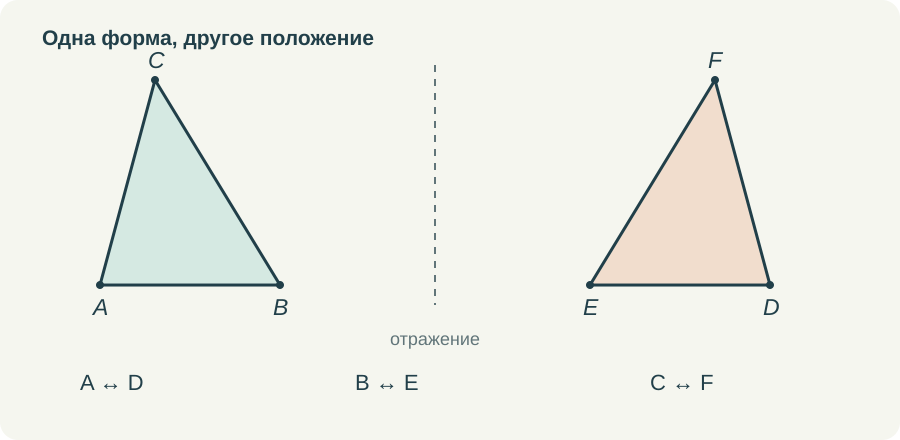
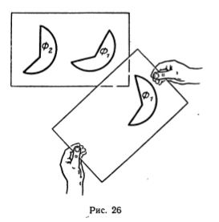
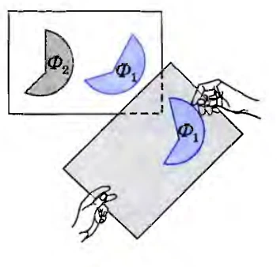
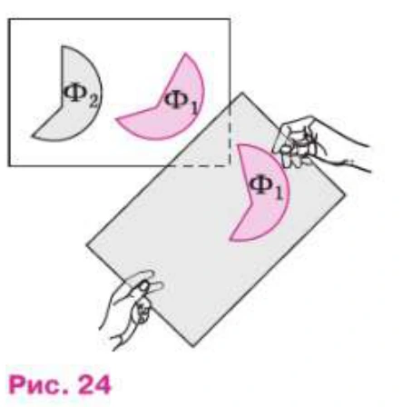

# Наложение: что именно мы разрешаем делать с фигурой

Слово «наложим» в начале геометрии звучит очень естественно. Можно вырезать два треугольника, приложить один к другому и посмотреть, совпадут ли они. Можно перевести рисунок на кальку. Ребёнку понятно действие, а учитель получает удобный способ объяснить равенство фигур.

Затруднение возникает чуть позже, когда это же действие участвует в доказательстве. Теперь речь идёт уже не о двух вырезанных деталях, а о любых треугольниках, удовлетворяющих условию. Мне кажется полезным задержаться на этом переходе. Наглядный способ объяснения от этого только выигрывает: становится яснее, что именно он показывает.

## Бумажную модель можно испортить

Если бумагу растянуть, надрезать или согнуть в нескольких местах, совпадения можно добиться совсем не тем способом, который имеет в виду геометрия. Поэтому первое правило я формулирую просто: фигуру разрешается переместить, повернуть, перевернуть, но нельзя деформировать. Расстояния между её точками сохраняются.

При переворачивании плоской бумажной модели меняется её ориентация. В геометрическом описании этому соответствует отражение. Если разрешить только перемещение и поворот в плоскости, зеркальные расположения не всегда совместятся. На первом знакомстве необязательно вводить всю теорию движений, но в анимации нельзя делать вид, что любое совмещение достигается одним поворотом.

*Узнавать соответствующие вершины полезно ещё до наложения. Форма и длины сохраняются, расположение на странице может меняться.*

Такая договорённость не является полным аксиоматическим изложением. Это доступное семикласснику объяснение того, какой смысл мы вкладываем в модель. Позднее у движения появится точное определение и будут изучены его свойства. Сейчас важно не приписывать наложению произвольных возможностей.

## Равенство ещё нужно установить

Когда доказывается первый признак, мы не имеем права заранее считать данные треугольники равными. Известны лишь две пары сторон и пара углов между ними. Смысл рассуждения в том, чтобы последовательно установить совпадение остальных элементов.

Сначала мы располагаем вершины соответствующих углов вместе и совмещаем их стороны. Затем равенство длин определяет положение концов отрезков на совпавших лучах. Если от одной точки по одному лучу отложены отрезки одинаковой длины, их вторые концы совпадают. После этого совпадают три вершины треугольников и их стороны.

Здесь стоит различать разрешение переместить фигуру и утверждение о её полном совпадении с другой. Переместить можно и неравные треугольники. Совпадут они не всегда. Поэтому само слово «наложение» не создаёт логического круга. Вопрос в том, достаточно ли ясно названы условия, при которых совмещение отдельных элементов приводит к совпадению всей фигуры.

Мне нравится, что эту мысль можно показать без длинных вычислений. Но я хочу оставить в объяснении время на вопрос: почему следующая вершина уже не может оказаться в другом месте? Именно он связывает движение картинки с доказательством.

## Зачем я сопоставляю издания

Когда речь идёт о старом и новом учебнике, недостаточно положить рядом обложки. Нужно открыть один и тот же сюжет, посмотреть формулировку и место рисунка, прочитать соседние строки. Год на титуле сам по себе не говорит, стало ли объяснение строже, проще или понятнее.

В этой серии фрагменты разных изданий вынесены с отдельными подписями и номерами страниц. Я ограничиваю сравнение тем, что видно в этих фрагментах. Если ход рассуждения сохраняется, это тоже результат сравнения. Нет необходимости непременно обнаруживать ухудшение или улучшение, чтобы оправдать разговор о двух книгах.

В трёх просмотренных изданиях сохраняется опыт с калькой: в пробном учебнике для 6 класса 1987 года это с. 12, рис. 26; в учебнике 7–9 классов 2010 года — с. 11, рис. 19; в издании 2023 года — с. 11, рис. 24. Изменились оформление и нумерация, но сам способ знакомства с равенством здесь близок.

<figure class="source-figure"><figcaption>Наложение с помощью кальки. 1987, с. 12, рис. 26. <a href="https://sheba.spb.ru/shkola/geometr-06-1987.htm" rel="noopener">Источник</a> · <a href="../sources.html#1987">Об издании</a></figcaption></figure><figure class="source-figure"><figcaption>Наложение с помощью кальки. 2010, с. 11, рис. 19. <a href="https://ege-ok.ru/wp-content/uploads/2014/01/59_2-Geometriya.-7-9-kl.-Uchebnik_Atanasyan-L.S.-i-dr_2010-384s.pdf" rel="noopener">Источник</a> · <a href="../sources.html#2010">Об издании</a></figcaption></figure><figure class="source-figure"><figcaption>Наложение с помощью кальки. 2023, с. 11, рис. 24. <a href="https://so.11klasov.net/15957-geometrija-7-9-klass-uchebnik-atanasjan-ls-butuzov-vf-kadomcev-sb-i-dr.html" rel="noopener">Источник</a> · <a href="../sources.html#2023">Об издании</a></figcaption></figure>

Рядом с этим постоянством есть и содержательные изменения. В статье о [равнобедренном треугольнике](../06-ravnobedrennyi-treugolnik/) я сопоставляю доказательство через медиану и третий признак в издании 1987 года с доказательством через биссектрису и первый признак в двух более поздних книгах. Здесь различается уже не цвет рисунка, а учебный путь к результату.

Для собственной работы я всё равно задаю один и тот же вопрос: что понадобится добавить в объяснение конкретному ученику? Одному достаточно рисунка и текста. Другому нужно передвинуть модель своими руками. Третьему полезно остановиться на единственности положения точки на луче. Это различия в поддержке ученика, которые не сводятся к выбору года издания.

## Как показать наложение в ролике

Я бы начала с двух неподвижных фигур и соответствия вершин. Буквы должны оставаться различимыми: если после движения подписи накладываются друг на друга, красивый эффект только мешает. Затем можно по очереди выделить две стороны и угол между ними, чтобы ученик видел, что именно известно до начала совмещения.

Движение не должно быть слишком быстрым. Сначала совпадают вершины угла, затем его стороны. После паузы отмечается совпадение концов равных отрезков. Только в конце появляется вывод о равенстве треугольников. Если всё произошло за секунду, ученик увидел результат, но не успел проследить основание каждого шага.

Полезна и вторая попытка с недостаточными данными. Например, закрепить две длины, а угол оставить свободным. Третья сторона будет изменяться. Ролик объяснит, зачем понадобилось условие об угле, а тренажёр даст возможность проверить это действие самому. Важно, чтобы свободное движение действительно сохраняло заявленные длины.

## Чего я не жду от анимации

Даже хорошо сделанная модель не доказывает утверждение обо всех треугольниках только тем, что на экране показан один удачный случай. Она помогает понять общий ход. После просмотра ученик должен суметь объяснить его словами и указать, где использована каждая пара равных элементов.

Поэтому последняя неподвижная сцена мне нужна не меньше движущейся. На ней остаются условие, соответствие вершин и несколько строк рассуждения. Можно остановить видео, свериться с учебником и самостоятельно восстановить пропущенный шаг. Такое завершение соединяет впечатление от движения с тем, что ребёнок затем запишет в тетради.

Я бы сохраняла наложение в начале курса. Оно даёт очень ясный образ равенства. Дополнить его нужно коротким разговором о допустимых действиях и основаниях совпадения. Тогда привычное «видно, что треугольники одинаковые» постепенно превращается в объяснение, которое другой человек может проверить.
