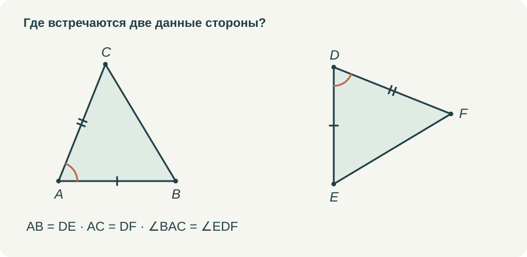
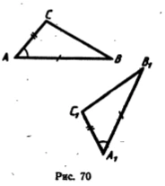
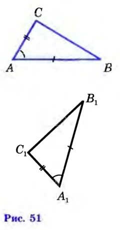
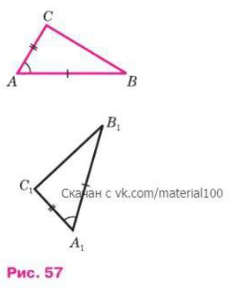

# Первый признак: почему угол должен быть между сторонами

В формулировке первого признака есть слова, которые ученик иногда произносит правильно, но почти не замечает: «угол между ними». Между тем именно здесь решается, можно ли применить теорему. Две стороны и какой-нибудь угол — совсем другое условие.

Я хочу разбирать первый признак так, чтобы эти слова были видны на чертеже. И чтобы после применения признака ученик понимал, зачем ему понадобилось равенство треугольников. Само по себе красивое заключение «треугольники равны» ещё не завершает задачу, если требовалось найти другую сторону или доказать равенство углов.

## Начать с соответствия

Пусть известны AB = DE, AC = DF и ∠BAC = ∠EDF. Вершина A соответствует D, B — E, C — F. Поэтому итоговая запись будет △ABC = △DEF. Порядок букв сообщает, какие элементы сопоставлены; переставить их произвольно нельзя.

Прежде чем спрашивать признак, полезно попросить ученика найти на каждом рисунке общий конец двух данных сторон. Это A и D. Именно при этих вершинах должны находиться равные углы. Такое действие проще длинной формулировки и одновременно проверяет её смысл.

*Три условия читаются вместе. Одинаковые засечки связывают стороны, дуги показывают именно углы между ними.*

Затем я бы повернула один из треугольников или поменяла положение его вершины на экране. Соответствие остаётся прежним. Если ребёнок теперь выбирает другую пару сторон, значит, первая попытка была основана на привычном расположении рисунка. Это хорошее место для помощи до того, как появится длинное доказательство.

## Тот же замысел в разных изданиях

В просмотренных учебниках 1987, 2010 и 2023 годов доказательство первого признака опирается на наложение: сначала совмещаются вершина и стороны угла, затем используются равные длины. На иллюстрациях меняются оформление и номера, но сохраняется важное для чтения доказательства соответствие вершин. Утверждать по этим страницам, что более новое издание отказалось от прежнего подхода, оснований нет.

<figure class="source-figure"><figcaption>Рисунок к первому признаку равенства треугольников. 1987, с. 33, рис. 70. <a href="https://sheba.spb.ru/shkola/geometr-06-1987.htm" rel="noopener">Источник</a> · <a href="../sources.html#1987">Об издании</a></figcaption></figure><figure class="source-figure"><figcaption>Рисунок к первому признаку равенства треугольников. 2010, с. 30, рис. 51. <a href="https://ege-ok.ru/wp-content/uploads/2014/01/59_2-Geometriya.-7-9-kl.-Uchebnik_Atanasyan-L.S.-i-dr_2010-384s.pdf" rel="noopener">Источник</a> · <a href="../sources.html#2010">Об издании</a></figcaption></figure><figure class="source-figure"><figcaption>Рисунок к первому признаку равенства треугольников. 2023, с. 31, рис. 57. <a href="https://so.11klasov.net/15957-geometrija-7-9-klass-uchebnik-atanasjan-ls-butuzov-vf-kadomcev-sb-i-dr.html" rel="noopener">Источник</a> · <a href="../sources.html#2023">Об издании</a></figcaption></figure>

В книге 1987 года речь идёт о пробном учебнике для 6 класса. Я сравниваю одинаковую теорему в конкретных книгах, а не приравниваю тогдашнюю программу шестого класса к современной.

## Что именно закрепляют три условия

Две заданные длины можно представить как две жёсткие планки с общим концом. Пока угол между ними свободен, положение третьей стороны меняется. Треугольники получаются разными. Когда фиксируется и угол между планками, положение их концов относительно друг друга определено с точностью до расположения всей фигуры.

Модель объясняет замысел теоремы. Доказательство требует ещё назвать, почему равные углы можно совместить, а концы равных отрезков на совпавших лучах займут одни и те же места. Этот вопрос разбирается в [статье о наложении](../03-nalozhenie-figur/). Мне важно не терять связь: движение показывает идею, последовательность оснований объясняет её.

В учебном ролике я оставляю три исходных условия рядом с рисунком. По мере доказательства каждое из них выделяется, но не исчезает. После совпадения всех вершин появляется заключение. Так видно, что мы не объявили равенство заранее, а использовали известные элементы по очереди.

## Почему нельзя взять другой угол

Возьмём AB = 6, BC = 4 и ∠BAC = 30°. Эти данные устроены иначе: угол при A не лежит между данными сторонами AB и BC. Вершина их соединения — B. На луче из A под углом 30° к AB можно получить два разных положения C на расстоянии 4 от B.

Чтобы увидеть это, достаточно провести окружность с центром B и радиусом 4. Она пересечёт луч в двух точках. В обоих треугольниках сохранятся AB, BC и угол при A, но длины AC будут разными. Это пример того, почему нельзя без дополнительных условий подменять первый признак словами «две стороны и угол».

Я не предлагаю семикласснику на этой стадии решать задачу с квадратным уравнением или вычислять обе длины AC. Здесь достаточно аккуратного построения и понимания двух возможных положений. Также не нужно делать противоположный неверный вывод, будто две стороны и угол не между ними никогда не позволяют установить равенство. У отдельных конфигураций есть дополнительные ограничения и специальные признаки. Сейчас мы проверяем условия именно первого признака.

## Общая сторона тоже считается

В следующих задачах два треугольника часто имеют общую сторону. На рисунке она одна, и ученик может искать ещё одну нарисованную палочку, чтобы получить пару. Полезно проговорить: сравниваются два треугольника, а отрезок входит в оба. Его длина равна самой себе.

Например, AB = AC, AD — биссектриса угла BAC, D лежит на BC. В треугольниках ABD и ACD имеются AB = AC, общая AD и равные углы BAD и DAC. Углы лежат между выбранными сторонами. Значит, можно применить первый признак. Из равенства треугольников получится BD = DC.

В этой задаче особенно важно сначала назвать цель: доказать равенство частей основания. Оно не известно заранее. Если поставить на BD и DC одинаковые засечки до рассуждения, рисунок незаметно сообщит ученику ответ как готовое условие. Отметки должны появиться после применения признака.

## Как построить отработку

Первые задания — выбор трёх нужных элементов на двух отдельных треугольниках. Затем предложила бы найти недостающее условие и отличить угол между сторонами от другого угла. Только после этого — конфигурацию с общей стороной. Здесь задача уже требует выделить два треугольника внутри одного рисунка.

Дальше можно дать короткое доказательство с пропуском: известны три равенства, а ученик выбирает порядок вершин и записывает следствие. После нескольких таких задач опора убирается. Ребёнок сам решает, какие треугольники сравнить и что получится из их равенства.

Ошибку в выборе угла я бы не сопровождала общим сообщением «неверно». Полезнее подсветить две выбранные стороны и спросить, в какой вершине они встречаются. Ошибку в порядке букв можно показать через соответствие вершин. Разные затруднения требуют разных подсказок, хотя формально неправильный ответ всего один.

И ещё я обязательно оставила бы задачу на бумаге. Тренажёр может помочь выбрать элементы, но в тетради ребёнку придётся самому обозначить их, назвать треугольники и закончить мысль. После такого перехода становится понятнее, усвоен ли признак или пока удаётся пользоваться только подсветкой.
