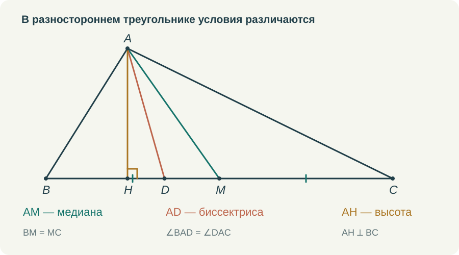
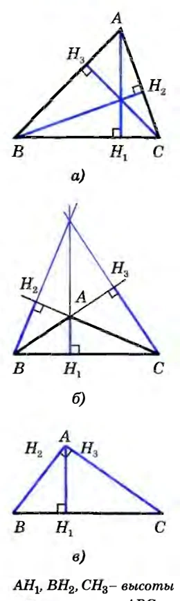
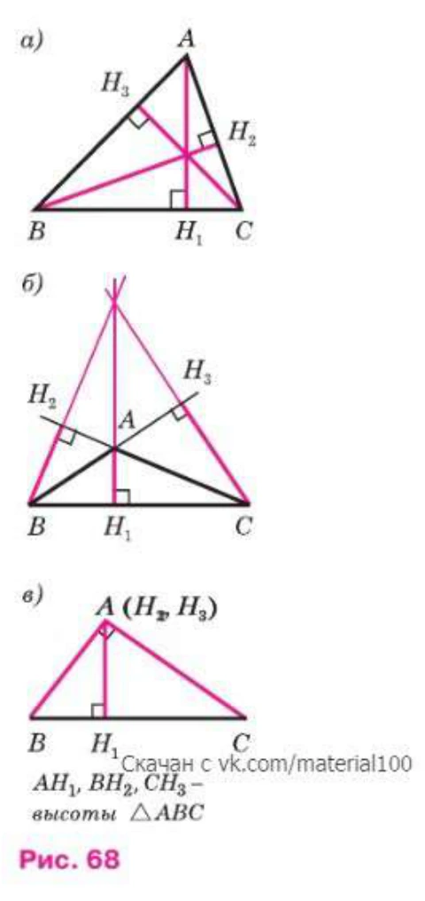
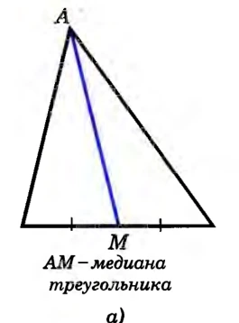
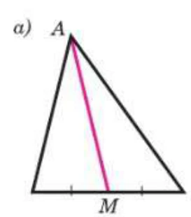

# Медиана, биссектриса и высота: три разных условия

Три отрезка, проведённые из вершины треугольника, легко спутать. Особенно если первый рисунок оказался равнобедренным треугольником с вершиной наверху и основанием внизу. Там все три отрезка могут совпасть, а ребёнок запомнит одну вертикальную линию и три названия.

Поэтому я бы начинала эту тему с разностороннего треугольника. На нём лучше видно, что медиану, биссектрису и высоту определяют разные условия. К равнобедренному треугольнику мы вернёмся позже, и совпадение отрезков уже будет результатом, который хочется объяснить.

## Медиана делит сторону

Если M — середина BC, отрезок AM является медианой треугольника ABC. Проверять здесь нужно принадлежность M стороне BC и равенство BM = MC. Про угол при A пока ничего не сказано. Медиана вполне может разделить его на неравные углы.

Мне кажется полезным прямо попросить ученика поставить только те отметки, которые следуют из определения. Для медианы это одинаковые засечки на BM и MC. Прямоугольный значок у M и равные дуги при A пока не нужны. Когда ребёнок сам выбирает отметки, становится видно, различает ли он определения.

Затем можно повернуть рисунок. Медиана не обязана идти сверху вниз и не обязана казаться центральной линией картинки. Она соединяет вершину с серединой противоположной стороны при любом расположении треугольника на странице. Рисунок, повёрнутый на четверть оборота, хорошо освобождает термин от случайного зрительного образа.

## Биссектриса делит угол

Для биссектрисы AD нужно равенство ∠BAD = ∠DAC, а точка D лежит на противоположной стороне. Здесь уже отмечаются углы. Равенство BD = DC в обычном треугольнике не следует из определения. Оно может оказаться верным при дополнительном условии, но сначала это условие придётся назвать и использовать.

Если угол A равен 68°, то каждая его часть равна 34°. Это удобная первая задача, однако останавливаться на делении числа пополам не стоит. Следующая задача может спрашивать, какой из трёх изображённых отрезков является биссектрисой. А потом — каких отметок не хватает, чтобы это утверждать.

Слово «пополам» вообще требует уточнения. Что именно делится пополам: длина стороны или величина угла? Пока ученик не различает эти объекты, определения остаются похожими фразами. Я предпочитаю каждый раз называть объект целиком: «делит сторону на два равных отрезка», «делит угол на два равных угла».

*Отрезки проведены из одной вершины. Их основания различны, потому что выполнены три разных условия.*

## Высота задаёт перпендикулярность

Высота AH перпендикулярна прямой, содержащей противоположную сторону. В остроугольном треугольнике основание высоты лежит на стороне. В тупоугольном для некоторых высот оно окажется на её продолжении. Поэтому в определении существенно слово «прямая», а не только нарисованный отрезок BC.

Если всё время показывать острый треугольник, у ученика легко возникает лишнее условие: высота обязательно находится внутри. Потом правильный рисунок с продолженной стороной кажется ошибкой. Я бы дала такой рисунок сразу после первых простых упражнений, пока определение ещё не успело превратиться в шаблон.

В прямоугольном треугольнике две высоты совпадают с катетами. Это ещё один полезный случай: дополнительную линию проводить не требуется. Отрезок уже соединяет вершину с противоположной стороной и перпендикулярен ей. Умение проверить определение важнее привычки непременно что-нибудь дорисовать.

Для высоты ставится прямоугольный значок. Он не сообщает о равенстве частей стороны и не сообщает о равенстве частей угла при вершине. Я бы прямо просила ученика перечислить, какие выводы делать пока нельзя. Такие вопросы предупреждают ошибки, которые позднее трудно заметить внутри длинного доказательства.

## Что уже показано в учебнике

В изданиях 2010 и 2023 годов рядом с определением высоты показаны остроугольный, тупоугольный и прямоугольный треугольники. Это стоит сохранить в собственном объяснении. Если на занятии остаётся только один удобный остроугольный рисунок, часть возможностей, уже предусмотренных учебником, мы теряем сами.

<figure class="source-figure tall"><figcaption>Высоты в остроугольном, тупоугольном и прямоугольном треугольниках. 2010, с. 34, рис. 62. <a href="https://ege-ok.ru/wp-content/uploads/2014/01/59_2-Geometriya.-7-9-kl.-Uchebnik_Atanasyan-L.S.-i-dr_2010-384s.pdf" rel="noopener">Источник</a> · <a href="../sources.html#2010">Об издании</a></figcaption></figure><figure class="source-figure tall"><figcaption>Высоты в трёх видах треугольников. 2023, с. 35, рис. 68. <a href="https://so.11klasov.net/15957-geometrija-7-9-klass-uchebnik-atanasjan-ls-butuzov-vf-kadomcev-sb-i-dr.html" rel="noopener">Источник</a> · <a href="../sources.html#2023">Об издании</a></figcaption></figure>

С медианой полезно обратить внимание на одинаковые отметки частей стороны. Именно они объясняют, почему проведённый отрезок является медианой. При повороте рисунка это основание не исчезает. Ни в старом, ни в новом оформлении вертикальное положение линии само по себе не входит в определение.

<figure class="source-figure"><figcaption>Медиана соединяет вершину с серединой противоположной стороны. Фрагмент рис. 59а, 2010, с. 33. <a href="https://ege-ok.ru/wp-content/uploads/2014/01/59_2-Geometriya.-7-9-kl.-Uchebnik_Atanasyan-L.S.-i-dr_2010-384s.pdf" rel="noopener">Источник</a> · <a href="../sources.html#2010">Об издании</a></figcaption></figure><figure class="source-figure"><figcaption>Медиана на рисунке учебника. Фрагмент рис. 65а, 2023, с. 34. <a href="https://so.11klasov.net/15957-geometrija-7-9-klass-uchebnik-atanasjan-ls-butuzov-vf-kadomcev-sb-i-dr.html" rel="noopener">Источник</a> · <a href="../sources.html#2023">Об издании</a></figcaption></figure>

## Когда три названия относятся к одному отрезку

В равнобедренном треугольнике отрезок из вершины к основанию может выполнять все три роли. Но это не повод смешивать определения. Наоборот, здесь видно, зачем нужны теоремы: из одних условий мы получаем новые свойства.

Пусть AB = AC и AD — биссектриса. Сначала известно только равенство углов BAD и DAC. После сравнения треугольников ABD и ACD по первому признаку получится BD = DC. Значит, AD — медиана. Равные смежные углы ADB и ADC окажутся прямыми, поэтому AD также высота.

Если начать с медианы, понадобится другой способ обосновать равенство полученных треугольников. Например, признак по трём сторонам, если он уже изучен. В начале курса я бы выбирала построение с учётом доступных знаний. Нельзя незаметно пользоваться будущей теоремой только потому, что взрослому результат давно знаком.

## Как я хочу это отрабатывать

Первый тренажёр должен просить выбрать основание отрезка по условию: середину стороны, точку на нужном луче или основание перпендикуляра. Следующий — поставить соответствующие отметки. Затем можно предложить выбрать название уже нарисованного отрезка и объяснить выбор.

В ролике мне нужны не три определения на сменяющих друг друга слайдах, а один понятный переход между действиями. Для медианы показывается поиск середины стороны. Для биссектрисы — равное деление угла. Для высоты — построение перпендикуляра к прямой. Рядом остаётся короткая запись каждого условия. После этого ученик видит общий рисунок и сравнивает три результата.

Самостоятельную проверку я бы вынесла на другой треугольник, с другими буквами и положением. Хороший вопрос здесь: «Каких данных достаточно, чтобы назвать этот отрезок медианой?» Ответ должен опираться на определение, а не на сходство с предыдущей картинкой.

В тетради полезно закончить тему тремя собственными рисунками. Не копировать единственный удачный треугольник, а подобрать разные положения. Если ученик может сам нарисовать высоту с основанием на продолжении стороны и объяснить, почему она остаётся высотой, значит, слово уже связано с математическим условием.
