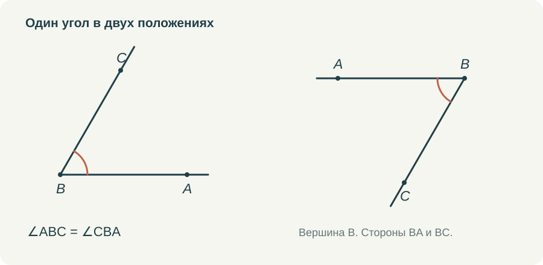

# Как читать чертёж и не додумывать условие

Хороший чертёж помогает думать. На нём видны связи, которые трудно удержать в длинном предложении. Но тот же чертёж способен незаметно сообщить ученику лишнее: стороны покажутся равными, угол — прямым, точка — серединой. Поэтому умение читать рисунок я считаю отдельной частью курса.

Мне не хочется превращать это в постоянный запрет доверять глазам. Геометрия всё-таки наглядный предмет. Нужно научиться различать то, что мы видим как возможную закономерность, и то, на что уже можем сослаться в решении. У рисунка есть несколько задач, и их полезно выполнять по очереди.

## Сначала обозначения

Пусть требуется найти ∠ABC. Сначала надо отыскать B, затем лучи BA и BC. Если из B выходит несколько лучей, одной буквы для названия угла недостаточно: непонятно, какой именно угол имеется в виду. Три буквы позволяют указать его однозначно в рассматриваемой конфигурации.

Угол можно записать и как ∠CBA. Вершина останется посередине, стороны поменяются местами. На простом рисунке полезно дать обе записи и попросить выделить угол. Затем добавить ещё один луч и спросить, какие новые углы появились. Так обозначения связываются с действием на чертеже.

С отрезками похожая история. AB и BA называют один отрезок. Но луч AB начинается в A, а луч BA — в B. Совпадение букв не делает эти лучи одним объектом. Такие различия кажутся мелкими до тех пор, пока не приходится читать условие о продолжении стороны или противоположных лучах.

## Затем только известные отметки

Одинаковые засечки на отрезках сообщают об их равенстве. Одинаковые дуги у углов — о равенстве углов. Если на рисунке несколько групп равных элементов, нужны разные обозначения: одна засечка для одной пары, две — для другой; одна дуга для одной группы углов, две — для другой.

Число дуг не означает величину угла. Угол с двумя дугами не вдвое больше угла с одной. Это способ различить группы. Такое пояснение стоит произнести явно, потому что ребёнок вправе искать в графическом знаке числовой смысл, если мы не объяснили другой.

*Отметки читаются вместе с буквами. Положение рисунка не меняет обозначенный угол и известные равенства.*

Значок прямого угла сообщает перпендикулярность. Он должен стоять там, где она дана или установлена. Если художник нарисовал угол почти прямым, но в условии и отметках об этом ничего нет, использовать 90° нельзя. То же относится к внешне параллельным прямым и симметричным фигурам.

## Где находится точка

Порядок точек полезно проговаривать словами. «D лежит на стороне BC», «D находится на продолжении BC за C», «D расположена внутри треугольника» — это разные условия. Они меняют и нужные суммы длин, и отношения углов.

Если B, C и D лежат на одной прямой и C находится между B и D, то BD = BC + CD. Если между B и C лежит D, равенство другое: BC = BD + DC. Числа могут быть одинаковыми, а действия разными. Поэтому я сначала прошу назвать целый отрезок и только потом подставлять значения.

В задачах на сложение углов также важно, проходит ли луч внутри угла. Если BD лежит внутри ∠ABC, то ∠ABD + ∠DBC = ∠ABC. Если луч находится снаружи, прежнее равенство не следует автоматически. Для первого знакомства достаточно двух аккуратных рисунков с одним изменённым положением луча.

## Поворот как проверка понимания

Повернуть готовый рисунок иногда полезнее, чем заменить в задаче все числа. После замены чисел ученик может повторить алгоритм, не прочитав конфигурацию. Поворот заставляет снова найти вершины, стороны и соответствие элементов.

Здесь уместны и треугольники с основанием сбоку, и высоты к продолжению стороны, и равные фигуры в зеркальном расположении. Но изменения должны быть осмысленными. Если рисунок перегружен линиями или буквы перекрываются, мы проверяем способность разглядеть картинку, а не геометрическое понимание.

Для не выполненного в масштабе чертежа нужна честная оговорка. На схеме можно не выдерживать числовые пропорции, но нельзя менять существенные отношения: ставить точку вне стороны, если она должна лежать на ней, или рисовать пересечение там, где его нет. Схема остаётся записью условия, даже когда длины на бумаге приблизительны.

## Что даёт интерактивность

В тренажёре ученик может сам выбрать угол, отрезок или пару треугольников. Это хорошая проверка до ввода ответа. Если выбраны не те элементы, подсказка помогает перечитать название или условие. Правильное число, случайно полученное из неподходящих величин, не должно скрывать ошибку чтения.

Подвижная модель позволяет изменять положение точек, сохраняя условие. Например, вершина равнобедренного треугольника перемещается по серединному перпендикуляру к основанию, а боковые стороны остаются равными. Но сама модель должна соблюдать ограничение. Если условие при движении теряется, наблюдения ученика уже относятся к другой задаче.

Я бы соединяла исследование с коротким вопросом: что сейчас можно изменить и что обязано сохраниться? После нескольких перемещений стоит записать предположение, затем найти доказательство. Движение помогает его придумать, а не освобождает от необходимости обосновать результат.

## Когда рисунок строит сам ученик

В готовом тренажёре буквы и линии обычно уже стоят на месте. Поэтому часть заданий обязательно должна переходить в тетрадь. Прочитать условие, сделать собственный рисунок, поставить только известные отметки. По такой работе хорошо видно, где начинается затруднение.

Я бы не оценивала художественную аккуратность вместо содержания. Важно, чтобы чертёж позволял проверить условие и следить за рассуждением. Буквы должны читаться, группы равных элементов — различаться, дополнительные линии — иметь объяснимую цель. Тогда рисунок действительно помогает ученику решать, а учителю — понимать его решение.
