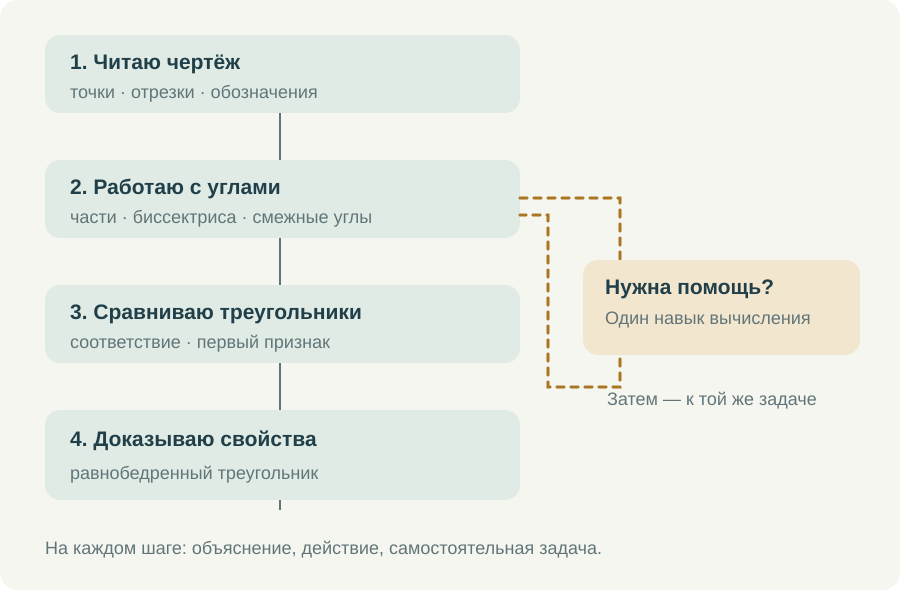

# Как я выстраиваю маршрут по геометрии

Мне нужен курс, в котором семиклассник понимает, что делать после входа. Открыть длинный каталог тренажёров недостаточно: можно потратить время на выбор и так и не начать работу. Но и один жёсткий порядок для всех не подходит. Кто-то уверенно решает уравнения и теряется в обозначениях углов, а кому-то мешают вычисления в понятной геометрической задаче.

Поэтому я разделяю основной маршрут по геометрии, маршрут по алгебре и короткие возвраты к необходимым знаниям. Они встречаются там, где это нужно для конкретной задачи. Ученик должен видеть ближайшее действие и иметь возможность разобраться с затруднением, не теряя места в основной теме.

## Основная последовательность

В начале геометрического маршрута — точки, прямые, отрезки и лучи, порядок точек, обозначение и сравнение углов. Затем измерение, сложение длин и углов, середина отрезка, биссектриса, смежные и вертикальные углы, перпендикулярность. Эти сведения будут постоянно использоваться дальше, поэтому здесь особенно важны небольшие самостоятельные действия.

После этого можно переходить к треугольникам, соответствию их элементов и первому признаку равенства. Медиана, биссектриса и высота подводят к свойствам равнобедренного треугольника. Важен не только порядок названий: на каждом шаге должно быть понятно, какие прежние знания понадобились и какое новое действие ученик теперь способен выполнить.

*Возврат к вычислениям нужен для текущей задачи. После короткой отработки ученик продолжает геометрическую тему.*

Я не стала бы переносить в этот маршрут все доступные на сайте задания по геометрии. Задача на площадь или окружность может быть полезной, но если она требует ещё не изученной теоремы, её место в другом разделе. Большой каталог даёт выбор учителю; последовательный курс должен помогать ученику этот выбор сузить.

## Внутри одной темы

Сначала — короткий вопрос или задача, ради которой вводится новое действие. Затем объяснение с рисунком и небольшим количеством текста. Рядом с тренажёром нужен ролик, показывающий, как выполнить именно это действие в интерфейсе: что выделить, куда ввести ответ, когда открывать подсказку и как перейти к следующему примеру.

Разбор математической задачи и инструкция по работе с тренажёром отвечают на разные вопросы. В первом ролике ученик понимает, почему решение верно. Во втором видит, как самостоятельно выполнить работу на странице. Их удобно держать рядом, чтобы ребёнок мог открыть тот, который нужен ему сейчас.

После объяснения следует задача с поддержкой. Потом — похожая самостоятельная задача, где изменены не только числа, но при необходимости и положение рисунка. Завершает небольшой блок работа в тетради. Здесь приходится самому строить чертёж и оформлять рассуждение, без готовых кнопок и подсветки.

Смотреть все ролики подряд я бы не требовала. Если ученик уже умеет выполнять действие, можно сразу попробовать самостоятельную задачу. Если затруднение возникло на одном шаге, нужно вернуться к соответствующему объяснению. Видео в таком курсе становится доступной помощью, к которой обращаются по делу.

## Три разных повода вернуться назад

Первый — не понято само геометрическое понятие. Например, ученик принимает середину отрезка за любую точку на нём. Здесь поможет короткая работа с положением точки и равенством частей. Дополнительные вычисления без этого различения будут только повторять прежнюю ошибку.

Второй — геометрическая связь понятна, но не получается посчитать. Из суммы смежных углов правильно составлено выражение 180° − 67°, а ошибка возникает в вычитании. Тогда нужен возврат к вычислению с последующим повтором исходной задачи. Повторять всю тему смежных углов из-за одной арифметической ошибки незачем.

Третий — ученик знает отдельные факты, но не может соединить их. Он помнит определение биссектрисы и первый признак, однако не замечает два треугольника в общей фигуре. Здесь нужна помощь в поиске: выделить треугольники, назвать общую сторону, проверить угол между выбранными сторонами. Это уже работа с рассуждением.

Различать эти ситуации важно и в отчёте. Формулировка «геометрия не усвоена» слишком широка. Гораздо полезнее запись о конкретном действии: правильно выбирает угол, путает соответствующие вершины, составляет верное равенство, нуждается в подсказке при выборе вспомогательной линии.

## Как связываются алгебра и геометрия

Маршрут по алгебре сохраняет свою последовательность: выражения, подстановка, действия со знаками, раскрытие скобок, подобные слагаемые, уравнения. Геометрическая задача может обратиться к одному из этих навыков. Например, условие о смежных углах приводит к уравнению 3x + x = 180.

Ученик, который затруднился решить это уравнение, получает небольшой переход к подобным слагаемым и делению обеих частей. После отработки он возвращается к углам и проверяет смысл ответа: x = 45°, второй угол 135°, сумма 180°. Решение уравнения не должно обрывать геометрическую задачу на полпути.

Обратная связь тоже полезна. Середина отрезка, периметр треугольника и соотношения углов дают осмысленные примеры для алгебры. Но я бы всегда оставляла возможность пройти алгебраическую тему отдельно. Совместное использование навыка не означает, что два предмета надо смешать в один неразличимый список.

## Что я хочу видеть по окончании работы

Мне важно различать просмотр объяснения, решение с помощью и самостоятельное выполнение. После совместного разбора нужна новая задача: только она покажет, может ли ученик повторить действие без поддержки. Один удачный ответ ещё не означает, что вся тема освоена.

Работа в личном кабинете и открытые упражнения на сайте также имеют разные возможности. В кабинете используется постоянная учебная история. У отдельных открытых тренажёров результат может оставаться в текущем браузере. Поэтому для назначенной работы я направляю ученика в кабинет, а свободные упражнения предлагаю как дополнительную практику.

В личном кабинете завершённую работу можно передать кнопкой **«Сдать Наталье Михайловне»**. Учитель получает результат попытки из кабинета. Просмотр видео и работа в отдельном открытом тренажёре сами по себе такую сдачу не заменяют.

Короткий законченный блок должен оставлять понятный след: что ученик сделал, где понадобилась помощь и какой следующий шаг ему подходит. Фотографию письменного решения можно прислать привычным способом. Электронные результаты помогают увидеть ход работы, тетрадь — проверить самостоятельную запись доказательства.

Так я представляю движение по курсу до равнобедренных треугольников: с ясной последовательностью, доступной помощью и возможностью вернуться к нужному месту. Учебник остаётся опорой, а тренажёры и видео помогают пройти расстояние от прочитанного параграфа до собственного решения.
