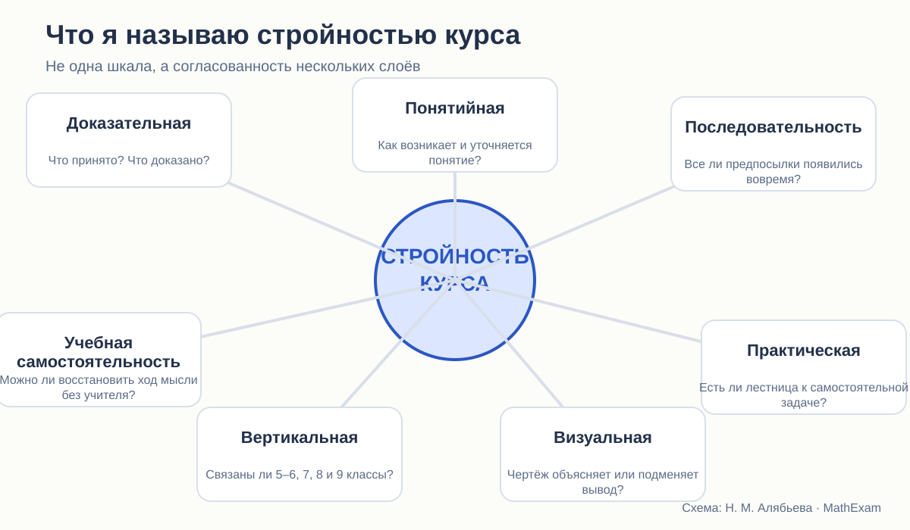

# Что значит «стройный курс геометрии»

Критерии, по которым можно сравнивать учебники, не сводя всё к вкусу и привычке.

<aside class="series-note good"><h3>О чём этот цикл</h3>
Я не пытаюсь определить «самый хороший учебник» одной цифрой. Меня интересует, насколько последовательно каждый курс строит математическое знание: от исходных понятий — к теоремам, от готового доказательства — к самостоятельной работе ученика.
</aside>

<figure class="series-figure infographic">

<figcaption>Стройность курса складывается из нескольких взаимосвязанных слоёв. Если один из них провисает, это рано или поздно отражается и на доказательствах, и на решении задач.</figcaption>
</figure>

## Почему я употребляю слово «стройность»

У школьного учебника может быть прекрасный набор задач, аккуратные рисунки и вполне правильные доказательства — и всё же курс может оставлять ощущение рассыпанности. Сегодня ученик выучил признак равенства треугольников, завтра применил его в трёх почти одинаковых задачах, а через месяц уже не узнаёт тот же признак в повёрнутом чертеже. Формально материал был. Учебного результата нет.

Бывает и обратная ситуация. Изложение выглядит очень строгим: определения, аксиомы, теоремы стоят на своих местах. Но шаг между предложениями слишком велик, происхождение вспомогательного построения не объяснено, а самостоятельные задачи начинаются сразу там, где кончается готовый образец. Такой курс математически собран, но педагогически хрупок.

Поэтому под стройностью я понимаю не красоту оглавления и не отсутствие опечаток. **Стройный курс — это курс, в котором основания, понятия, доказательства, задачи и повторение образуют одну работающую систему.** Ученик видит не только отдельные факты, но и то, откуда они следуют, зачем нужны и где применяются дальше.

## Первый критерий: доказательная состоятельность

Это главный критерий. Геометрия в 7–9 классах — первая школьная дисциплина, где доказательство становится не редкой добавкой, а способом существования предмета.

Для каждого существенного утверждения я проверяю четыре вещи:

1. Каков его статус: определение, аксиома, теорема, следствие, наблюдение?
2. На какие ранее установленные факты опирается доказательство?
3. Не используется ли рисунок как незаявленная посылка?
4. Рассмотрены ли все случаи, предусмотренные формулировкой?

Здесь важно не впадать в две крайности. Нельзя выдавать наглядное совпадение за доказательство. Но столь же неверно судить школьный текст так, будто перед нами университетский трактат по основаниям геометрии. Школьное сокращение допустимо, если пропущенный шаг однозначно восстанавливается из уже изученного. Логический пробел — другое дело: он требует нового основания, которого в курсе нет или которое появляется значительно позже.

В статьях я буду различать:

| Что обнаружено | Как это понимать |
|---|---|
| Математическая ошибка | утверждение или вывод неверны |
| Логический разрыв | результат может быть верен, но из предъявленных оснований не следует |
| Скрытая аксиома | рассуждение корректно после явного добавления исходного положения |
| Схема доказательства | идея дана, часть шагов сознательно оставлена читателю |
| Допустимое сокращение | шаг уже подготовлен курсом и легко восстанавливается |
| Педагогическая трудность | математика верна, но ученик почти не получает средств понять ход мысли |

Такой словарь нужен, чтобы критика оставалась точной. Иначе любое сокращение можно объявить ошибкой, а любой привычный учителю переход — «очевидным».

## Второй критерий: понятийная связность

Определение само по себе ещё не формирует понятия. Ученик может дословно воспроизводить, что параллелограмм — четырёхугольник с попарно параллельными противоположными сторонами, но не видеть, что прямоугольник, ромб и квадрат являются частными случаями параллелограмма.

Полный цикл работы с понятием включает:

- знакомый образ или задачу, из которой возникает необходимость нового слова;
- выделение существенных признаков;
- точное определение;
- примеры и контрпримеры;
- пограничные случаи;
- первое применение;
- возвращение к понятию в другом контексте;
- обобщение или уточнение.

Именно здесь особенно интересны различия трёх курсов. Атанасян часто начинает с наглядного и привычного действия. Погорелов стремится быстрее встроить понятие в систему основных свойств. Мерзляк заметнее организует учебный текст рубриками, примерами и уровнями задач. Но внешняя организация ещё не доказывает внутренней связности — её предстоит проверять по конкретным темам.

## Третий критерий: последовательность зависимостей

Оглавление учебника — это не просто список тем. Это порядок, в котором разрешается пользоваться математическими фактами.

Если теорема опирается на понятие движения, а движение вводится через два года, возникает логический долг. Он может быть педагогически оправдан: иногда точное понятие действительно рано формализовать. Но тогда необходимо понимать, что именно временно принято на интуитивном уровне и когда это будет переосмыслено.

Я буду строить для ключевых тем графы зависимостей:

> исходное понятие → определение или аксиома → первая теорема → типовой приём → самостоятельная задача → дальнейшее применение.

Такой граф быстро показывает странности, которые в линейном чтении легко пропустить: тема введена, но нигде не работает; теорема активно применяется до объяснения; понятие переопределяется, но связь со старым смыслом не установлена.

## Четвёртый критерий: обучение практике

В учебнике могут быть сотни задач и при этом отсутствовать путь от теории к самостоятельности.

Меня интересует не количество номеров, а **размер учебного шага**. После чтения доказательства ученик должен пройти несколько стадий:

1. распознать знакомую конфигурацию;
2. назвать нужный факт;
3. применить его по прямой подсказке;
4. выбрать факт без подсказки;
5. соединить несколько утверждений;
6. построить собственное доказательство;
7. узнать тот же метод в новой конфигурации.

Если первые две ступени есть, а затем сразу требуется шестая, проблема не в «слабых детях». В курсе просто отсутствует лестница.

## Пятый критерий: роль чертежа и опыта

Хороший геометрический рисунок выполняет работу: удерживает обозначения, показывает взаимное положение элементов, помогает заметить вспомогательную конструкцию. Но он не вправе тайком становиться доказательством.

Особенно внимательно я буду рассматривать фразы:

- «из рисунка видно»;
- «очевидно»;
- «мысленно перегнём»;
- «наложим»;
- «аналогично»;
- «проведём» — когда существование нужного объекта ещё не обосновано.

Каждая из них может быть совершенно законной. И каждая может скрывать пропущенное основание. Решает контекст.

## Шестой критерий: вертикальная преемственность

В 7 класс ребёнок приходит не с пустой головой. Он уже измерял отрезки и углы, строил фигуры, работал с окружностью, координатами, симметрией. Виленкин в 5–6 классах предлагает практические задания, наблюдения, измерения и перегибание бумаги. Это создаёт запас образов.

Но здесь есть важная граница. Предшествующий опыт объясняет, **почему семикласснику понятна идея**, но не всегда объясняет, **почему она допустима как шаг доказательства**.

Поэтому я буду проверять преемственность на трёх уровнях:

- термин действительно встречался раньше;
- ученик выполнял с ним действие;
- прежнего опыта достаточно для новой логической роли.

## Седьмой критерий: возможность учиться по книге

Учебник рассчитан на урок с учителем, но всё же должен оставаться книгой, по которой можно восстановить пропущенный материал, повторить доказательство и проверить себя.

Здесь особенно интересен Погорелов: в тексте есть специальные советы, как читать доказательство по предложениям и проверять смысл каждого шага. У Мерзляка структура задачи и уровень сложности видны ещё до начала работы. Атанасян даёт более привычный школьный поток «теория — вопросы — задачи», где многое зависит от организации урока.

Сравнивать будем не декларации, а то, насколько сам текст действительно поддерживает ученика.

## Как будет устроено исследование

Вместо общего впечатления я использую один и тот же порядок разбора:

<strong>1. Фиксирую</strong>точное место понятия или теоремы в курсе.

<strong>2. Восстанавливаю</strong>все необходимые предпосылки.

<strong>3. Смотрю практику</strong>какие действия требуют первые и последующие задачи.

<strong>4. Проверяю судьбу</strong>возвращается ли идея дальше и становится ли методом.

Первый цикл статей — качественный аудит. Я не буду прикрывать сложные выводы псевдоточными баллами вроде «8,4 из 10». Позднее можно добавить количественный реестр теорем и задач, но числа имеют смысл только после того, как определено, что именно считается полным доказательством, самостоятельной задачей или возвратом к теме.

## Предварительный вопрос, а не заранее выбранный победитель

У каждого курса уже видны сильные стороны.

Погорелов наиболее ясно предъявляет аксиоматический договор. Атанасян умеет начинать с понятного образа и быстро вводит ученика в содержание геометрии. Мерзляк заметнее других проектирует навигацию по теории и практике, а углублённая линия позволяет увидеть, как расширяется сама система методов.

Но сильная первая глава не гарантирует стройности всего курса. Наглядный вход не гарантирует последующей строгости. Большое число рубрик не гарантирует настоящего научения.

Поэтому итоговый вопрос цикла звучит так:

> **Что именно стоит сохранить из каждой авторской линии, если мы хотим построить курс, в котором доказательство строго, теория связна, а ученик действительно учится мыслить самостоятельно?**

<section class="source-list">
<h2>Какие издания сравниваются</h2>
<ul><li><a href="https://prosv.ru/product/geometriya-7-9-klass-uchebnik101/" rel="noopener">Л. С. Атанасян и др. «Математика. Геометрия. 7–9 классы. Базовый уровень»</a>. В работе использовано 14-е переработанное издание 2023 года.</li><li><a href="https://prosv.ru/product/geometriya-7-9-klass-uchebnik301/" rel="noopener">А. В. Погорелов. «Геометрия. 7–9 классы»</a>. В работе использовано 11-е стереотипное издание 2022 года.</li><li><a href="https://prosv.ru/catalog/geometriya-merzlyak-a-g-7-9-bazovii/" rel="noopener">А. Г. Мерзляк, В. Б. Полонский, М. С. Якир. «Геометрия. 7, 8, 9 классы»</a>. Сравнивается базовая линия.</li><li><a href="https://prosv.ru/product/geometriya-7-klass-uglublyonnii-uroven-elektronnaya-forma-uchebnika02/" rel="noopener">А. Г. Мерзляк, В. М. Поляков. Углублённая линия «Геометрия. 7–9 классы»</a>. Используется как внутренний контроль: что авторы считают настоящим углублением.</li><li><a href="https://prosv.ru/product/matematika-5-klass-uchebnik-v-2-ch-chast-101/" rel="noopener">Н. Я. Виленкин и др. «Математика. 5 класс»</a> и <a href="https://prosv.ru/product/matematika-6-klass-uchebnik-v-2-ch-chast-101/" rel="noopener">«Математика. 6 класс»</a>. Эти книги рассматриваются как предыстория систематического курса геометрии.</li></ul>

Ссылки ведут на официальные страницы издательства. Фрагменты страниц приведены в объёме, необходимом для методического и критического анализа; права на учебники и их оформление принадлежат авторам и издательствам.

</section>
