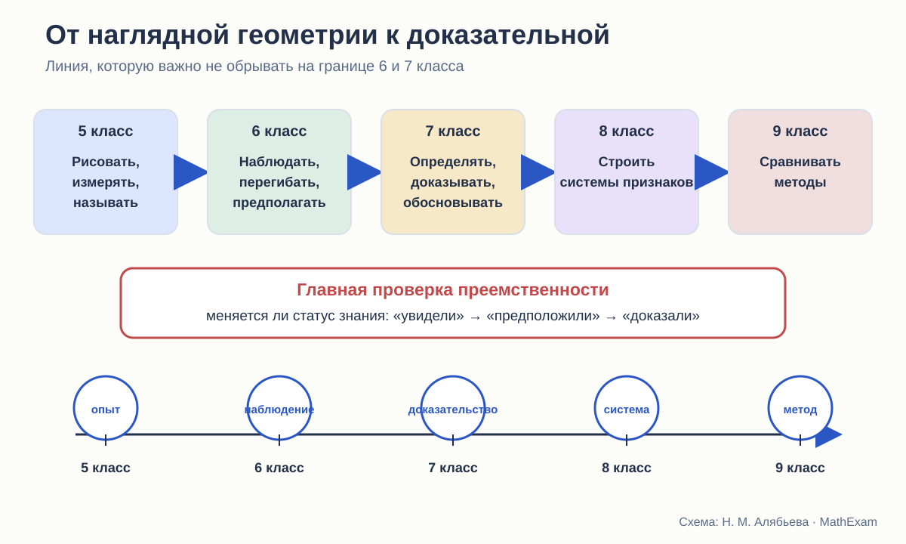

# Что ученик приносит в 7 класс

Как наглядная геометрия Виленкина готовит систематический курс — и чего от неё нельзя требовать.

<aside class="series-note good"><h3>Почему без 5–6 классов сравнение будет неполным</h3>
Учебник геометрии 7 класса всегда что-то считает уже известным. Поэтому я смотрю не только на то, как автор начинает новый курс, но и на тот опыт, с которым ребёнок к нему приходит.
</aside>

<figure class="series-figure infographic">

<figcaption>На каждом этапе меняется не только объём материала, но и статус знания: сначала ребёнок действует и наблюдает, затем формулирует гипотезу, а в систематическом курсе должен научиться доказывать.</figcaption>
</figure>

## В 7 классе геометрия начинается второй раз

Формально систематический курс геометрии начинается в 7 классе. Фактически ребёнок к этому моменту уже несколько лет имеет дело с геометрическими объектами. Переход из 5–6 классов в 7-й — это переход от наглядной геометрии к систематической планиметрии: те же отрезки и углы начинают жить по правилам доказательства.

Он знает, как выглядит отрезок, угол, прямоугольник, окружность. Пользуется линейкой и транспортиром. Сравнивает длины, вычисляет периметры и площади. В 6 классе строит точки на координатной плоскости, знакомится с параллельными и перпендикулярными прямыми, осевой и центральной симметрией.

Это не мелкие подготовительные сведения. Из них складывается первоначальная геометрическая интуиция. И если учебник 7 класса говорит «наложим фигуры», «проведём перпендикуляр», «возьмём точку внутри угла», ученик понимает эти слова не из определения, а из прежнего опыта.

Вопрос в другом: **достаточно ли этого опыта для той роли, которую ему теперь поручают?**

## Что именно даёт курс Виленкина

В используемом издании математики для 6 класса задания разделены на работу в классе, повторение и домашнюю работу. Отдельно отмечены устные, групповые и практические упражнения. Есть рубрики, посвящённые математической речи, рассуждению и наблюдению. Это важно: геометрический материал появляется не только в виде готовых формул, но и как деятельность.

Ребёнку предлагают:

- строить треугольники по заданным элементам;
- измерять стороны и углы;
- делать предположения о сумме углов треугольника;
- работать с окружностью, кругом, шаром;
- строить симметричные точки и фигуры;
- проверять результат перегибанием бумаги;
- находить оси и центры симметрии;
- применять координаты для описания симметрии.

С точки зрения подготовки к геометрии особенно ценны задания, где ответ не сообщается заранее, а возникает после действия: «измерьте», «сравните», «сделайте предположение», «проверьте на модели».

Так формируется привычка искать закономерность. Но пока это ещё не доказательная привычка.

<figure class="series-figure source-fragment">

<figcaption>Виленкин Н. Я. и др. Математика. 6 класс. Часть 1. § 3, п. 22 «Симметрии», с. 142. После построения симметричного отрезка предлагается перегнуть лист по оси симметрии: совпадение отрезков используется как наглядное обоснование их равенства.</figcaption>
</figure>

## Перегибание здесь уместно

В параграфе о симметрии сказано: если перегнуть лист по оси, симметричные отрезки совпадут, значит, они равны. Для шестиклассника это хорошая работающая модель.

Она связывает сразу несколько представлений:

- ось симметрии — это не просто нарисованная линия;
- точки по разные стороны оси соответствуют друг другу;
- при сгибе одна половина фигуры накрывает другую;
- совпадение связано с равенством.

Бумага позволяет буквально почувствовать преобразование. На этом этапе требовать определения движения как отображения плоскости, сохраняющего расстояния, было бы преждевременно. Ребёнок ещё только накапливает материал, который позднее получит строгий язык.

Проблема возникает не в 6 классе. Она появляется, если систематический курс затем использует перегибание уже как доказательство теоремы, но не объясняет, почему физическая модель имеет право обосновывать утверждение об идеальной плоскости.

Иными словами:

> Виленкин вправе сказать: «перегните и убедитесь».  
> Учебник доказательной геометрии должен добавить: «а теперь установим, почему это верно для всех фигур».

## Что ученик знает, а что только видел

При анализе преемственности важно не ставить знак равенства между разными уровнями владения.

| Уровень | Что это означает |
|---|---|
| Видел | узнаёт изображение или слово |
| Выполнял | может повторить действие по инструкции |
| Называет | воспроизводит термин и простое определение |
| Применяет | решает прямую задачу |
| Объясняет | связывает действие со свойством |
| Доказывает | выводит общее утверждение из принятых оснований |

Шестиклассник мог многократно видеть симметрию и строить симметричные точки. Это ещё не означает, что он знает свойства осевой симметрии как теоремы. Он мог измерить углы треугольника и получить сумму, близкую к 180°. Это ещё не доказательство теоремы о сумме углов.

Такое различение кажется очевидным взрослому, но в учебной практике оно часто стирается. Ученик привыкает к формуле «мы проверили на нескольких рисунках — значит, всегда». А потом учитель удивляется, почему ребёнок считает чертёж достаточным аргументом.

## Переход, который должен быть проговорён

Мне представляется естественной следующая последовательность.

### 5 класс: действие

Ребёнок чертит, измеряет, сравнивает, вырезает, прикладывает. Геометрическая фигура для него тесно связана с материальной моделью.

### 6 класс: наблюдение и гипотеза

Он уже может заметить инвариант: при сгибе фигуры совпадают; сумма углов в разных треугольниках получается одной и той же; противоположные координаты дают симметричные точки.

### 7 класс: смена правила проверки

Теперь мало убедиться на примере. Требуется объяснить, почему утверждение верно для любого объекта, удовлетворяющего условию. Появляются определения, исходные свойства, теоремы и доказательства.

### 8–9 классы: методы

Те же идеи возвращаются в более строгом виде: признаки, необходимые и достаточные условия, координатный и векторный методы, движения, подобие.

Если эту смену не назвать, ребёнок продолжает жить в двух несовместимых системах. На уроке он слышит: «по рисунку ничего нельзя доказывать», но в учебнике встречает доказательство через мысленное перегибание. Учитель подразумевает идеальное преобразование, ученик представляет лист бумаги. Оба используют одно слово, но говорят о разном.

## С чем именно приходят разные дети

Есть ещё одна практическая оговорка. Атанасян, Погорелов и Мерзляк не могут рассчитывать только на опыт Виленкина. В 5–6 классах школа могла работать по другой линии, часть материала могла быть пропущена или пройдена бегло.

Поэтому хороший учебник 7 класса должен быть **локально самодостаточным**:

- напомнить нужное действие;
- уточнить термин;
- показать, что теперь меняется статус знания;
- не строить доказательство на единичном упражнении из конкретной линии 6 класса.

Предшествующий курс может облегчить вход, но не должен быть скрытой обязательной посылкой.

## Что делают три автора на старте

### Атанасян

Введение напоминает знакомые фигуры и практические умения. Затем достаточно быстро появляются сравнение отрезков и углов, равенство фигур через наложение, измерение и первые теоремы. Переход мягкий: новые идеи вырастают из привычных действий.

Слабое место такого подхода — риск оставить физическое действие в роли неоговорённого основания.

### Погорелов

Погорелов начинает строить язык основных свойств почти сразу. Порядок точек, полуплоскости, откладывание отрезков и углов, существование равного треугольника входят в систему исходных положений. Для преемственности это более резкий переход, зато правила доказательства предъявлены отчётливее.

### Мерзляк

Мерзляк сначала идёт от знакомых фигур и простых свойств, а затем специально останавливается на вопросе: на чём вообще держатся первые доказанные теоремы? Так появляется отдельный параграф об аксиомах. Переход от опыта к дедукции сделан заметным, хотя ранние определения равных отрезков и углов всё ещё опираются на наложение.

## Какой мост я считаю оптимальным

В новом курсе я бы не убирала перегибание, вырезание и измерение. Наоборот, они нужны. Но возле каждого такого опыта должен стоять честный указатель его роли.

Например:

1. **Опыт.** Перегните лист и посмотрите, что произошло.
2. **Гипотеза.** Какие свойства, по-видимому, сохраняются?
3. **Математическая модель.** Заменим физический сгиб осевой симметрией.
4. **Основание.** Сформулируем определение и нужные свойства преобразования.
5. **Доказательство.** Теперь выведем утверждение для произвольной фигуры.
6. **Возврат к модели.** Объясним, почему опыт с бумагой дал правильный результат.

Такая схема не обедняет наглядность. Она делает её интеллектуально честной.

## Итог

Курс Виленкина создаёт хорошую чувственную и практическую базу: ребёнок умеет действовать с геометрическими объектами, наблюдать и предполагать. Но систематический курс не вправе считать эти наблюдения доказанными теоремами.

Стройность начинается там, где автор ясно показывает смену режима:

> раньше мы проверяли на модели;  
> теперь будем доказывать на основании определений, аксиом и уже установленных теорем.

Именно этот переход я дальше буду искать у Атанасяна, Погорелова и Мерзляка.

<section class="source-list">
<h2>Какие издания сравниваются</h2>
<ul><li><a href="https://prosv.ru/product/geometriya-7-9-klass-uchebnik101/" rel="noopener">Л. С. Атанасян и др. «Математика. Геометрия. 7–9 классы. Базовый уровень»</a>. В работе использовано 14-е переработанное издание 2023 года.</li><li><a href="https://prosv.ru/product/geometriya-7-9-klass-uchebnik301/" rel="noopener">А. В. Погорелов. «Геометрия. 7–9 классы»</a>. В работе использовано 11-е стереотипное издание 2022 года.</li><li><a href="https://prosv.ru/catalog/geometriya-merzlyak-a-g-7-9-bazovii/" rel="noopener">А. Г. Мерзляк, В. Б. Полонский, М. С. Якир. «Геометрия. 7, 8, 9 классы»</a>. Сравнивается базовая линия.</li><li><a href="https://prosv.ru/product/matematika-5-klass-uchebnik-v-2-ch-chast-101/" rel="noopener">Н. Я. Виленкин и др. «Математика. 5 класс»</a> и <a href="https://prosv.ru/product/matematika-6-klass-uchebnik-v-2-ch-chast-101/" rel="noopener">«Математика. 6 класс»</a>. Эти книги рассматриваются как предыстория систематического курса геометрии.</li></ul>

Ссылки ведут на официальные страницы издательства. Фрагменты страниц приведены в объёме, необходимом для методического и критического анализа; права на учебники и их оформление принадлежат авторам и издательствам.

</section>
