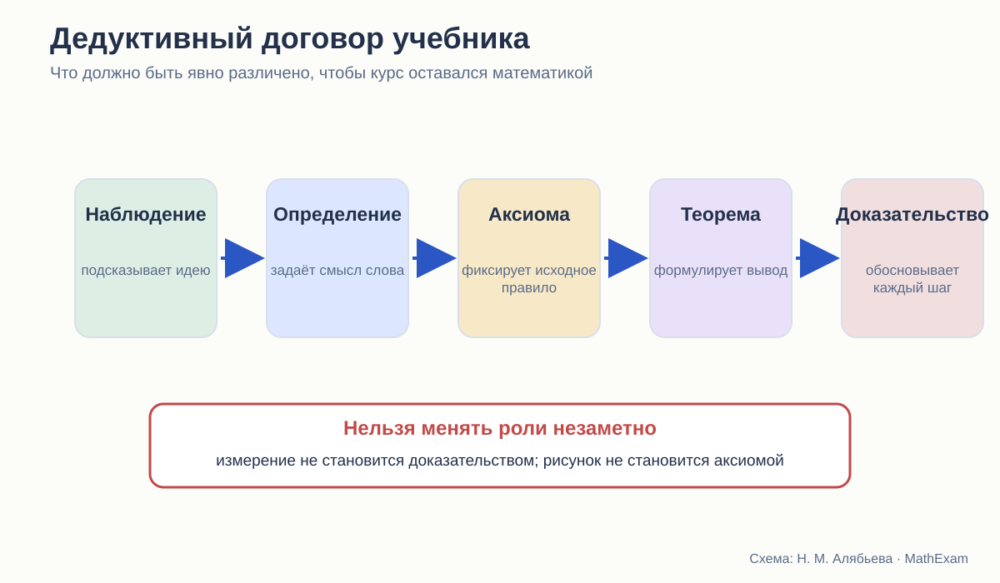
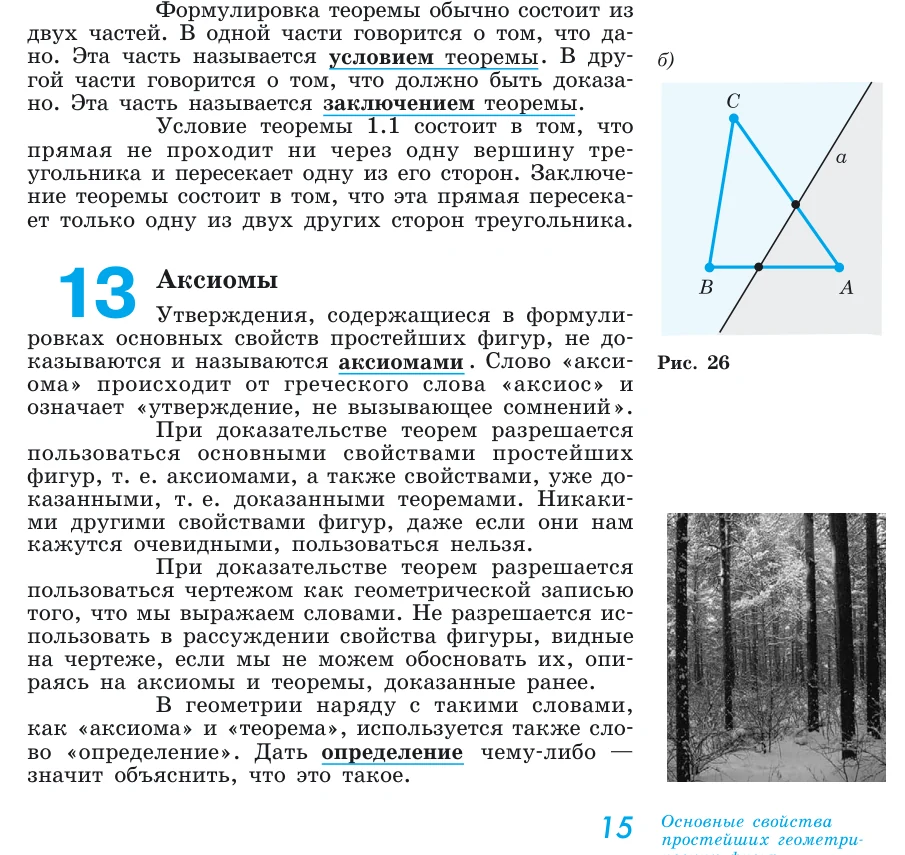
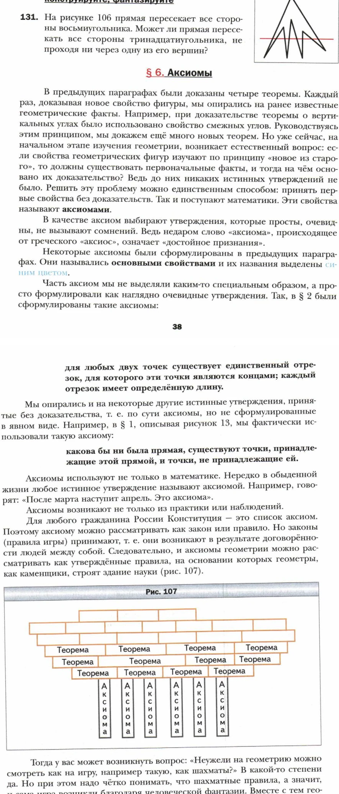

# Определение, аксиома, теорема: правила игры в школьной планиметрии

Три способа объяснить школьнику правила доказательной геометрии.

<aside class="series-note warning"><h3>Главный вопрос статьи</h3>
Когда ученик читает доказательство, он должен понимать не только ход рассуждения, но и право автора сделать каждый шаг. Для этого учебник обязан объяснить, какие утверждения принимаются без доказательства и чем они отличаются от определений и теорем.
</aside>

<figure class="series-figure infographic">

<figcaption>Наблюдение, определение, аксиома, теорема и доказательство выполняют разные функции. Сбой начинается, когда одна роль незаметно подменяет другую.</figcaption>
</figure>

## Геометрия начинается не с точки

На первой странице систематического курса обычно появляются точка и прямая. Но с точки зрения логики геометрия начинается ещё раньше — с ответа на вопрос:

> Какие правила рассуждения здесь действуют?

В арифметике школьник много лет пользовался знакомыми свойствами действий, не особенно задумываясь об их месте в системе. В геометрии это быстро перестаёт работать. Из рисунка можно предположить равенство углов, но нельзя ссылаться на него без основания. Через две точки можно провести прямую, но это не доказывается — принимается как исходное свойство. Определение треугольника объясняет, что называть треугольником, но не утверждает новую теорему.

Если учебник не разводит эти роли, ученик усваивает очень неприятную привычку: всё напечатанное жирным кажется ему «правилом», а разница между определением, свойством и признаком исчезает.

## Погорелов: правила объявлены в начале

У Погорелова первый параграф называется «Основные свойства простейших геометрических фигур». В нём последовательно задаются свойства принадлежности точек и прямых, порядок точек на прямой, измерение отрезков и углов, откладывание фигур, существование треугольника в заданном положении, параллельность.

После первых примеров автор отдельно вводит понятия условия и заключения теоремы, а затем аксиомы.

<figure class="series-figure source-fragment">

<figcaption>А. В. Погорелов. Геометрия. 7–9 классы, с. 15. Автор прямо пишет: при доказательстве можно пользоваться аксиомами и ранее доказанными теоремами; свойства, только видимые на чертеже, использовать нельзя.</figcaption>
</figure>

Это, пожалуй, самый ясный из трёх вариантов дедуктивного договора. Особенно ценно прямое предупреждение о рисунке. Семикласснику не предлагают самому догадаться, почему фраза «здесь углы вроде одинаковые» не принимается.

Сильная сторона Погорелова — прозрачность. Ученик знает, что:

- часть понятий принимается исходной;
- основные свойства не доказываются;
- новые утверждения выводятся из них;
- чертёж служит записью условия, но не источником дополнительных фактов.

Однако у этой модели есть цена. В самом начале курса появляется плотная сеть основных свойств: принадлежность, порядок, полуплоскости, откладывание, существование и единственность. Для сильного учителя это хороший фундамент. Для слабого ученика — довольно крутой подъём. Если он просто выучит формулировки, система останется строгой на бумаге, но не станет его инструментом.

## Мерзляк: вопрос об основаниях появляется после первых теорем

Мерзляк выбирает более разговорный маршрут. Сначала вводятся простейшие фигуры, доказываются первые теоремы о пересекающихся прямых, смежных и вертикальных углах. Затем авторы останавливаются и задают естественный вопрос: если всякий новый факт выводится из прежнего, где начало цепочки?

<figure class="series-figure source-fragment">

<figcaption>А. Г. Мерзляк, В. Б. Полонский, М. С. Якир. Геометрия. 7 класс, с. 38–39. Аксиомы объясняются как исходные правила, на которых строится здание теории.</figcaption>
</figure>

Для ученика это сильный педагогический ход. Аксиома появляется не как обязательный термин из словаря, а как ответ на возникшую проблему. Рисунок со стеной из теорем на опорах-аксиомах хорошо передаёт идею зависимости.

Но здесь нужно быть точным. До параграфа об аксиомах курс уже пользовался некоторыми исходными положениями. Авторы честно замечают, что часть из них применялась без явной формулировки. Такой порядок педагогически понятен, однако логически он означает: **система сначала работает, а затем объясняет собственные основания**.

Это не ошибка. Это способ организации. Его качество зависит от того, возвращается ли учебник к ранним доказательствам и помогает ли увидеть в них уже использованные аксиомы.

## Атанасян: переход через привычное действие

У Атанасяна введение строится иначе. Автор напоминает известные фигуры, измерения и практические умения. В начальных параграфах появляются прямые, отрезки, углы, наложение, измерение. Понятия теоремы и доказательства подробно входят в курс рядом с первым признаком равенства треугольников.

Такая последовательность психологически мягкая. Ребёнок не сталкивается сразу с большим списком аксиом. Он начинает с объектов, которые уже узнаёт.

Но математический договор здесь менее заметен. Часть исходных положений представлена как понятные свойства, часть — через практическое действие, часть — как нечто уже известное. Учителю приходится самому удерживать границу:

- это определение;
- это опытное объяснение;
- это свойство, которое мы принимаем;
- это теорема, которую сейчас доказываем.

Если учитель делает эту работу, курс идёт естественно. При самостоятельном чтении граница может размыться.

## Определение не доказывают

Одна из распространённых школьных ошибок — требовать доказательства определения или, наоборот, применять определение как готовую теорему.

Возьмём параллелограмм. Определение сообщает, какие четырёхугольники мы будем называть параллелограммами. Из него непосредственно следует параллельность соответствующих сторон, потому что это и есть признак принадлежности к классу.

А равенство противоположных сторон — уже теорема. Чтобы получить его, требуется доказательство.

Затем появляются признаки параллелограмма. Они решают обратную задачу: позволяют по другим свойствам установить, что данный четырёхугольник принадлежит классу параллелограммов.

Стройный учебник постоянно поддерживает эту разницу. Нестройный может правильно сформулировать всё по отдельности, но не помочь ученику увидеть систему:

| Элемент | Какой вопрос решает |
|---|---|
| Определение | Что мы называем этим объектом? |
| Свойство | Что верно для всякого объекта этого класса? |
| Признак | Как распознать объект по другим данным? |
| Аксиома | Какое исходное утверждение принимаем без доказательства? |
| Теорема | Какой новый вывод устанавливаем? |
| Следствие | Что непосредственно получаем из уже доказанного? |

## Что значит «аксиома очевидна»

И Погорелов, и Мерзляк связывают аксиомы с опытом и наглядной убедительностью. Это естественно для школы, но слово «очевидно» требует осторожности.

Аксиома не становится аксиомой потому, что её никто не сумел доказать или потому, что рисунок выглядит убедительно. Внутри конкретного курса она является исходным положением, из которого строится теория.

Для школьника достаточно более простого объяснения:

> Мы выбираем небольшой набор правил, принимаем их без доказательства и далее строго следим, чтобы каждое новое утверждение выводилось только из них и уже доказанных теорем.

Такой язык не требует обсуждать независимость и непротиворечивость аксиоматической системы на университетском уровне. Но он сохраняет главное: доказательство не начинается из воздуха.

## Скрытые аксиомы: всегда ли это плохо

Не всякая скрытая предпосылка делает курс плохим. Иногда автор сознательно не перегружает 7 класс формализмом. Например, возможность наложить фигуру в нужном положении может временно восприниматься интуитивно.

Проблема начинается в трёх случаях:

1. скрытая предпосылка используется как решающий шаг доказательства;
2. позднее учебник вводит другой смысл того же понятия, но не связывает его с прежним;
3. ученик получает противоречивые сигналы: «рисунку верить нельзя», но «мысленно перегнём рисунок» принимается без объяснения.

Поэтому в дальнейшем я буду отмечать не только наличие скрытого основания, но и его судьбу:

- сформулировано ли оно позже;
- доказана ли связь со старым употреблением;
- меняется ли после этого смысл ранних доказательств.

## Какая модель лучше

В чистом виде ни одна из трёх моделей не решает всё.

### Сильная сторона Погорелова

Он честно и рано предъявляет правила доказательства. Ученик видит, что геометрия — система выводов, а не коллекция картинок.

### Сильная сторона Мерзляка

Он создаёт мотивацию для понятия аксиомы. Возникает вопрос — затем появляется ответ и запоминающийся образ здания теории.

### Сильная сторона Атанасяна

Он не отрывает геометрию от прежнего практического опыта и не делает начало курса чрезмерно абстрактным.

Оптимальный вариант, на мой взгляд, должен соединить эти достоинства:

1. начать с знакомой задачи или опыта;
2. показать, что опыт подсказывает, но не доказывает;
3. сформулировать небольшой набор исходных правил;
4. сразу применить их в настоящем доказательстве;
5. вернуться к исходному опыту и объяснить его математически.

## Что я буду считать признаком стройности

В следующих статьях для каждого доказательства я буду задавать один и тот же набор вопросов:

- Все ли понятия уже определены?
- Ясно ли, что принято без доказательства?
- Можно ли назвать основание каждого перехода?
- Не добавляет ли рисунок незаявленное условие?
- Не требует ли фраза «проведём» отдельного доказательства существования?
- Не появляется ли основание позже самого вывода?
- Есть ли после текста задачи, где ученик пользуется системой самостоятельно?

Дедуктивный договор не обязан выглядеть как формальная декларация на первой странице. Но к моменту первого серьёзного доказательства он должен быть понятен и автору, и учителю, и ученику.

<section class="source-list">
<h2>Какие издания сравниваются</h2>
<ul><li><a href="https://prosv.ru/product/geometriya-7-9-klass-uchebnik101/" rel="noopener">Л. С. Атанасян и др. «Математика. Геометрия. 7–9 классы. Базовый уровень»</a>. В работе использовано 14-е переработанное издание 2023 года.</li><li><a href="https://prosv.ru/product/geometriya-7-9-klass-uchebnik301/" rel="noopener">А. В. Погорелов. «Геометрия. 7–9 классы»</a>. В работе использовано 11-е стереотипное издание 2022 года.</li><li><a href="https://prosv.ru/catalog/geometriya-merzlyak-a-g-7-9-bazovii/" rel="noopener">А. Г. Мерзляк, В. Б. Полонский, М. С. Якир. «Геометрия. 7, 8, 9 классы»</a>. Сравнивается базовая линия.</li></ul>

Ссылки ведут на официальные страницы издательства. Фрагменты страниц приведены в объёме, необходимом для методического и критического анализа; права на учебники и их оформление принадлежат авторам и издательствам.

</section>
