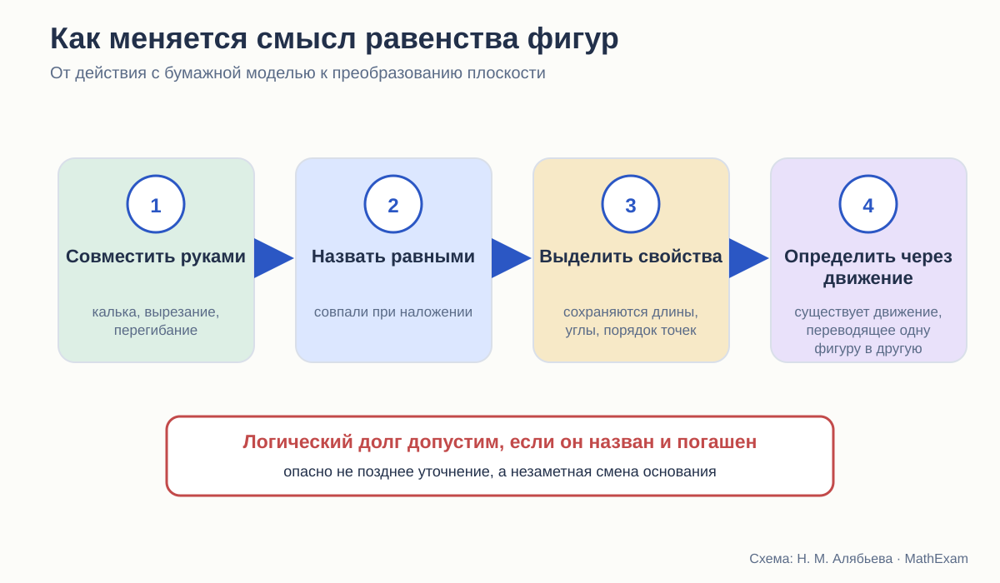
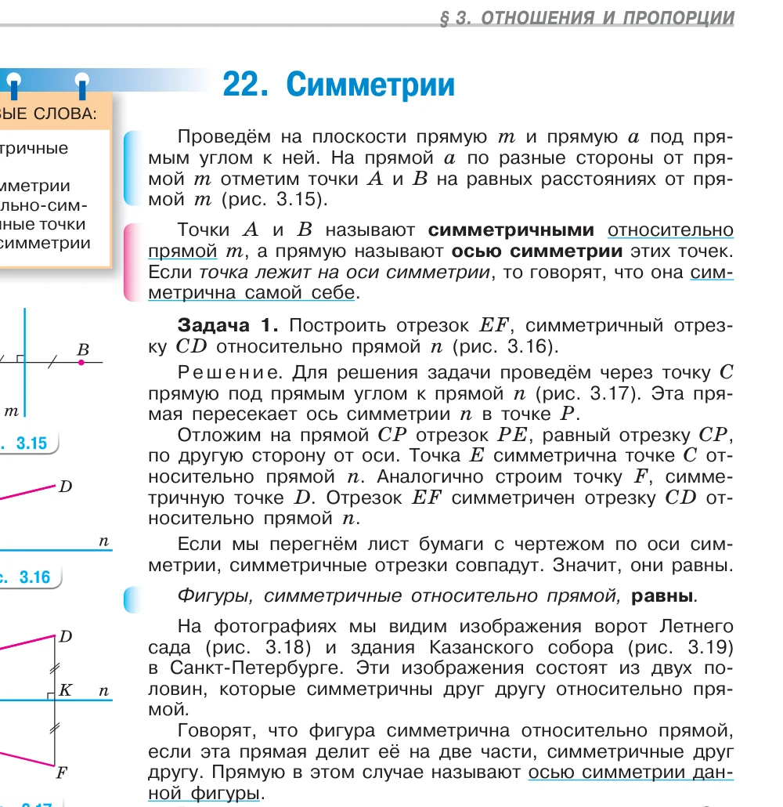
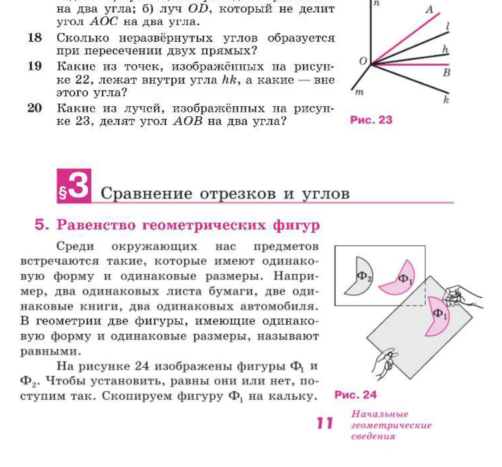
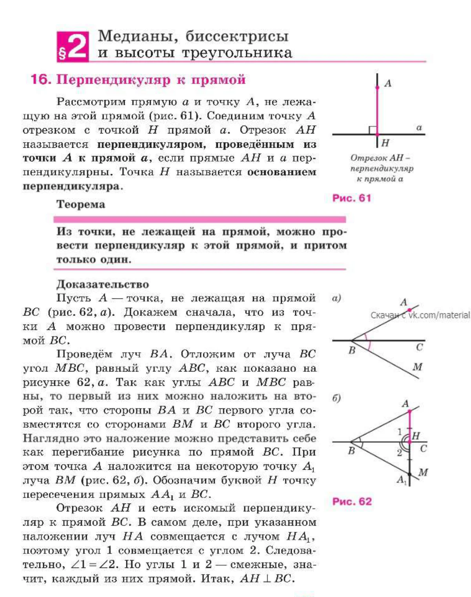
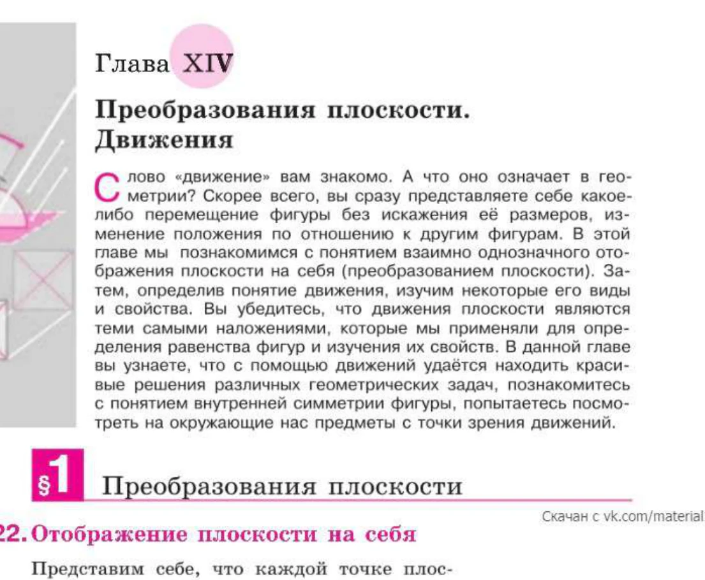
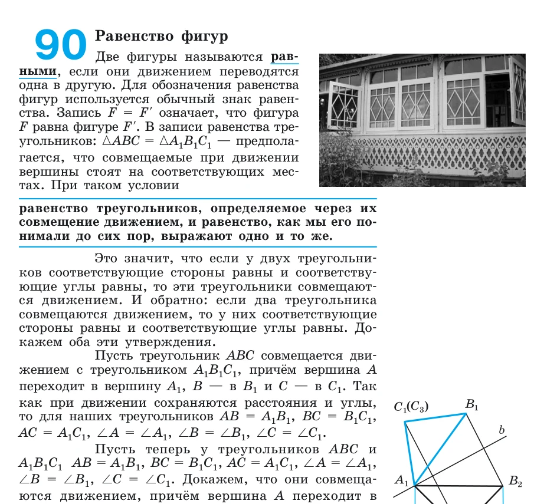
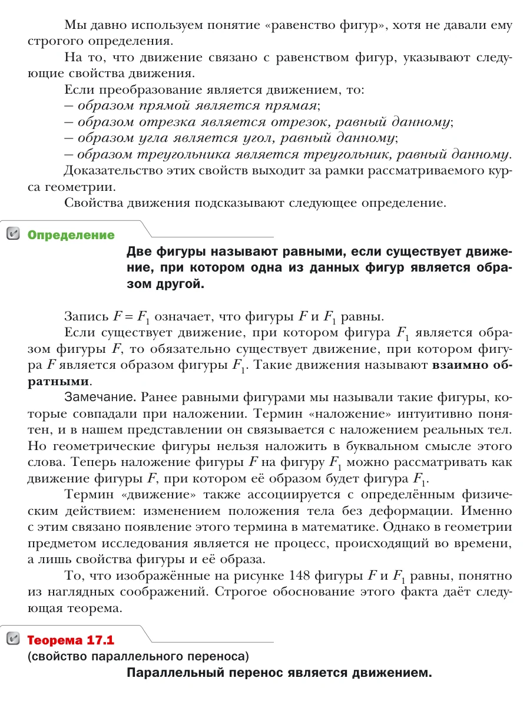

# Наложение, перегибание и движение

Как меняется смысл равенства фигур от бумажной модели до преобразования плоскости.

<aside class="series-note warning"><h3>Почему это не частный терминологический спор</h3>
Через понятие равенства фигур проходят признаки равенства треугольников, свойства симметрии, построения и поздняя теория движений. Если смысл слова меняется, нужно проверить всю цепочку.
</aside>

<figure class="series-figure infographic">

<figcaption>От физического совмещения к движению плоскости. Поздняя формализация допустима, если учебник явно связывает новый язык с прежним.</figcaption>
</figure>

## Одно слово — несколько разных смыслов

Фраза «эти фигуры равны» кажется школьнику совершенно понятной. Он представляет две одинаковые детали, две вырезанные формы, два совпадающих треугольника. Между тем равенство фигур — одно из оснований школьной планиметрии: на нём держатся признаки треугольников и почти всё, что доказывается дальше.

Для первых шагов этого достаточно. Но в доказательной геометрии возникает вопрос: **что именно означает возможность совместить идеальные фигуры?**

Физические предметы можно взять в руки. Рисунок можно перевести на кальку. Геометрическая фигура не является бумажным объектом. Поэтому слово «наложение» либо остаётся наглядной метафорой, либо должно получить точный математический смысл.

В трёх курсах эта проблема решается по-разному.

## Виленкин: сначала физический опыт

В 6 классе симметричные отрезки предлагается проверить перегибанием листа. При сгибе они совпадают, и это служит убедительным для ребёнка подтверждением равенства.

<figure class="series-figure source-fragment">

<figcaption>Н. Я. Виленкин и др. Математика. 6 класс. Часть 1, с. 142. Здесь перегибание выполняет роль опыта: ученик видит совпадение и связывает его с равенством.</figcaption>
</figure>

В этом месте всё методически естественно. Автор работает с наглядной геометрией. Ученик ещё не строит аксиоматическую теорию преобразований.

Но опыт оставляет после себя важную ассоциацию:

> равные фигуры — те, которые можно совместить.

Именно с ней ребёнок приходит в 7 класс.

## Атанасян: наложение становится определением

В начале курса Атанасяна равенство геометрических фигур вводится через совмещение. Для проверки предлагается скопировать одну фигуру на кальку и наложить её на другую. Затем тем же способом сравниваются отрезки и углы.

<figure class="series-figure source-fragment">

<figcaption>Л. С. Атанасян и др. Геометрия. 7–9 классы, с. 11–13. Наглядная операция с калькой становится основой определения равенства фигур.</figcaption>
</figure>

Это понятный переход от опыта Виленкина. Ученик не должен сначала осваивать язык отображений плоскости: он уже знает, что значит совместить две формы.

Однако теперь наложение используется не только для наблюдения. Оно входит в определения, а вскоре — и в доказательства. Значит, от него требуются свойства:

- фигуру можно разместить в нужном положении;
- расстояния при этом не меняются;
- лучи и углы переходят в лучи и углы;
- порядок точек сохраняется;
- совпадение соответствующих элементов означает совпадение всей фигуры.

В ранней части курса эти свойства не собраны в отдельную теорию. Они воспринимаются как естественные свойства физического перемещения.

## Наложение в доказательстве

Самый заметный пример — первый признак равенства треугольников. Треугольник предлагается наложить на другой так, чтобы совпали вершина и стороны заданного угла. Равенство сторон обеспечивает совпадение остальных вершин.

Логическая идея верна: если существует сохраняющее расстояния преобразование, которое переводит заданные элементы в соответствующие элементы, треугольники совпадут.

Но школьный текст говорит не о преобразовании, а о наложении. Поэтому доказательство фактически опирается на неявное понимание движения.

Ещё выразительнее доказательство существования перпендикуляра из точки к прямой. Наложение предлагается представить как мысленное перегибание рисунка.

<figure class="series-figure source-fragment">

<figcaption>Л. С. Атанасян и др. Геометрия. 7–9 классы, с. 33. Перегибание уже не просто практическая проверка, а образ ключевого шага доказательства существования перпендикуляра.</figcaption>
</figure>

Здесь и возникает принципиальная граница. Как объяснение идеи перегибание очень удачно. Как единственное основание вывода оно требует формализации.

## Поздний ответ Атанасяна

В 9 классе, в главе «Преобразования плоскости. Движения», автор прямо связывает движения с теми самыми наложениями, которые использовались раньше для определения равенства и изучения свойств фигур.

<figure class="series-figure source-fragment">

<figcaption>Л. С. Атанасян и др. Геометрия. 7–9 классы, с. 313. Введение главы прямо говорит, что движения плоскости являются теми же наложениями, применявшимися ранее.</figcaption>
</figure>

Это важная связка. Она показывает, что раннее наложение не было случайным бытовым жестом: авторы подразумевали движение плоскости.

Но остаётся вопрос порядка. Свойства движения доказываются значительно позже, чем используются интуитивно. Значит, ранние доказательства следует понимать как доказательства в системе, где возможность наложения и сохранение соответствующих свойств фактически приняты исходно.

Такой подход допустим для школы. Было бы лишь полезно назвать этот статус раньше:

> Пока мы пользуемся интуитивным представлением о перемещении фигуры без деформации. В 9 классе оно будет уточнено понятием движения.

Одна фраза сделала бы логический долг видимым.

## Погорелов: сначала равенство элементов

Погорелов в начале курса определяет равные отрезки через равенство длин, равные углы — через равенство градусных мер, а равные треугольники — через равенство соответствующих сторон и углов.

Это принципиально другой выбор. Равенство треугольников не определяется через физическое наложение. Вместо этого в систему основных свойств входит существование треугольника, равного данному и расположенного заданным образом.

Так автор получает возможность доказывать признаки равенства, не обращаясь к кальке или бумажному сгибу. Он строит равный треугольник в нужном положении по аксиоме, а затем показывает совпадение вершин.

Позднее, после введения движений, Погорелов определяет равенство произвольных фигур через возможность перевести одну в другую движением и отдельно доказывает согласованность этого определения с прежним пониманием равенства треугольников.

<figure class="series-figure source-fragment">

<figcaption>А. В. Погорелов. Геометрия. 7–9 классы, с. 133. Автор не просто даёт новое определение, а формулирует задачу доказать его эквивалентность прежнему определению равенства треугольников.</figcaption>
</figure>

С точки зрения логической прозрачности это сильный ход. Старое понятие не исчезает бесследно; связь между двумя языками становится теоремой.

## Мерзляк: позднее признание предварительного определения

В 7 классе Мерзляк, как и Атанасян, определяет равные отрезки и углы через возможность совместить их наложением. Равные треугольники также связываются с совпадением при наложении. Одновременно вводится «основное свойство равенства треугольников»: для данного треугольника и луча существует равный треугольник в заданном положении.

В 9 классе авторы возвращаются к проблеме очень прямо:

<figure class="series-figure source-fragment">

<figcaption>А. Г. Мерзляк, В. Б. Полонский, М. С. Якир. Геометрия. 9 класс, с. 152. Авторы отмечают, что строгого определения раньше не давали, и объясняют наложение как движение фигуры.</figcaption>
</figure>

Мне нравится интеллектуальная честность этого фрагмента. Авторы не делают вид, будто бытовое наложение всегда было формальным определением. Они называют его интуитивно понятным и затем дают точный язык.

Однако вопрос обратной силы остаётся. Если ранние доказательства опирались на свойства наложения, то позднее определение не автоматически доказывает все эти свойства. Нужно ещё показать, что используемые преобразования действительно являются движениями и обладают нужными свойствами.

В базовом курсе часть таких доказательств выносится за рамки. Для школьного уровня это может быть разумно, но статус должен быть обозначен: здесь мы принимаем некоторые свойства движения или используем их как известные.

## Три модели одной идеи

| Авторская линия | Раннее понимание равенства | Поздняя формализация | Главный риск |
|---|---|---|---|
| Атанасян | совпадение при наложении | движения объявляются теми же наложениями | свойства наложения долго остаются интуитивными |
| Погорелов | равенство сторон и углов; аксиома существования равного треугольника | равенство фигур через движение с доказательством согласованности | старт более формален и тяжёл |
| Мерзляк | совпадение при наложении + основное свойство равенства треугольников | прямое переопределение через движение | позднее уточнение не закрывает автоматически все ранние основания |

## Можно ли пользоваться наложением в школе

Да. Запрещать слово «наложение» было бы педагогической ошибкой. Оно даёт сильный образ конгруэнтности и связывает геометрию с действием.

Но в стройном курсе надо развести три уровня.

### Уровень 1. Физическая модель

Калька, вырезанная фигура, сгиб бумаги. Модель помогает увидеть совпадение.

### Уровень 2. Исходное допущение курса

Мы считаем возможным перемещать фигуру без деформации и принимаем, что такое перемещение сохраняет нужные отношения. Если курс использует это до формальной теории движений, следует сказать об этом прямо.

### Уровень 3. Математическое определение

Движение — преобразование, сохраняющее расстояния. Равные фигуры — фигуры, одна из которых переводится в другую движением. Теперь свойства можно доказывать в точном языке.

Без второго уровня возникает иллюзия, что бумажный опыт сам доказывает теорему. Без первого курс теряет наглядную опору. Без третьего слово «наложение» навсегда остаётся метафорой.

## Мой вывод

Атанасян и Мерзляк строят понятный мост от физического опыта к математике, но формальный берег этого моста появляется поздно. Погорелов раньше выстраивает систему исходных положений и затем аккуратно связывает равенство с движением, зато требует от ученика более высокой готовности к абстракции.

Для нового курса я бы сохранила наложение и перегибание, но сразу пометила их статус:

> Это модель. Она подсказывает, какое свойство следует ожидать.  
> В доказательстве мы опираемся на явно сформулированное свойство перемещений.  
> Позднее определим движение через сохранение расстояний и проверим согласованность понятий.

Тогда знакомое действие не исчезает, но и не получает доказательную силу тайком.

<section class="source-list">
<h2>Какие издания сравниваются</h2>
<ul><li><a href="https://prosv.ru/product/geometriya-7-9-klass-uchebnik101/" rel="noopener">Л. С. Атанасян и др. «Математика. Геометрия. 7–9 классы. Базовый уровень»</a>. В работе использовано 14-е переработанное издание 2023 года.</li><li><a href="https://prosv.ru/product/geometriya-7-9-klass-uchebnik301/" rel="noopener">А. В. Погорелов. «Геометрия. 7–9 классы»</a>. В работе использовано 11-е стереотипное издание 2022 года.</li><li><a href="https://prosv.ru/catalog/geometriya-merzlyak-a-g-7-9-bazovii/" rel="noopener">А. Г. Мерзляк, В. Б. Полонский, М. С. Якир. «Геометрия. 7, 8, 9 классы»</a>. Сравнивается базовая линия.</li><li><a href="https://prosv.ru/product/matematika-5-klass-uchebnik-v-2-ch-chast-101/" rel="noopener">Н. Я. Виленкин и др. «Математика. 5 класс»</a> и <a href="https://prosv.ru/product/matematika-6-klass-uchebnik-v-2-ch-chast-101/" rel="noopener">«Математика. 6 класс»</a>. Эти книги рассматриваются как предыстория систематического курса геометрии.</li></ul>

Ссылки ведут на официальные страницы издательства. Фрагменты страниц приведены в объёме, необходимом для методического и критического анализа; права на учебники и их оформление принадлежат авторам и издательствам.

</section>
