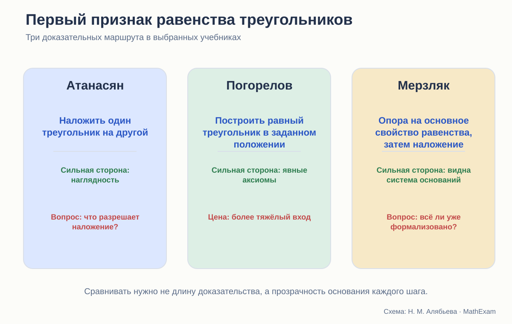
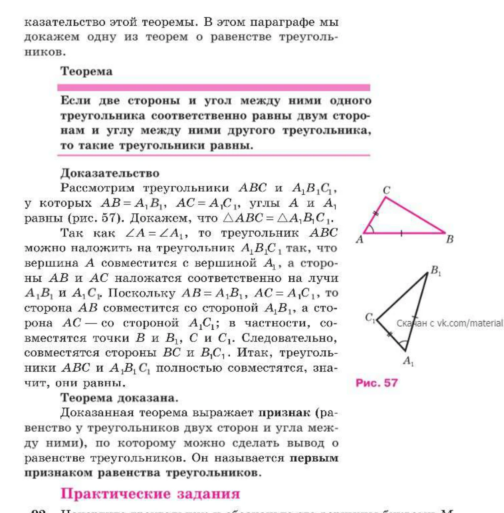
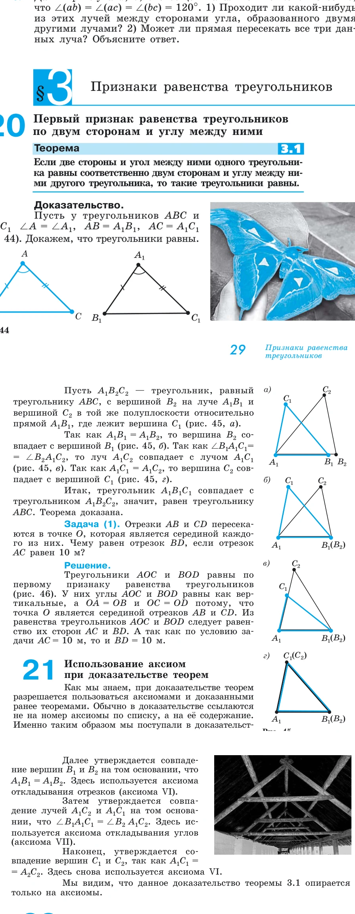
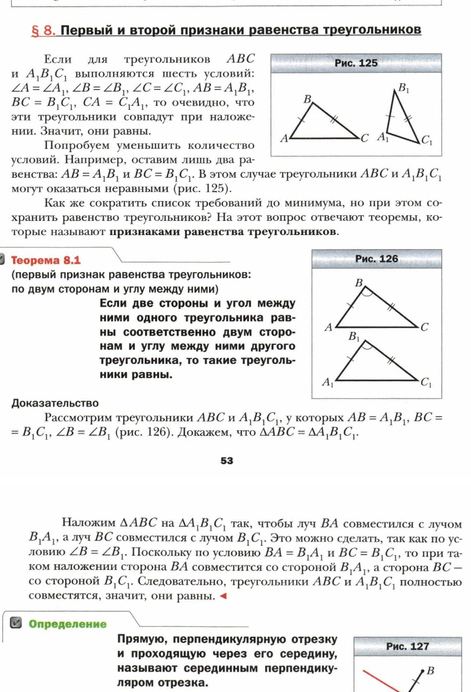

# Первый признак равенства треугольников

Построчный разбор доказательств у Атанасяна, Погорелова и Мерзляка.

<aside class="series-note warning"><h3>Почему именно эта теорема</h3>
Первый признак равенства треугольников — первая крупная проверка всей системы. В одном коротком доказательстве встречаются равенство фигур, возможность расположить фигуру, единственность откладывания отрезков и углов, совпадение точек и роль чертежа.
</aside>

<figure class="series-figure infographic">

<figcaption>Теорема одна и та же, но авторы по-разному отвечают на вопрос, почему один треугольник можно расположить относительно другого нужным образом.</figcaption>
</figure>

## Формулировка одинакова, основания разные

Во всех трёх курсах первый признак утверждает:

> Если две стороны и угол между ними одного треугольника соответственно равны двум сторонам и углу между ними другого, то треугольники равны.

Для ученика формулировка кажется почти очевидной. Если закрепить две стороны и угол между ними, третья вершина будто бы уже не может оказаться в другом месте.

Но слово «будто бы» здесь и есть предмет доказательства. Необходимо обосновать:

1. почему один треугольник можно расположить так, чтобы совпала вершина и стороны угла;
2. почему равные отрезки на совпавших лучах имеют общий конец;
3. почему после совпадения трёх вершин совпадает вся фигура;
4. какой смысл вкладывается в равенство треугольников.

## Атанасян: доказательство как наложение

<figure class="series-figure source-fragment">

<figcaption>Л. С. Атанасян и др. Геометрия. 7–9 классы, с. 31. Треугольник ABC предлагается наложить на A₁B₁C₁ так, чтобы вершина A совместилась с A₁, а стороны AB и AC — с соответствующими лучами.</figcaption>
</figure>

Ход доказательства очень короткий и наглядный.

- Равенство углов позволяет совместить вершину и стороны угла.
- Равенство сторон приводит к совпадению точек B с B₁ и C с C₁.
- Значит, совпадают третьи стороны и треугольники полностью.

Для первого знакомства это сильный текст. Ученик способен удержать всю идею целиком. Вспомогательных построений нет, доказательство не тонет в обозначениях.

Но главный шаг выражен словами «треугольник можно наложить». Почему можно? Ранний курс уже определял равные фигуры через наложение, однако здесь равенство треугольников как раз требуется установить. Разрешение не является кругом, если под наложением понимается свободное перемещение без деформации: мы не предполагаем равенство треугольников, а лишь перемещаем один из них.

Тогда скрытым основанием становится другое утверждение:

> фигуру можно переместить так, чтобы заданная точка и два луча совместились с другой точкой и двумя равными по величине лучами.

Именно это свойство в раннем тексте не формулируется отдельно. Доказательство содержательно верно в интуитивной модели движений, но её правила остаются за кадром.

### Что получает ученик

Он получает хорошую идею признака: две стороны и угол между ними жёстко задают треугольник.

### Чего он пока не получает

Он не учится раскладывать доказательство на исходные положения. Фраза «можно наложить» выглядит самоочевидной операцией, а не применением определённого свойства.

## Погорелов: равный треугольник в заданном положении

У Погорелова равенство треугольников первоначально определяется через равенство всех соответствующих сторон и углов. Значит, теорема должна вывести остальные равенства из трёх данных.

Для этого в начальную систему включена аксиома: каков бы ни был треугольник, существует равный ему треугольник в заданном расположении относительно данной полупрямой.

<figure class="series-figure source-fragment">

<figcaption>А. В. Погорелов. Геометрия. 7–9 классы, с. 29–31. Сначала строится треугольник, равный ABC и расположенный относительно луча A₁B₁; затем совпадение вершин выводится из аксиом откладывания отрезков и углов.</figcaption>
</figure>

Доказательство устроено так:

1. По аксиоме существования берётся треугольник A₁B₂C₂, равный ABC и расположенный в нужной полуплоскости.
2. Так как A₁B₁ = A₁B₂, вершины B₁ и B₂ совпадают. Здесь работает единственность откладывания отрезка заданной длины на луче.
3. Равенство углов обеспечивает совпадение соответствующих лучей.
4. Равенство A₁C₁ = A₁C₂ обеспечивает совпадение точек C₁ и C₂.
5. Построенный равный треугольник совпадает с A₁B₁C₁, следовательно, исходные треугольники равны.

Следующий пункт учебника специально возвращается к доказательству и называет аксиомы VI, VII и VIII. Это редкий и очень полезный методический жест: автор показывает ученику не только цепочку, но и её фундамент.

### Не является ли аксиома VIII готовым признаком?

На первый взгляд возникает подозрение: мы хотим доказать равенство, а начинаем со строительства равного треугольника.

Круга нет. Аксиома не утверждает, что **данный второй треугольник** равен первому по трём элементам. Она гарантирует существование копии первого треугольника в требуемом положении. Затем теорема доказывает, что эта копия вынужденно совпадает со вторым треугольником.

Это тонкое различие, и Погорелов позволяет его увидеть.

### Цена строгости

Доказательство длиннее и формальнее. Ученик должен одновременно понимать:

- равенство треугольников как равенство шести элементов;
- существование равной копии;
- заданную полуплоскость;
- единственность откладывания;
- совпадение лучей и точек.

Для слабого семиклассника это серьёзная нагрузка. Без наглядной модели он может выучить текст, не почувствовав «жёсткость» двух сторон и угла между ними.

## Мерзляк: аксиоматический фон и прямое наложение

В курсе Мерзляка до признака уже появляется отдельный параграф об аксиомах и основное свойство равенства треугольников: для данного треугольника и луча существует равный ему треугольник в заданном положении.

<figure class="series-figure source-fragment">

<figcaption>А. Г. Мерзляк, В. Б. Полонский, М. С. Якир. Геометрия. 7 класс, с. 53–54. После обсуждения минимального набора условий доказательство снова строится через наложение треугольников.</figcaption>
</figure>

Перед теоремой авторы задают хороший содержательный вопрос: все шесть равенств гарантируют равенство треугольников, но можно ли уменьшить число условий? Два равенства сторон явно недостаточны; требуется найти минимальный набор.

Это хорошо мотивирует сам смысл признака. Теорема перестаёт быть очередной формулировкой и становится ответом на задачу об однозначном задании треугольника.

Доказательство, однако, идёт не через сформулированное ранее основное свойство, а снова через наложение:

- луч BA совмещается с B₁A₁;
- луч BC — с B₁C₁;
- равенство сторон даёт совпадение вершин.

Получается интересное сочетание. Аксиоматический фон уже создан, но самый заметный шаг остаётся интуитивным.

### Что здесь особенно удачно

Мерзляк связывает признак с вопросом о сокращении условий и почти сразу использует его в доказательстве свойства серединного перпендикуляра. Теорема быстро становится инструментом.

### Что можно было бы сделать точнее

После наложения стоило бы добавить короткую ссылку на основное свойство равенства треугольников или на единственность откладывания угла и сторон. Тогда доказательство сохранило бы наглядность, но его основание стало бы видимым.

## Построчное сравнение

| Шаг | Атанасян | Погорелов | Мерзляк |
|---|---|---|---|
| Как получаем нужное положение | «наложим» | строим равную копию по аксиоме VIII | «наложим», хотя основное свойство уже сформулировано |
| Почему совпадают лучи | равенство углов понимается через наложение | аксиома единственности откладывания угла | равенство углов и совмещение |
| Почему совпадают концы сторон | равные отрезки на совпавших лучах | аксиома откладывания отрезков | равные стороны при наложении |
| Что значит равенство треугольников | полное совпадение при наложении | равенство соответствующих сторон и углов | полное совпадение при наложении |
| Педагогический акцент | ясная целостная идея | прозрачная система оснований | мотивация минимального набора условий |

## Какой вариант математически строже

Если оценивать только явность оснований, преимущество у Погорелова. Он показывает, какое исходное положение разрешает построить копию треугольника, и отдельно разбирает аксиомы каждого совпадения.

Но это не значит, что тексты Атанасяна и Мерзляка «неверны». Они используют классическую интуицию наложения. Их доказательство корректно при принятом, но не полностью проговорённом правиле свободного движения фигур без деформации.

Точный диагноз такой:

- у Погорелова основание эксплицировано;
- у Атанасяна основание интуитивно и формализуется позднее через движения;
- у Мерзляка аксиоматический инструмент уже есть, но доказательство пользуется более коротким языком наложения.

## Какой вариант лучше учит

На этот вопрос нельзя ответить без уточнения: **чему именно**.

- Атанасян лучше передаёт геометрическую идею одним взглядом.
- Погорелов лучше учит спрашивать об основании каждого шага.
- Мерзляк лучше мотивирует, почему признак вообще нужен, и быстро включает его в систему задач.

Для нового курса я бы собрала доказательство в два слоя.

### Слой 1. Идея

Показать наложение или динамическую модель. Ученик видит: угол фиксирует направления сторон, длины фиксируют положение двух вершин.

### Слой 2. Строгая запись

1. По исходному свойству расположим копию первого треугольника на луче второго.
2. По единственности откладывания равных отрезков совпадут соответствующие вершины.
3. Следовательно, копия совпадает со вторым треугольником.
4. Значит, исходные треугольники равны.

Так наглядность не заменяет доказательство, а объясняет его замысел.

## Что должно идти после теоремы

Ещё одна проверка стройности — первые задачи. Ученик должен научиться не только узнавать три отмеченных элемента, но и видеть, зачем признак применён.

Хорошая последовательность:

1. найти на рисунке две стороны и угол между ними;
2. назвать соответствующие вершины;
3. завершить короткое доказательство;
4. определить, каких данных не хватает;
5. доказать равенство в повёрнутой конфигурации;
6. самостоятельно провести вспомогательный отрезок;
7. использовать признак внутри более длинной цепочки.

Если после теоремы сразу дать сложную конфигурацию, ученик запомнит не признак, а беспомощность.

## Итоговый вывод

Первый признак показывает характер каждого курса лучше многих предисловий.

Атанасян доверяет геометрической интуиции. Погорелов требует явного основания. Мерзляк пытается соединить аксиоматический фон, мотивировку и короткое доказательство.

Наиболее стройным мне кажется не выбор одного текста, а совмещение трёх достоинств:

> сначала поставить вопрос, как у Мерзляка;  
> показать идею наложения, как у Атанасяна;  
> затем назвать основания каждого шага, как у Погорелова.

<section class="source-list">
<h2>Какие издания сравниваются</h2>
<ul><li><a href="https://prosv.ru/product/geometriya-7-9-klass-uchebnik101/" rel="noopener">Л. С. Атанасян и др. «Математика. Геометрия. 7–9 классы. Базовый уровень»</a>. В работе использовано 14-е переработанное издание 2023 года.</li><li><a href="https://prosv.ru/product/geometriya-7-9-klass-uchebnik301/" rel="noopener">А. В. Погорелов. «Геометрия. 7–9 классы»</a>. В работе использовано 11-е стереотипное издание 2022 года.</li><li><a href="https://prosv.ru/catalog/geometriya-merzlyak-a-g-7-9-bazovii/" rel="noopener">А. Г. Мерзляк, В. Б. Полонский, М. С. Якир. «Геометрия. 7, 8, 9 классы»</a>. Сравнивается базовая линия.</li></ul>

Ссылки ведут на официальные страницы издательства. Фрагменты страниц приведены в объёме, необходимом для методического и критического анализа; права на учебники и их оформление принадлежат авторам и издательствам.

</section>
