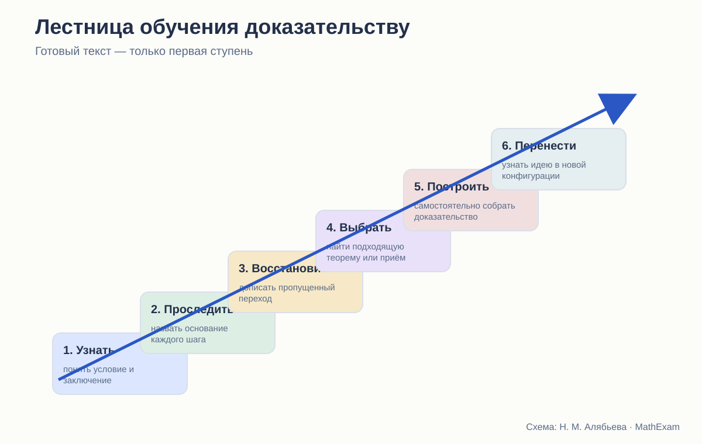
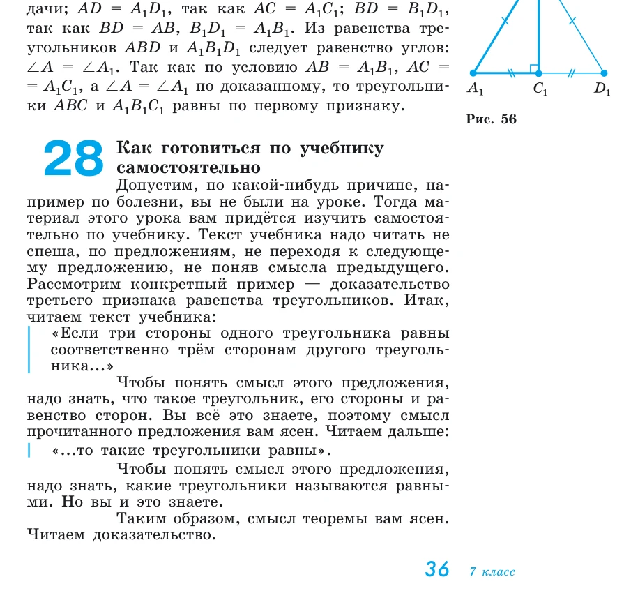
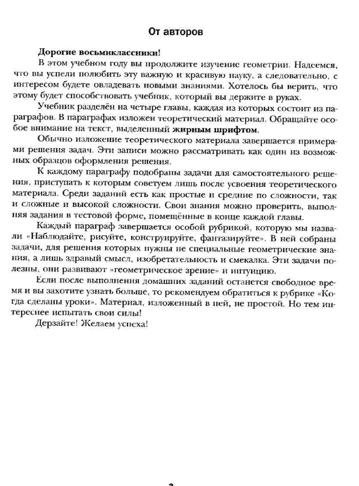

# Как учебники планиметрии учат доказывать

Готовое доказательство, самостоятельное рассуждение и ступени между ними.

<aside class="series-note warning"><h3>Проверка, которую легко забыть</h3>
Правильные доказательства в тексте ещё не означают, что учебник учит доказывать. Нужно посмотреть, какие действия выполняет сам ученик после чтения теоремы.
</aside>

<figure class="series-figure infographic">

<figcaption>Между чтением готового доказательства и самостоятельным открытием лежат промежуточные умения. Если учебник их пропускает, основная нагрузка ложится на учителя.</figcaption>
</figure>

## Прочитать доказательство — не значит научиться доказывать

На уроке бывает знакомая ситуация. Разбираем теорему, проговариваем каждый шаг, ученик кивает и даже может воспроизвести текст. Затем даём похожую задачу — и работа останавливается на первой строке.

Это не обязательно означает, что ученик «ничего не понял». Он мог понять уже построенный маршрут, но не научиться этот маршрут находить.

Доказательство включает несколько разных действий:

- перевести условие в чертёж и обозначения;
- определить, что требуется получить;
- вспомнить подходящий факт;
- заметить недостающий элемент;
- придумать вспомогательное построение;
- выстроить шаги в правильном порядке;
- проверить, что каждый шаг обоснован;
- оформить рассуждение так, чтобы его мог проверить другой человек.

Большинство учебников хорошо показывают готовый результат. Гораздо реже они разлагают сам процесс поиска.

## Что делает Погорелов

У Погорелова есть необычный для школьного учебника пункт «Как готовиться по учебнику самостоятельно». Автор берёт доказательство третьего признака равенства треугольников и предлагает читать его буквально по предложениям: понимать условие, заключение, значение каждого термина, замечать доказательство от противного и проверять, откуда следует переход.

<figure class="series-figure source-fragment">

<figcaption>А. В. Погорелов. Геометрия. 7–9 классы, с. 36. Доказательство рассматривается не как сплошной текст для заучивания, а как последовательность смысловых шагов.</figcaption>
</figure>

Это сильная сторона курса. Ученику демонстрируют метакогнитивное действие: не просто «прочитай ещё раз», а выясни, что означает каждое предложение и на какой результат оно опирается.

Кроме того, контрольные вопросы часто требуют не назвать теорему, а доказать её и указать использованные аксиомы. Так формируется привычка видеть за текстом структуру.

Но есть и ограничение. Анализ уже готового доказательства — только одна ступень. Ученик учится разбирать построенный маршрут, но поиск идеи всё равно остаётся трудным. Задачи после параграфа нередко требуют довольно быстро перейти к самостоятельному доказательству.

Погорелов хорошо объясняет, **как проверять доказательство**, но не всегда столь же подробно показывает, **как его находить**.

## Что делает Мерзляк

Авторы Мерзляка прямо говорят в предисловии, что примеры решения можно рассматривать как один из возможных образцов оформления. Задачи маркируются по сложности, отдельно выделяются ключевые задачи, устная и домашняя работа. В углублённой линии различаются окончания доказательств теорем, следствий и лемм.

<figure class="series-figure source-fragment">

<figcaption>А. Г. Мерзляк, В. Б. Полонский, М. С. Якир. Геометрия. 8 класс. Теория завершается примерами решений, после чего предлагаются самостоятельные задачи разных уровней.</figcaption>
</figure>

В этом подходе есть важное достоинство: ученик заранее видит, что задачи неодинаковы. Он может начать с прямого применения, затем переходить к более сложным.

Особенно полезны «ключевые задачи», если их результат действительно используется дальше. Тогда задача становится маленькой леммой и обучает строить теорию не только через параграфы, но и через решение.

Однако маркировка сложности сама по себе не создаёт лестницу. Две задачи могут иметь соседние значки, но требовать совершенно разных идей. Поэтому я смотрю не только на значки, а на переходы:

- повторяет ли первая задача образец;
- меняется ли только число или сама конфигурация;
- появляется ли задача с недостающим шагом;
- приходится ли выбирать признак;
- предлагается ли доказать обратное утверждение;
- возвращается ли ключевая идея позднее без подсказки.

У Мерзляка таких мостиков больше, чем кажется при простом подсчёте номеров, но и здесь отдельные доказательные задачи способны возникать резким скачком.

## Что делает Атанасян

Атанасян обычно строит параграф в привычном формате: определение или теорема, доказательство, иногда разобранная задача, затем вопросы и упражнения. В учебнике много задач на доказательство, а материал организован так, чтобы учитель мог выстроить полноценный урок.

Сильная сторона — относительная компактность. Теоретический текст не подавляет задачу. Ученик быстро переходит к применению.

Но именно из-за компактности большая часть работы по обучению доказательству остаётся у учителя. В тексте редко отдельно разбирается:

- как была найдена вспомогательная линия;
- почему выбран именно этот признак;
- какие неудачные ходы возможны;
- как отличить идею доказательства от его записи.

Если учитель проговаривает это на уроке, учебник работает. При самостоятельной работе слабому ученику часто остаётся либо заучить готовое доказательство, либо смотреть на задачу без точки входа.

## Шесть уровней владения доказательством

Я бы различала следующие уровни.

### 1. Узнавание

Ученик понимает, какая теорема сформулирована, где условие и где заключение.

### 2. Воспроизведение

Может повторить доказательство по памяти или по плану.

### 3. Обоснование

Способен назвать основание каждого перехода и заметить незаконный шаг.

### 4. Достраивание

Заполняет пропуск, продолжает доказательство, исправляет порядок шагов.

### 5. Самостоятельное построение

Выбирает метод и составляет полную цепочку.

### 6. Перенос

Узнаёт ту же идею в изменённом рисунке, более длинной задаче или новой теме.

Школьные оценки часто смешивают эти уровни. Ученик, который воспроизвёл доказательство теоремы, получает впечатление, что умеет доказывать. Столкнувшись с новой задачей, обнаруживает разрыв.

Стройный курс должен давать задания на каждом уровне.

## Какие задания действительно учат доказывать

Полезная серия после теоремы могла бы выглядеть так:

1. **Найдите ошибку.** В готовом доказательстве один переход опирается только на рисунок.
2. **Назовите основание.** Рядом с каждой строкой укажите определение, аксиому или теорему.
3. **Восстановите пропуск.** Даны начало и конец рассуждения.
4. **Выберите из двух планов.** Один ведёт к цели, другой использует недостаточные данные.
5. **Достройте чертёж.** Нужно провести одну вспомогательную линию.
6. **Докажите по плану.** Идея названа, запись делает ученик.
7. **Докажите самостоятельно.**
8. **Измените условие.** Сохранится ли утверждение? Найдите контрпример.
9. **Решите другим способом.** Сравните синтетический, координатный или векторный подход.

В обычных учебниках встречаются отдельные элементы этой системы, но редко — вся последовательность.

## Формулировка «докажите самостоятельно»

Она может означать две совершенно разные вещи.

В первом случае теорема является почти дословным повторением только что разобранной. Тогда самостоятельное доказательство разумно: ученик переносит знакомый ход.

Во втором случае автор пропускает доказательство содержательно нового результата и просто передаёт его ученику. Это не самостоятельность, а снятая с учебника работа.

Поэтому рядом с таким заданием полезно указывать уровень помощи:

- по аналогии с теоремой …;
- используйте признак …;
- проведите диагональ;
- рассмотрите два случая;
- план не даётся.

Подсказка не обесценивает доказательство. Она точно определяет, какое умение сейчас тренируется.

## Где появляется идея вспомогательного построения

Это одна из самых слабых точек школьной геометрии вообще. В готовом доказательстве внезапно проводится диагональ, параллельная прямая или высота. Учитель знает, что это стандартный приём. Ученик видит магию.

Стройное изложение должно хотя бы иногда раскрывать происхождение конструкции:

- нам нужно получить два треугольника;
- для применения признака не хватает общей стороны;
- проведём диагональ, которая создаст её;
- требуется перенести угол к известной стороне;
- построим параллельную прямую.

После нескольких таких разборов можно сокращать комментарии. Но если причина никогда не называется, ученик обучается читать чужую догадку, а не делать свою.

## Сильные стороны трёх линий

| Автор | Что особенно полезно для доказательной культуры | Чего не хватает |
|---|---|---|
| Погорелов | анализ текста по предложениям, явные ссылки на аксиомы, требование воспроизводить доказательства | более плавной лестницы от разбора к поиску идеи |
| Мерзляк | маркировка сложности, ключевые задачи, образцы оформления, разнообразные рубрики | явного описания размера перехода между задачами |
| Атанасян | компактность, большое число содержательных доказательных упражнений, хорошая связь с обычным уроком | поддержки самостоятельного поиска и разбора стратегии |

## Что я бы изменила в новом курсе

Каждую основную теорему стоит сопровождать не только доказательством, но и коротким блоком:

### Зачем понадобилось построение

Одна-две фразы о цели, а не только команда «проведём».

### Карта доказательства

Три-четыре смысловых шага без технических деталей.

### Основания

Список результатов, которые используются.

### Проверка понимания

Один незаконный вывод, который нужно найти.

### Лестница задач

От прямого применения к переносу.

### Возврат

Через несколько тем — задача, где метод не назван.

Тогда доказательство перестаёт быть красивой витриной и становится учебным действием.

## Вывод

Погорелов лучше других показывает, как читать и проверять доказательство. Мерзляк лучше организует внешнюю навигацию по уровням и типам задач. Атанасян оставляет больше пространства обычной работе учителя и предлагает компактный поток содержательных задач.

Но ни один учебник сам по себе не закрывает весь путь от понимания готового текста до самостоятельного поиска.

Именно этот путь, а не число выученных теорем, я считаю главным показателем того, действительно ли курс учит геометрии.

<section class="source-list">
<h2>Какие издания сравниваются</h2>
<ul><li><a href="https://prosv.ru/product/geometriya-7-9-klass-uchebnik101/" rel="noopener">Л. С. Атанасян и др. «Математика. Геометрия. 7–9 классы. Базовый уровень»</a>. В работе использовано 14-е переработанное издание 2023 года.</li><li><a href="https://prosv.ru/product/geometriya-7-9-klass-uchebnik301/" rel="noopener">А. В. Погорелов. «Геометрия. 7–9 классы»</a>. В работе использовано 11-е стереотипное издание 2022 года.</li><li><a href="https://prosv.ru/catalog/geometriya-merzlyak-a-g-7-9-bazovii/" rel="noopener">А. Г. Мерзляк, В. Б. Полонский, М. С. Якир. «Геометрия. 7, 8, 9 классы»</a>. Сравнивается базовая линия.</li><li><a href="https://prosv.ru/product/geometriya-7-klass-uglublyonnii-uroven-elektronnaya-forma-uchebnika02/" rel="noopener">А. Г. Мерзляк, В. М. Поляков. Углублённая линия «Геометрия. 7–9 классы»</a>. Используется как внутренний контроль: что авторы считают настоящим углублением.</li></ul>

Ссылки ведут на официальные страницы издательства. Фрагменты страниц приведены в объёме, необходимом для методического и критического анализа; права на учебники и их оформление принадлежат авторам и издательствам.

</section>
