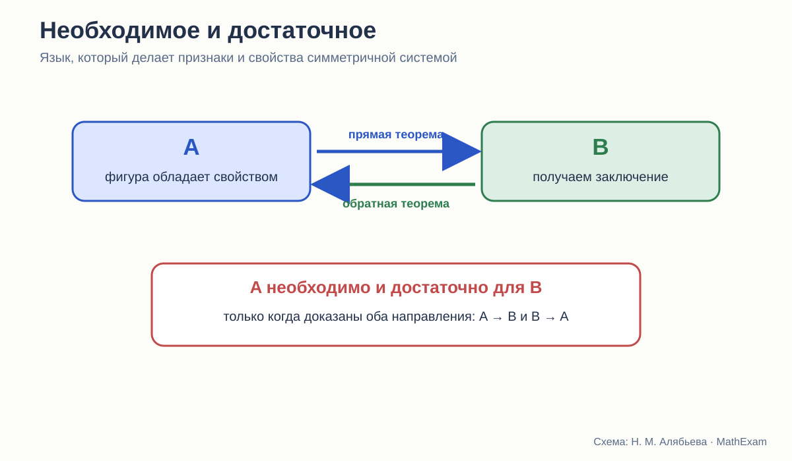
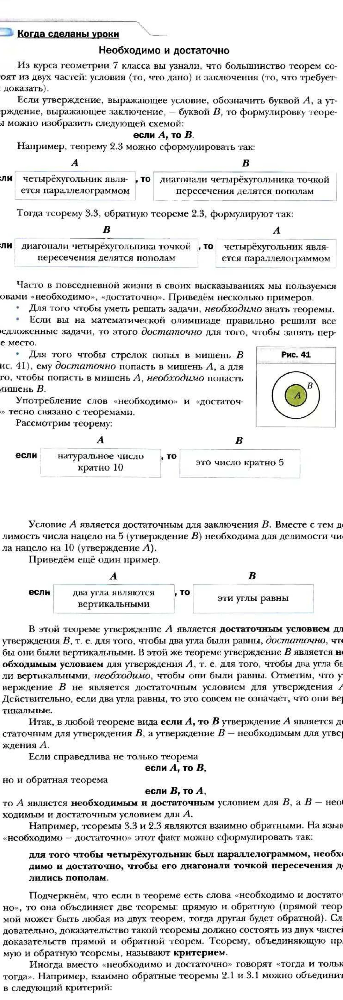

# Необходимо и достаточно

Почему язык прямой и обратной теоремы должен появляться не эпизодом, а работать во всём курсе.

<aside class="series-note good"><h3>Почему это центральная тема, а не логическая вставка</h3>
Большая часть школьной геометрии строится на парах «свойство — признак». Без языка необходимых и достаточных условий ученик запоминает две похожие формулировки, но не видит направления вывода.
</aside>

<figure class="series-figure infographic">

<figcaption>Прямая теорема даёт A → B, обратная — B → A. Только вместе они позволяют сказать «необходимо и достаточно».</figcaption>
</figure>

## Почему ученики путают свойства и признаки

Свойство параллелограмма: его диагонали точкой пересечения делятся пополам.

Признак параллелограмма: если диагонали четырёхугольника точкой пересечения делятся пополам, то этот четырёхугольник — параллелограмм.

Слова почти те же. Для взрослого различие очевидно: поменялось направление рассуждения. Для школьника обе формулировки часто сливаются в одно правило про диагонали.

Отсюда типичная ошибка: ученик знает, что в равнобедренном треугольнике углы при основании равны, и заключает, что любой треугольник с двумя равными углами равнобедренный, не замечая, что использовал обратное утверждение. Оно верно, но требует отдельного доказательства.

Стройный курс должен не просто давать прямые и обратные теоремы, а формировать у ученика привычку спрашивать:

> Что дано? Что из этого следует? Можно ли повернуть стрелку назад?

## Мерзляк: отдельный разговор о логике

В учебнике Мерзляка для 8 класса после свойств и признаков параллелограмма помещён специальный текст «Необходимо и достаточно».

<figure class="series-figure source-fragment">

<figcaption>А. Г. Мерзляк, В. Б. Полонский, М. С. Якир. Геометрия. 8 класс, с. 27–28. Теоремы записываются в виде A → B, затем объясняются обратное утверждение, необходимое и достаточное условия, критерий и выражение «тогда и только тогда».</figcaption>
</figure>

Это один из наиболее удачных фрагментов базовой линии.

Авторы:

- разделяют условие A и заключение B;
- показывают прямую и обратную теоремы;
- объясняют, что A достаточно для B;
- поясняют, что B необходимо для A;
- объединяют взаимно обратные теоремы в критерий;
- переводят это в формулировку «тогда и только тогда».

Особенно полезен контрпример с вертикальными углами. Вертикальность достаточна для равенства углов, но равенство не достаточно для вертикальности. То есть ученик видит не только удачную пару взаимно обратных теорем, но и случай, когда обратное утверждение неверно.

Это и есть настоящий урок логики в контексте геометрии.

## Но работает ли этот язык дальше

Наличие хорошего раздела — половина дела. Вторая половина — дальнейшая жизнь понятий.

После такого текста ученик должен регулярно встречать задания:

- выделить условие и заключение;
- сформулировать обратную теорему;
- определить, верна ли она;
- найти контрпример;
- объединить два утверждения в критерий;
- установить, является ли условие необходимым, достаточным или необходимым и достаточным;
- различить признак и свойство в задаче.

У Мерзляка подобные формулировки встречаются, особенно в углублённой линии, но логический язык не всегда становится постоянной частью каждого следующего параграфа. Он может восприниматься как отдельная интересная рубрика, а не как общий инструмент.

Для нового курса я бы вынесла обозначение стрелок A → B и B → A в поля многих теорем, пока привычка не закрепится.

## Погорелов: обратная теорема появляется раньше

В курсе Погорелова понятие обратной теоремы вводится уже в 7 классе, рядом со свойствами равнобедренного треугольника. Ученик знакомится с тем, что из верности прямой теоремы ещё не следует верность обратной.

Это логически оправдано: признаки равенства, свойства равнобедренного треугольника и признаки параллельности быстро требуют различать направление вывода.

Погорелов чаще заставляет ученика формулировать и доказывать обратные утверждения. В его аксиоматической модели это естественно: теорема — не просто факт, а импликация с условием и заключением.

Сильная сторона такого подхода — раннее включение логики в доказательную практику.

Слабая — язык «необходимо и достаточно» не собран в столь наглядную самостоятельную схему, как у Мерзляка. Ученику приходится постепенно выводить общую идею из нескольких примеров.

## Атанасян: свойства и признаки есть, общий язык менее заметен

У Атанасяна курс насыщен парами:

- свойства и признаки равнобедренного треугольника;
- признаки параллельности;
- свойства параллельных прямых;
- свойства и признаки параллелограмма;
- признаки подобия.

То есть сама логическая структура курса присутствует.

Однако на раннем этапе внимание чаще направлено на содержание конкретной теоремы, а не на универсальную схему A → B. Понятия прямой и обратной теоремы обсуждаются, но не становятся столь заметной сквозной разметкой текста.

Для многих учеников это означает, что «свойство» и «признак» запоминаются как названия разных параграфов. Их логическое отношение приходится отдельно объяснять учителю.

## Три уровня понимания признака

### Уровень 1. Формулировка

Ученик может произнести признак параллелограмма.

### Уровень 2. Направление

Он понимает: по некоторым данным о четырёхугольнике заключаем, что это параллелограмм.

### Уровень 3. Место в системе

Он видит, что признак является обратной теоремой к свойству или связан с ним, знает, доказаны ли оба направления, и может сформулировать критерий.

Именно третий уровень делает знания переносимыми.

## «Тогда и только тогда» нельзя вводить как красивую замену

Формулировка «четырёхугольник является параллелограммом тогда и только тогда, когда его диагонали делятся пополам» компактна. Но она содержит две теоремы.

Если ученик не видит двух направлений, он воспринимает выражение как длинный оборот речи. Поэтому правильная последовательность такая:

1. доказать A → B;
2. сформулировать обратное B → A;
3. проверить, верно ли оно;
4. доказать;
5. только затем объединить в A ↔ B.

Мерзляк это объясняет явно. Эту практику стоит распространить на весь курс.

## Контрпример как часть доказательной культуры

Обратная теорема — удобное место для обучения контрпримеру.

Чтобы опровергнуть утверждение «если углы равны, то они вертикальные», достаточно построить два равных, но не вертикальных угла. Один рисунок опровергает универсальную формулировку.

Это принципиально другой вид рассуждения:

- теорему нельзя доказать несколькими примерами;
- ложное общее утверждение можно опровергнуть одним примером.

В школьном курсе контрпример часто появляется эпизодически. Между тем он помогает понять саму природу математического доказательства.

## Как язык условий помогает решать задачи

Представим задачу: доказать, что четырёхугольник — параллелограмм.

Ученик, который знает только определения, пытается доказать параллельность двух пар сторон.

Ученик, владеющий критериями, строит карту возможных целей:

- доказать равенство противоположных сторон;
- доказать равенство и параллельность одной пары;
- доказать, что диагонали делятся пополам.

Он выбирает условие, к которому ближе данные задачи.

То есть язык необходимых и достаточных условий не украшает теорию. Он организует поиск решения.

## Сравнение трёх курсов

| Курс | Как вводится логическое направление | Сильная сторона | Риск |
|---|---|---|---|
| Атанасян | через конкретные свойства и признаки | содержание не перегружено символикой | ученик может не увидеть общей схемы |
| Погорелов | рано вводится обратная теорема, условие и заключение | логика встроена в дедуктивный курс | обобщение требует высокой самостоятельности |
| Мерзляк | специальный раздел A → B, B → A, «необходимо и достаточно» | наглядная и ясная систематизация | рубрика может остаться локальной, если язык не поддерживать дальше |

## Как я бы встроила эту тему в новый курс

Не отдельным «уроком логики», а повторяющейся разметкой.

Возле каждой пары «свойство — признак» можно помещать небольшую схему:

> параллелограмм → диагонали делятся пополам  
> диагонали делятся пополам → параллелограмм

А затем задавать четыре коротких вопроса:

1. Какое условие достаточно?
2. Какое необходимо?
3. Доказаны ли оба направления?
4. Можно ли сказать «тогда и только тогда»?

Через несколько тем схема станет внутренним инструментом ученика и перестанет требовать отдельной подсказки.

## Итог

Мерзляк предлагает самый ясный самостоятельный фрагмент о необходимых и достаточных условиях. Погорелов раньше включает обратную теорему в ткань курса. Атанасян даёт богатый материал свойств и признаков, но общий логический каркас меньше вынесен на поверхность.

Наиболее стройный вариант должен соединить:

- раннее различение прямого и обратного утверждения;
- наглядную схему A → B;
- постоянное применение языка в задачах;
- контрпримеры;
- переход от двух теорем к критерию.

Тогда «признак» перестанет быть названием параграфа и станет способом думать.

<section class="source-list">
<h2>Какие издания сравниваются</h2>
<ul><li><a href="https://prosv.ru/product/geometriya-7-9-klass-uchebnik101/" rel="noopener">Л. С. Атанасян и др. «Математика. Геометрия. 7–9 классы. Базовый уровень»</a>. В работе использовано 14-е переработанное издание 2023 года.</li><li><a href="https://prosv.ru/product/geometriya-7-9-klass-uchebnik301/" rel="noopener">А. В. Погорелов. «Геометрия. 7–9 классы»</a>. В работе использовано 11-е стереотипное издание 2022 года.</li><li><a href="https://prosv.ru/catalog/geometriya-merzlyak-a-g-7-9-bazovii/" rel="noopener">А. Г. Мерзляк, В. Б. Полонский, М. С. Якир. «Геометрия. 7, 8, 9 классы»</a>. Сравнивается базовая линия.</li></ul>

Ссылки ведут на официальные страницы издательства. Фрагменты страниц приведены в объёме, необходимом для методического и критического анализа; права на учебники и их оформление принадлежат авторам и издательствам.

</section>
