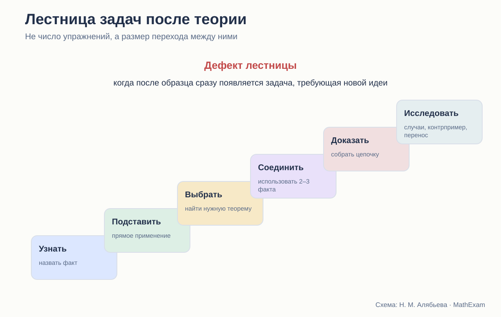
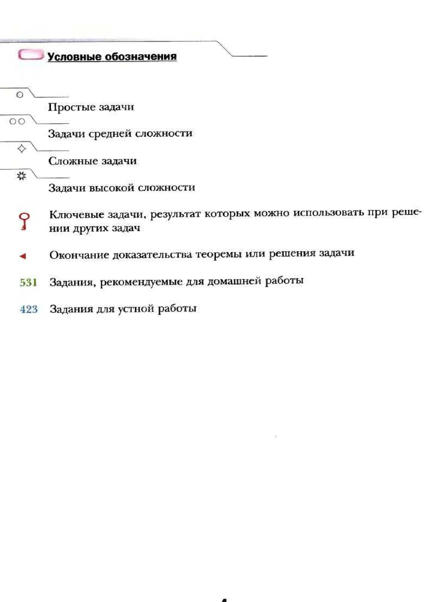

# Как теория превращается в умение

Сравнение систем задач: уровни, ключевые задачи, практические работы и перенос.

<aside class="series-note good"><h3>Что я считаю системой задач</h3>
Не просто набор номеров после параграфа, а запланированный путь: первичное действие, закрепление, выбор метода, доказательство, перенос и возвращение к теме позже.
</aside>

<figure class="series-figure infographic">

<figcaption>Качество практики определяется не количеством упражнений, а тем, насколько посильны переходы между разными видами действия.</figcaption>
</figure>

## Почему много задач может быть недостаточно

Учебник геометрии редко страдает от полного отсутствия упражнений. Проблема чаще в другом: задачи идут, но не образуют учебного маршрута.

После доказательства теоремы ученик получает несколько прямых заданий, а затем — номер со звёздочкой, где нужно придумать новую конструкцию. Между ними может не быть ничего. Учителю приходится самостоятельно создавать недостающие ступени.

Поэтому я не считаю систему задач по общему числу номеров. Для каждой темы важнее выяснить:

- какое действие требуется в первой задаче;
- когда исчезает прямая подсказка;
- когда меняется рисунок;
- когда нужно выбрать теорему;
- когда появляется доказательство;
- когда требуется новая идея;
- возвращается ли тема после окончания параграфа.

## Атанасян: плотный традиционный задачник внутри учебника

У Атанасяна после теоретического материала обычно идут практические задания, затем основной набор задач, дополнительные задачи и вопросы для повторения.

Эта система хорошо знакома российскому учителю. В ней достаточно материала для обычного урока: построить, измерить, вычислить, доказать. Задачи компактны, чертежи не перегружают страницу, многие номера легко выбирать для классной и домашней работы.

Сильная сторона — содержательная плотность. Один учебник можно использовать и как источник теории, и как задачник.

Но уровни помощи часто не маркированы. Учитель сам определяет:

- какая задача является первичной;
- какая требует новой идеи;
- где ученик может работать один;
- где нужен предварительный разбор;
- какие номера образуют серию, а какие стоят особняком.

Для опытного педагога это свобода. Для начинающего учителя или самостоятельного ученика — дополнительная неопределённость.

### Практика как продолжение объяснения

В удачных местах задания буквально продолжают параграф. После введения наложения предлагается сравнить фигуры, после измерения — выполнить построения и вычисления, после признака равенства — доказать свойства конкретной конфигурации.

Но переход к самостоятельному доказательству нередко происходит быстрее, чем формируется навык выбора метода. Учитель вынужден вставлять промежуточные вопросы и более простые аналоги.

## Погорелов: задачи после завершённого теоретического блока

У Погорелова структура строже: параграф содержит последовательную теорию, контрольные вопросы, затем общий блок задач. Вопросы проверяют не только определения, но и доказательства теорем.

Такая организация подчёркивает дедуктивность. Сначала ученик должен восстановить систему фактов, затем применять её.

Сильная сторона — задачи не оторваны от доказательной культуры. Даже контрольный вопрос может требовать назвать аксиомы или доказать утверждение. Встречаются построения, доказательства от противного, задачи на геометрические места.

Но для слабого ученика блок задач выглядит менее навигационно. Он не всегда видит, какие номера являются входными, а какие требуют длинной цепочки.

Погорелов как будто предполагает, что маршрут задаёт учитель: учебник предоставляет качественный материал, а педагог дозирует его.

## Мерзляк: явная разметка сложности и назначения

У Мерзляка система задач заметнее всего оформлена внешне. В предисловии объясняются значки простых, средних, сложных и высоких по уровню задач, ключевых задач, устной и домашней работы. Теоретический материал обычно завершается примерами решения.

<figure class="series-figure source-fragment">

<figcaption>А. Г. Мерзляк, В. Б. Полонский, М. С. Якир. Геометрия. 8 класс. Читатель заранее видит предполагаемую сложность, ключевые задачи и рекомендуемый формат работы.</figcaption>
</figure>

Это облегчает выбор. Ученик понимает, что трудность растёт не случайно. Учитель быстрее собирает домашнюю работу для разного уровня.

Кроме того, имеются рубрики:

- «Практические задания»;
- «Упражнения для повторения»;
- «Наблюдайте, рисуйте, конструируйте, фантазируйте»;
- «Когда сделаны уроки»;
- тестовые блоки в более новых изданиях;
- проектные и компьютерные задания в 9 классе.

Структура действительно богаче обычного списка номеров.

### Значок не заменяет анализа шага

Сложная задача может быть трудна по разным причинам:

- длинные вычисления;
- непривычный чертёж;
- необходимость вспомогательной линии;
- соединение нескольких тем;
- отсутствие известного алгоритма;
- требование доказать существование или единственность.

Один значок не сообщает, какое именно затруднение ожидается. Поэтому учителю всё равно нужно читать задачи как систему действий.

## Ключевая задача: особенно удачная идея

У Мерзляка специальным знаком отмечаются задачи, результат которых можно использовать при решении других задач.

Это важный шаг к математической культуре. Ученик видит, что задача может стать инструментом, почти маленькой теоремой.

Но у ключевой задачи должна быть дальнейшая судьба. Я проверяю:

1. Используется ли её результат в последующих номерах?
2. Возвращается ли он через несколько параграфов?
3. Умеет ли ученик узнать метод в другом рисунке?
4. Объяснено ли, почему задача считается ключевой?
5. Требуется ли позже воспроизвести доказательство или только помнить формулу?

Если результат отмечен ключом, но больше нигде не нужен, значок остаётся декоративным.

## Какие типы задач должны быть в полноценной серии

Для каждой основной теоремы я бы ожидала не один набор, а несколько слоёв.

### 1. Задачи на распознавание

- найдите на рисунке условие теоремы;
- назовите соответствующие элементы;
- определите, можно ли применить признак.

### 2. Прямое применение

- вычислите угол или сторону;
- докажите равенство в стандартной конфигурации;
- используйте только что введённый факт.

### 3. Выбор метода

- теорема не названа;
- на рисунке есть лишние элементы;
- возможны два подхода.

### 4. Построение доказательства

- требуется вспомогательная линия;
- нужно соединить несколько утверждений;
- часть рассуждения надо составить самостоятельно.

### 5. Обратные и исследовательские задачи

- верно ли обратное;
- найдите контрпример;
- сколько решений имеет построение;
- измените условие;
- исследуйте граничный случай.

### 6. Перенос

- знакомая идея в повёрнутой фигуре;
- применение в другой теме;
- использование координат или векторов вместо синтетического доказательства.

Не каждый параграф обязан содержать все шесть слоёв. Но в пределах главы они должны появиться.

## Повторение: самый недооценённый элемент

Задача, решённая сразу после теоремы, проверяет прежде всего кратковременную память. Название параграфа уже подсказывает метод.

Настоящее владение обнаруживается позже, когда:

- тема не названа;
- рядом изучается другое;
- рисунок изменён;
- нужно самостоятельно выбрать старый факт.

У Погорелова повторение встроено через контрольные вопросы и обращение к прежним теоремам в новых доказательствах. У Атанасяна есть вопросы и дополнительные задачи. У Мерзляка явно выделены упражнения для повторения и итоги глав.

Но во всех курсах учителю полезно отдельно строить распределённое повторение. Учебник идёт линейно, а память требует возвратов.

## Построения — отдельная практика, а не украшение

Геометрические построения проверяют совсем другой тип понимания. Ученик должен:

- провести анализ;
- определить, какие точки можно построить;
- выполнить построение;
- доказать, что фигура удовлетворяет условию;
- исследовать число решений.

В Атанасяне и Погорелове построения составляют заметный тематический блок. У Мерзляка они также систематизированы, причём отдельно обсуждаются этапы решения задачи на построение.

Хорошая система не ограничивается циркулем и линейкой. Она учит самому общему навыку: разложить неизвестную конструкцию на доступные шаги и доказать корректность результата.

## Практические работы: опыт или математика

Измерить углы, проверить свойство, вырезать фигуру — полезно. Но практическая работа должна завершаться одним из трёх результатов:

- формулировкой гипотезы;
- объяснением погрешности;
- переходом к доказательству.

Иначе ученик усваивает ложное правило: если измерения совпали, теорема доказана.

Мерзляк чаще выделяет практические задания отдельной рубрикой. Атанасян включает их в общий поток. Погорелов использует практические сюжеты и построения, но сильнее тяготеет к теоретическому обоснованию.

## Дифференциация без изоляции

Маркировка уровней помогает, но есть риск: слабому ученику дают только простые вычислительные задачи, а доказательство навсегда оставляют сильным.

Это неправильная дифференциация. Слабому ученику тоже нужна доказательная работа, только с меньшим шагом:

- выбрать основание из двух вариантов;
- расставить строки;
- заполнить пропуск;
- доказать по плану;
- работать с одним новым элементом за раз.

Углубление должно менять степень самостоятельности и сложность связей, а не лишать базовую группу сути геометрии.

## Сравнение систем

| Курс | Сильная сторона практики | Что чаще должен добавлять учитель |
|---|---|---|
| Атанасян | большой компактный набор содержательных задач | разметку уровней и промежуточные ступени |
| Погорелов | связь задач с аксиоматикой и доказательствами | дозирование и входные упражнения |
| Мерзляк | явная дифференциация, ключевые и практические задачи | анализ характера трудности и распределённое повторение |

## Какой должна быть цифровая надстройка

Интерактивный тренажёр может взять на себя те ступени, которые неудобно многократно отрабатывать в печатном учебнике:

- распознавание условия теоремы на разных рисунках;
- выбор допустимого основания;
- сборка доказательства из строк;
- поиск незаконного шага;
- изменение положения фигуры;
- интервальное возвращение к старым темам.

Но тренажёр не должен превращать доказательство в угадывание кнопки. После интерактивной опоры ученик всё равно должен написать связное рассуждение сам.

## Вывод

У Атанасяна сильный и ёмкий задачный материал, но маршрут чаще создаёт учитель. Погорелов связывает практику с дедуктивной системой, хотя вход в задачи может быть резким. Мерзляк лучше других обозначает уровни и назначение заданий, однако значки не гарантируют плавности переходов.

Стройная система задач строится не вокруг вопроса «сколько номеров дать», а вокруг вопроса:

> Какое новое самостоятельное действие ученик сможет выполнить после этой серии — и где оно будет проверено снова?

<section class="source-list">
<h2>Какие издания сравниваются</h2>
<ul><li><a href="https://prosv.ru/product/geometriya-7-9-klass-uchebnik101/" rel="noopener">Л. С. Атанасян и др. «Математика. Геометрия. 7–9 классы. Базовый уровень»</a>. В работе использовано 14-е переработанное издание 2023 года.</li><li><a href="https://prosv.ru/product/geometriya-7-9-klass-uchebnik301/" rel="noopener">А. В. Погорелов. «Геометрия. 7–9 классы»</a>. В работе использовано 11-е стереотипное издание 2022 года.</li><li><a href="https://prosv.ru/catalog/geometriya-merzlyak-a-g-7-9-bazovii/" rel="noopener">А. Г. Мерзляк, В. Б. Полонский, М. С. Якир. «Геометрия. 7, 8, 9 классы»</a>. Сравнивается базовая линия.</li><li><a href="https://prosv.ru/product/geometriya-7-klass-uglublyonnii-uroven-elektronnaya-forma-uchebnika02/" rel="noopener">А. Г. Мерзляк, В. М. Поляков. Углублённая линия «Геометрия. 7–9 классы»</a>. Используется как внутренний контроль: что авторы считают настоящим углублением.</li></ul>

Ссылки ведут на официальные страницы издательства. Фрагменты страниц приведены в объёме, необходимом для методического и критического анализа; права на учебники и их оформление принадлежат авторам и издательствам.

</section>
