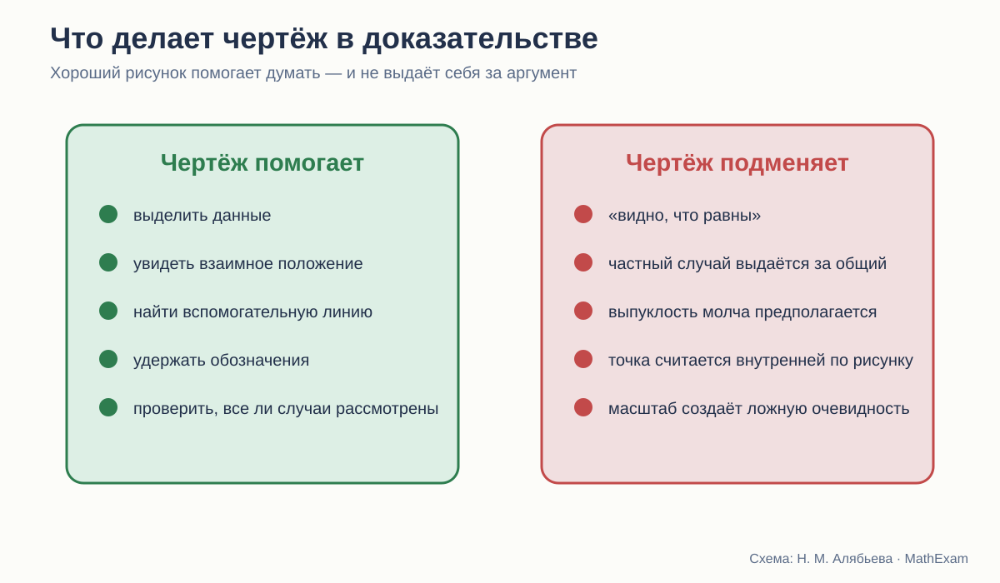

# Чертёж: помощник или ложная очевидность

Что можно увидеть на рисунке и что всё равно требуется доказать.

<aside class="series-note warning"><h3>Правило, которое стоит произносить вслух</h3>
Чертёж может подсказать, что доказывать и как доказывать. Но факт, который только выглядит верным на рисунке, ещё не вошёл в доказательство.
</aside>

<figure class="series-figure infographic">

<figcaption>Один и тот же рисунок способен быть языком задачи или источником незаконной посылки.</figcaption>
</figure>

## Почему геометрия без рисунка почти невозможна

Чертёж в геометрии выполняет сразу несколько функций.

Он заменяет длинное словесное описание взаимного положения точек. Помогает держать в памяти обозначения. Позволяет заметить равные треугольники, продолжить сторону, провести диагональ, увидеть возможную симметрию.

Поэтому совет «не смотрите на рисунок» бессмысленен. Смотреть нужно. Вопрос — **что именно мы имеем право из него взять**.

Если в условии сказано, что AB = AC, это можно отметить чёрточками и использовать. Если на рисунке стороны просто выглядят равными, использовать равенство нельзя.

Если точка D по условию лежит внутри треугольника, рисунок помогает увидеть конфигурацию. Если условие этого не говорит, положение D нельзя считать внутренним только потому, что художник так нарисовал.

## Погорелов формулирует границу прямо

В начале курса Погорелов пишет: разрешается пользоваться чертежом как геометрической записью того, что выражено словами, но нельзя использовать свойства, видимые на чертеже, если они не следуют из аксиом или доказанных теорем.

Это одна из самых важных фраз всего учебника.

Она отделяет две функции:

- чертёж **записывает** известное;
- доказательство **получает** новое.

<figure class="series-figure source-fragment">

<figcaption>А. В. Погорелов. Геометрия. 7–9 классы, с. 15. Автор специально запрещает ссылаться на свойства, которые лишь кажутся очевидными по рисунку.</figcaption>
</figure>

У Атанасяна и Мерзляка то же правило реализуется в практике, но столь жёсткая формулировка вынесена на поверхность меньше. Учителю полезно проговорить её независимо от выбранного учебника.

## Пять типичных ловушек рисунка

### 1. Равенство по внешнему виду

Ученик видит две похожие стороны или два угла и пишет, что они равны. Особенно часто это происходит в аккуратных симметричных чертежах.

Лекарство простое: каждое равенство должно иметь источник.

- дано;
- следует из определения;
- вертикальные углы;
- стороны равных треугольников;
- радиусы одной окружности;
- доказано ранее.

Полезно просить ученика ставить рядом короткую помету.

### 2. Частный случай вместо общего

Теорема формулируется для произвольного треугольника, а на рисунке изображён почти равнобедренный. Или речь идёт о четырёхугольнике, а рисунок похож на параллелограмм.

Даже если доказательство формально правильно, рисунок может направить мысль по слишком узкому пути и скрыть необходимые случаи.

### 3. Точка «очевидно» лежит внутри

Во многих задачах взаимное положение точки принципиально. Если точка может лежать на стороне, внутри или вне фигуры, доказательство должно либо охватить все случаи, либо условие обязано ограничить положение.

Школьные рисунки часто показывают только самый удобный случай. Ученик привыкает не проверять геометрию положения.

### 4. Чертёж в масштабе

Угол выглядит острым, длина — большей, прямые — почти параллельными. Но геометрический рисунок не обязан быть выполнен в масштабе.

Особенно опасны задачи «на доказательство», где картинка заранее показывает ответ. Ученик угадывает утверждение и затем подбирает формальные слова, не анализируя условие.

### 5. Ориентация как скрытая подсказка

Признак равенства легко узнаётся, пока треугольники стоят одинаково. После поворота или зеркального отражения соответствующие элементы теряются.

Если все упражнения используют одну ориентацию, ученик изучает шаблон картинки, а не математическую структуру.

## Как авторы используют рисунок

### Атанасян

Рисунки компактны и обычно тесно связаны с текстом доказательства. Они хорошо поддерживают обычный урок: учитель быстро переносит схему на доску, ученик — в тетрадь.

Вместе с тем раннее наложение и мысленное перегибание делают рисунок частью интуитивного аргумента. Здесь особенно важно различать: картинка объясняет преобразование, но математическое право на преобразование должно быть задано отдельно.

### Погорелов

Чертёж чаще встроен в дедуктивное рассуждение. Автор проговаривает порядок точек, принадлежность полуплоскости, необходимость и единственность построения.

Это снижает риск брать свойства «на глаз». Но насыщенные формальные описания могут затруднять первичное восприятие конфигурации.

### Мерзляк

Рисунков много, они разнообразнее оформлены, встречаются фотографии, практические схемы, невыпуклые фигуры и специальные рубрики «Наблюдайте, рисуйте, конструируйте, фантазируйте».

Это помогает бороться с шаблонным образом фигуры. Например, четырёхугольник показывается не только выпуклым и «красивым». Однако яркая визуальная среда требует дисциплины: ученик должен понимать, какая часть изображения является условием, а какая — иллюстрацией.

## Чертёж как запись условия

Полезно учить ребёнка строить рисунок в два прохода.

### Первый проход: только структура

- точки;
- прямые;
- принадлежность;
- взаимное положение;
- основные обозначения.

### Второй проход: данные

- равные отрезки;
- равные углы;
- параллельность;
- перпендикулярность;
- середины;
- окружности и радиусы.

Так ученик видит, что отметка на чертеже появляется не потому, что «так похоже», а потому, что за ней стоит условие или доказанный факт.

## Чертёж как инструмент поиска

После записи данных можно задавать вопросы:

- Какие треугольники уже видны?
- Какого элемента не хватает для признака?
- Можно ли получить общую сторону?
- Где появятся вертикальные или накрест лежащие углы?
- Какая линия свяжет условие с заключением?
- Есть ли симметрия или параллельный перенос?
- Какие альтернативные положения точки возможны?

Это превращает рисунок из картинки в рабочее поле.

## Когда нужен второй рисунок

Для многих теорем одного стандартного изображения недостаточно.

Стоит показывать:

- треугольник после поворота;
- зеркальный вариант;
- точку на продолжении стороны;
- тупоугольную конфигурацию;
- невыпуклый многоугольник;
- граничный случай;
- рисунок, намеренно выполненный не в масштабе.

Второй рисунок часто даёт больше понимания, чем ещё пять однотипных задач.

## Динамическая геометрия: сильный помощник и новая опасность

Интерактивная модель позволяет двигать точки и видеть, что свойство сохраняется. Это великолепный способ обнаружить инвариант и проверить, не зависит ли идея от частного положения.

Но перетаскивание точки не доказывает теорему. Оно проверяет множество частных случаев — пусть даже очень большое.

Правильная последовательность:

1. исследовать динамическую модель;
2. сформулировать гипотезу;
3. определить, какие величины сохраняются;
4. доказать утверждение;
5. вернуться к модели и объяснить наблюдаемое.

## Как проверять качество учебного рисунка

Я использую такие вопросы:

| Вопрос | Что он выявляет |
|---|---|
| Все ли отмеченные свойства даны или доказаны? | отсутствие визуальных «подсказок без основания» |
| Изображён ли только частный случай? | риск неполного доказательства |
| Можно ли повернуть рисунок и сохранить узнаваемость идеи? | понимание структуры |
| Видны ли линии и подписи без перегрузки? | читаемость |
| Соответствует ли порядок обозначений тексту? | возможность следить за доказательством |
| Нужен ли второй рисунок для другого случая? | полнота |
| Может ли ученик построить схему сам? | учебная самостоятельность |

## Полезное упражнение: намеренно плохой чертёж

Иногда стоит дать рисунок, который не похож на ответ:

- равные отрезки нарисованы разной длины;
- прямой угол выглядит не совсем прямым;
- равнобедренный треугольник повёрнут;
- точка находится на продолжении стороны;
- параллельные прямые визуально слегка сходятся.

Задача ученика — опираться только на обозначения и условие.

Это быстро обнаруживает, понимает ли он теорему или узнаёт знакомый силуэт.

## Что сохранить из трёх линий

От Погорелова — прямое правило: рисунок не создаёт новых фактов.

От Атанасяна — компактную связь текста и схемы, удобную для обычной тетради.

От Мерзляка — разнообразие положений, невыпуклые фигуры, практические и исследовательские рисунки.

В новом курсе к этому стоит добавить систематическое изменение ориентации и задания на поиск лишних визуальных предположений.

## Вывод

Геометрия действительно думает рисунками. Но доказывает она не рисунком.

Стройный курс не пытается убрать наглядность. Он учит пользоваться ею честно:

> рисунок помогает увидеть возможную связь;  
> условие сообщает, что известно;  
> доказательство объясняет, почему вывод неизбежен.

<section class="source-list">
<h2>Какие издания сравниваются</h2>
<ul><li><a href="https://prosv.ru/product/geometriya-7-9-klass-uchebnik101/" rel="noopener">Л. С. Атанасян и др. «Математика. Геометрия. 7–9 классы. Базовый уровень»</a>. В работе использовано 14-е переработанное издание 2023 года.</li><li><a href="https://prosv.ru/product/geometriya-7-9-klass-uchebnik301/" rel="noopener">А. В. Погорелов. «Геометрия. 7–9 классы»</a>. В работе использовано 11-е стереотипное издание 2022 года.</li><li><a href="https://prosv.ru/catalog/geometriya-merzlyak-a-g-7-9-bazovii/" rel="noopener">А. Г. Мерзляк, В. Б. Полонский, М. С. Якир. «Геометрия. 7, 8, 9 классы»</a>. Сравнивается базовая линия.</li></ul>

Ссылки ведут на официальные страницы издательства. Фрагменты страниц приведены в объёме, необходимом для методического и критического анализа; права на учебники и их оформление принадлежат авторам и издательствам.

</section>
