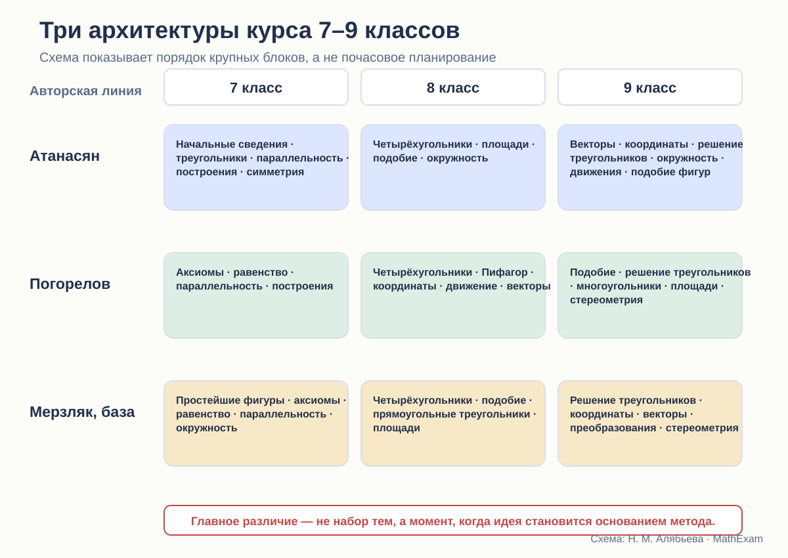

# Три маршрута через 7–9 классы

Макроструктура курсов Атанасяна, Погорелова и Мерзляка.

<aside class="series-note good"><h3>Макроструктура имеет последствия</h3>
Одна и та же тема меняет смысл в зависимости от места. Движение можно изучать как основание равенства, как обобщение уже известных фактов или как отдельную главу в конце курса.
</aside>

<figure class="series-figure infographic">

<figcaption>Диаграмма показывает крупные блоки в рассматриваемых изданиях. Она помогает увидеть, какие методы появляются рано, а какие формализуют уже накопленный материал лишь в конце.</figcaption>
</figure>

## Оглавление — это логическая гипотеза автора

Когда автор ставит площади перед подобием или после него, вводит координаты в 8 или 9 классе, помещает движения до векторов или почти в финале курса, он делает не технический выбор.

Он отвечает на вопросы:

- что считать опорной идеей;
- какой уровень абстракции доступен ученику;
- чем доказывать последующие теоремы;
- когда переходить от синтетической геометрии к новым методам;
- какие связи ученик успеет увидеть.

Содержание трёх учебников во многом совпадает. Архитектура — существенно различается.

## Атанасян: треугольник как несущая конструкция

Курс Атанасяна развивается по знакомой школьной логике.

### 7 класс

Начальные сведения о прямой, отрезке, угле и измерении быстро переходят к треугольникам и признакам их равенства. Затем следуют параллельные прямые, соотношения между сторонами и углами треугольника, прямоугольные треугольники, построения, геометрические места точек и симметричные фигуры.

Уже в первый год треугольник становится главным рабочим инструментом. Через равенство треугольников доказываются свойства других фигур и конфигураций.

### 8 класс

Четырёхугольники, площади, подобные треугольники и окружность образуют классический средний слой курса. Сначала развиваются свойства фигур, затем метрические соотношения и подобие, после чего теория применяется к окружности.

### 9 класс

Появляются векторы, координатный метод, соотношения между сторонами и углами треугольника, скалярное произведение, длина окружности и площадь круга. После этого вводятся преобразования плоскости, движения и преобразования подобия.

В рассматриваемом издании отдельного блока начальных сведений по стереометрии нет.

### Что даёт такой порядок

Курс долго остаётся синтетическим. Ученик успевает привыкнуть доказывать через равенство и подобие треугольников, свойства параллельных прямых и окружности.

Но движения появляются тогда, когда понятие равенства уже много лет используется через наложение. Новая теория скорее переосмысливает прежнюю практику, чем служит её первоначальным основанием.

Координаты и векторы также вводятся после большого массива синтетической геометрии. Это хорошо для формирования классической школы доказательства, но снижает число тем, где новые методы успевают стать привычными.

## Погорелов: ранняя аксиоматика и преобразования как каркас

### 7 класс

Первый большой параграф задаёт основные свойства простейших фигур, включая порядок точек, полуплоскости, откладывание отрезков и углов, существование равного треугольника и параллельность.

Затем идут смежные и вертикальные углы, признаки равенства треугольников, параллельность и сумма углов, геометрические построения и метод геометрических мест.

С самого начала курс строится как дедуктивная система.

### 8 класс

После четырёхугольников изучаются теорема Пифагора и тригонометрические отношения, затем декартовы координаты, движения и векторы.

Это принципиальный выбор. Преобразования и аналитический язык появляются не в финале, а в середине трёхлетнего курса.

### 9 класс

Подобие определяется через преобразование подобия. Затем следуют решение треугольников, многоугольники, длина окружности, радианная мера, площади и элементы стереометрии.

### Что даёт такой порядок

Погорелов строит более единую систему преобразований:

- в 8 классе движение формализует равенство фигур;
- в 9 классе преобразование подобия становится основанием подобия;
- координаты и векторы уже доступны как дополнительные языки.

Это концептуально стройно. Равенство и подобие оказываются частями общей теории преобразований.

Однако некоторые привычные школьные темы сдвигаются. Площади систематически собираются ближе к концу 9 класса, тогда как в других линиях они активно работают уже в 8-м. Учителю нужно учитывать, что задачная практика и экзаменационные требования могут потребовать более раннего метрического материала.

## Мерзляк: модульная и явно организованная линия

### 7 класс

Простейшие фигуры, измерение, смежные и вертикальные углы, отдельный разговор об аксиомах, равенство треугольников, параллельные прямые, сумма углов, окружность и построения.

Старт сочетает привычный наглядный материал с попыткой явно объяснить устройство теории.

### 8 класс

Четырёхугольники, подобные треугольники, решение прямоугольных треугольников, многоугольники и площади.

В отличие от Атанасяна подобие появляется до большого метрического блока. Это позволяет использовать его для вывода и решения ряда задач.

### 9 класс

Решение произвольных треугольников, правильные многоугольники, декартовы координаты, векторы, геометрические преобразования и начальные сведения по стереометрии.

Главы имеют заметные входы, итоги, тестовые задания и дополнительные рубрики. Архитектура ощущается как последовательность учебных модулей.

### Что даёт такой порядок

Мерзляк удобен для поэтапного освоения и контроля. Каждый год имеет относительно самостоятельную структуру.

Движения, как и у Атанасяна, формализуются поздно. Зато глава о преобразованиях в 9 классе включает параллельный перенос, осевую и центральную симметрию, поворот, гомотетию и подобие фигур — то есть собирает несколько разрозненных идей в один блок.

Координаты и векторы идут подряд, что облегчает переход между аналитическим и векторным языком.

## Пять ключевых расхождений

### 1. Когда появляется аксиоматический каркас

- Погорелов строит его сразу.
- Мерзляк сначала показывает несколько доказательств, затем объясняет необходимость аксиом.
- Атанасян вводит правила менее отдельным блоком, опираясь на знакомые действия и свойства.

Это влияет на весь стиль курса: от явной дедукции до постепенного перехода.

### 2. Когда формализуется движение

- Погорелов — в 8 классе.
- Атанасян — в конце 9 класса.
- Мерзляк — в 9 классе.

Поэтому у Погорелова движение успевает стать методом, а в двух других линиях прежде всего закрывает и обобщает прежние представления.

### 3. Когда изучается подобие

- Атанасян и Мерзляк — в 8 классе как важный инструмент.
- Погорелов — в 9 классе после движений, через преобразование подобия.

Первый вариант раньше даёт мощный задачный метод. Второй сильнее связывает понятие с общей теорией преобразований.

### 4. Когда вводятся координаты

- Погорелов — в 8 классе.
- Атанасян и Мерзляк — в 9 классе.

Раннее введение увеличивает время на освоение аналитического метода. Позднее сохраняет более долгий синтетический этап.

### 5. Есть ли стереометрическое продолжение

В рассматриваемых изданиях Погорелова и Мерзляка есть начальные сведения по стереометрии. В выбранном издании Атанасяна 2023 года отдельной главы по стереометрии нет.

Это не делает один курс автоматически полнее другого: объём учебного времени ограничен. Но переход к геометрии 10 класса получается разным.

## Различие не только в годах, но и в связях

Можно поставить две темы рядом и всё равно не связать их.

Например, движения могут быть изучены отдельным параграфом, после которого ученик решает несколько задач на перенос и симметрию, а затем больше к ним не возвращается.

Настоящая интеграция проявляется, когда:

- движение объясняет равенство фигур;
- симметрия используется в доказательстве;
- координаты дают альтернативный способ решения;
- векторный метод возвращается в задачах на окружность или многоугольники;
- подобие связывается с гомотетией;
- стереометрические модели опираются на уже известные плоские свойства.

По этому критерию Погорелов наиболее последовательно превращает движения и преобразования в часть теоретического каркаса. Мерзляк сильнее организует переходы внутри модулей. Атанасян сохраняет устойчивую линию синтетической геометрии и позднее добавляет новые языки.

## Какой порядок тем оптимален

Единственного ответа нет. Нужно выбрать приоритет.

### Если главное — ранняя дедуктивная система

Ближе маршрут Погорелова.

### Если главное — классическая школьная практика и постепенное усложнение

Ближе Атанасян.

### Если важны учебная навигация и модульность

Сильнее выглядит Мерзляк.

Но новый курс не обязан повторять один из маршрутов.

Я бы предложила:

1. в 7 классе — явный, но небольшой аксиоматический договор;
2. равенство треугольников — с наглядной идеей и строгим основанием;
3. раннее введение симметрий как методов, а не только красивых фигур;
4. подобие в 8 классе;
5. координаты — в конце 8 класса, чтобы они успели работать;
6. движения — не изолированной главой, а сквозной линией;
7. векторы — после координат, с постоянным сравнением методов;
8. короткий, но содержательный мост к стереометрии.

## Что показывает макроаудит

Атанасян, Погорелов и Мерзляк предлагают не три оформления одной программы, а три разные концепции.

**Атанасян** строит курс вокруг классической синтетической геометрии треугольника.

**Погорелов** строит дедуктивную систему, в которой преобразования постепенно становятся объединяющим языком.

**Мерзляк** организует материал как последовательность чётко размеченных модулей с развитой задачной навигацией.

Выбор учебника поэтому определяет не только порядок параграфов. Он определяет, какой образ геометрии получит ученик: набор классических теорем, строгую систему преобразований или хорошо организованную учебную траекторию.

<section class="source-list">
<h2>Какие издания сравниваются</h2>
<ul><li><a href="https://prosv.ru/product/geometriya-7-9-klass-uchebnik101/" rel="noopener">Л. С. Атанасян и др. «Математика. Геометрия. 7–9 классы. Базовый уровень»</a>. В работе использовано 14-е переработанное издание 2023 года.</li><li><a href="https://prosv.ru/product/geometriya-7-9-klass-uchebnik301/" rel="noopener">А. В. Погорелов. «Геометрия. 7–9 классы»</a>. В работе использовано 11-е стереотипное издание 2022 года.</li><li><a href="https://prosv.ru/catalog/geometriya-merzlyak-a-g-7-9-bazovii/" rel="noopener">А. Г. Мерзляк, В. Б. Полонский, М. С. Якир. «Геометрия. 7, 8, 9 классы»</a>. Сравнивается базовая линия.</li></ul>

Ссылки ведут на официальные страницы издательства. Фрагменты страниц приведены в объёме, необходимом для методического и критического анализа; права на учебники и их оформление принадлежат авторам и издательствам.

</section>
