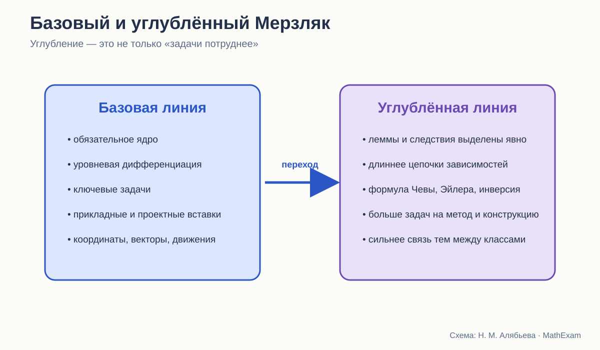

# Базовый и углублённый Мерзляк

Что меняется при настоящем углублении: содержание, методы и длина доказательных цепочек.

<aside class="series-note good"><h3>Зачем в исследовании нужна углублённая линия</h3>
Она служит внутренним контролем. Можно увидеть, что одна и та же авторская школа считает обязательным ядром, а что — содержательным углублением геометрии.
</aside>

<figure class="series-figure infographic">

<figcaption>Углубление проявляется не только в трудности упражнений, но и в составе понятий, длине доказательных цепочек и наборе доступных методов.</figcaption>
</figure>

## Нельзя сравнивать базовый и углублённый учебник как двух соперников

У них разные задачи. Базовый курс должен быть доступен массовой школе и обеспечить общее геометрическое образование. Углублённый — дать более богатую систему фактов и методов ученикам, готовым к высокой нагрузке. Сравнивать здесь имеет смысл два варианта одного курса планиметрии, а не два разных учебника.

Поэтому вопрос не «какой учебник лучше», а другой:

> Что именно авторы добавляют, когда хотят сделать изучение геометрии углублённым?

Ответ многое говорит и о базовой линии. Если в углублённый курс уходит важная логическая связь, можно спросить, не обеднено ли обязательное ядро. Если добавляются только громоздкие вычисления, это не настоящая глубина.

## Что сохраняется в обеих линиях

Базовая линия Мерзляка, Полонского и Якира и углублённая линия Мерзляка и Полякова имеют общую педагогическую манеру:

- главы и параграфы с явной навигацией;
- выделенные определения и важные утверждения;
- примеры решения после теории;
- задачи нескольких уровней;
- ключевые задачи;
- устная и домашняя работа;
- итоговые и дополнительные рубрики;
- внимание к истории и практическим применениям.

То есть углублённый курс не меняет полностью модель учебника. Он увеличивает плотность математической системы.

## Первый признак углубления: больше типов утверждений

В условных обозначениях углублённой линии отдельно отмечены окончания:

- доказательства теоремы;
- доказательства следствия;
- доказательства леммы;
- решения задачи.

Это не просто редакционная деталь. Слово «лемма» показывает ученику, что теория может строиться промежуточными утверждениями, специально подготовленными для более крупного результата.

В базовом курсе такая структура тоже фактически существует, но чаще остаётся внутри текста или ключевых задач. В углублённом она становится видимой частью математического языка.

## Второй признак: расширяется не список фактов, а сеть связей

В углублённом учебнике 9 класса появляются, например:

- тригонометрическая форма теоремы Чевы;
- формула Эйлера для расстояния между центрами вписанной и описанной окружностей;
- более широкий набор формул площадей;
- радикальная ось окружностей;
- более детальная теория преобразований;
- инверсия;
- дополнительные задачи, связывающие преобразования, окружности и построения.

Каждая такая тема ценна не сама по себе. Она соединяет несколько разделов.

Теорема Чевы связывает отношения отрезков, тригонометрию и конкурентность прямых. Радикальная ось объединяет уравнения окружностей и геометрические свойства. Инверсия перестраивает взгляд на окружности и касания.

Настоящее углубление появляется там, где ученик получает новый способ видеть целый класс задач.

## Третий признак: дольше живут доказательные цепочки

В базовом курсе теорема обычно должна быть доступна после ограниченного числа предыдущих фактов. Это разумное требование к нагрузке.

В углублённом курсе допустимы более длинные зависимости:

> определение → лемма → следствие → ключевая задача → основная теорема → применение в другой главе.

Такая цепочка требует большей математической памяти и дисциплины. Зато ученик начинает видеть теорию как сеть, а не череду параграфов.

Углубление здесь состоит не в том, что доказательство длиннее на десять строк. Оно требует удерживать более далёкие связи.

## Четвёртый признак: больше альтернативных методов

Базовая задача часто рассчитана на один ожидаемый способ. В углублённой линии естественно сравнивать:

- синтетическое доказательство;
- координатный метод;
- векторный метод;
- преобразование;
- тригонометрический подход.

Это важнейший признак математической зрелости. Ученик выбирает не только правильную теорему, но и язык решения.

В 9 классе углублённой линии координаты, векторы и преобразования развиты подробнее. За счёт этого одна и та же конфигурация может рассматриваться с нескольких сторон.

## Пятый признак: исследовательская задача становится нормой

В базовом курсе исследовательские и сложные задачи выделены и дозированы. В углублённом чаще появляются вопросы:

- сколько решений имеет построение;
- при каких условиях утверждение верно;
- как изменится результат при ослаблении условия;
- существует ли обратное утверждение;
- можно ли обобщить на n-угольник;
- какие точки или прямые сохраняются при преобразовании.

Такие задачи требуют не применить известную схему, а управлять условием.

## Что не следует отправлять только в углублённый курс

Есть элементы, которые нужны всем ученикам, хотя часто воспринимаются как «повышенный уровень».

### Явное основание доказательства

Понимать, на какую теорему опирается шаг, — не олимпиадное умение.

### Прямая и обратная теорема

Различать свойство и признак должен любой ученик.

### Контрпример

Умение опровергать общее утверждение одним примером входит в сам смысл доказательства.

### Несколько положений одного чертежа

Поворот фигуры не является углублением.

### Задачи с постепенным снятием подсказки

Это средство обучения, а не привилегия сильных.

Если базовый курс оставляет только формулы и прямые вычисления, он перестаёт быть геометрией в полноценном смысле.

## Что действительно можно оставить углублённой линии

- редкие специальные теоремы;
- длинные технические доказательства;
- сложные преобразования;
- развитую теорию инверсии;
- систематическое использование продвинутых формул;
- задачи с несколькими независимыми идеями;
- доказательства, требующие существенной алгебраической техники;
- большие исследовательские проекты.

Граница должна проходить не между «доказывать» и «не доказывать», а между разной глубиной и самостоятельностью доказательства.

## Сравнение организации 9 класса

Базовый учебник 9 класса включает решение треугольников, правильные многоугольники, координаты, векторы, геометрические преобразования и начальные сведения по стереометрии.

Углублённый сохраняет тот же крупный каркас, но расширяет его:

- внутри глав появляются дополнительные теоремы;
- метод координат развивается подробнее;
- преобразования рассматриваются глубже;
- стереометрическая часть богаче;
- в приложениях и задачах больше связующих сюжетов.

Это удачное решение: ученик углублённой группы не оказывается в совершенно другом мире. Он видит ту же карту, но с большим числом дорог.

## Риск углублённого курса: плотность вместо глубины

Большой объём может создать иллюзию качества. Если новые теоремы быстро следуют одна за другой, а задачи требуют лишь подставлять их как готовые инструменты, курс становится энциклопедическим, но не исследовательским.

Поэтому к углублённой линии я применяю дополнительные вопросы:

1. Мотивировано ли появление новой теоремы?
2. Есть ли задача, из которой она естественно вырастает?
3. Используется ли результат дальше?
4. Сравниваются ли разные методы?
5. Есть ли время на самостоятельное открытие?
6. Не вытесняет ли объём повторение?
7. Может ли ученик объяснить, какую новую идею получил, а не только перечислить факты?

## Риск базового курса: чрезмерное упрощение

Противоположная опасность — удалить из базового курса всё, что требует рассуждения.

Тогда остаются:

- определения;
- готовые формулы;
- несколько стандартных доказательств для пересказа;
- вычислительные задачи;
- экзаменационные шаблоны.

Такой курс может быть посильным, но теряет предмет. Геометрия нужна школе именно потому, что учит выводить новое из ограниченного набора условий.

## Как должна выглядеть уровневая модель

Я бы строила не два изолированных курса, а общее ядро с ветвлением.

### Общее обязательное ядро

- точные определения;
- честная система исходных положений;
- основные теоремы с понятными доказательствами;
- задачи на прямое применение;
- задания на восстановление и построение доказательства;
- контрпримеры;
- разные положения чертежа;
- базовые координатный, векторный и преобразовательный методы.

### Углубление

- дополнительные леммы;
- альтернативные доказательства;
- обобщения;
- более длинные цепочки;
- специальные конфигурации;
- исследовательские задачи;
- инверсия и другие расширенные преобразования;
- проекты, связывающие несколько глав.

Тогда сильный ученик движется дальше, не меняя математического языка, а слабый не лишается доказательной сущности предмета.

## Что углублённая линия подсказывает для переработки базовой

Она показывает, где авторы видят естественные связи, которые в базовой книге сокращены.

Например, отдельное выделение лемм и следствий можно использовать и в базовом курсе, но давать их проще. Сравнение методов можно вводить на одной доступной задаче. Идею преобразования можно применять раньше без полной теории.

Углублённый учебник полезен не только для отбора сложного материала. Он помогает увидеть скрытый каркас базового.

## Вывод

В линии Мерзляка углубление в целом понимается содержательно: расширяется язык, добавляются методы, удлиняются логические связи, появляются специальные теоремы и преобразования.

Но лучший вывод для нового курса состоит не в том, чтобы перенести как можно больше тем из углублённого учебника.

Нужно перенести в базовый курс **саму культуру глубины**:

> видеть основания, связывать темы, сравнивать методы, формулировать обратные утверждения и исследовать условие.

А объём специальных фактов уже можно дозировать по уровню.

<section class="source-list">
<h2>Какие издания сравниваются</h2>
<ul><li><a href="https://prosv.ru/product/geometriya-7-9-klass-uchebnik101/" rel="noopener">Л. С. Атанасян и др. «Математика. Геометрия. 7–9 классы. Базовый уровень»</a>. В работе использовано 14-е переработанное издание 2023 года.</li><li><a href="https://prosv.ru/product/geometriya-7-9-klass-uchebnik301/" rel="noopener">А. В. Погорелов. «Геометрия. 7–9 классы»</a>. В работе использовано 11-е стереотипное издание 2022 года.</li><li><a href="https://prosv.ru/catalog/geometriya-merzlyak-a-g-7-9-bazovii/" rel="noopener">А. Г. Мерзляк, В. Б. Полонский, М. С. Якир. «Геометрия. 7, 8, 9 классы»</a>. Сравнивается базовая линия.</li><li><a href="https://prosv.ru/product/geometriya-7-klass-uglublyonnii-uroven-elektronnaya-forma-uchebnika02/" rel="noopener">А. Г. Мерзляк, В. М. Поляков. Углублённая линия «Геометрия. 7–9 классы»</a>. Используется как внутренний контроль: что авторы считают настоящим углублением.</li></ul>

Ссылки ведут на официальные страницы издательства. Фрагменты страниц приведены в объёме, необходимом для методического и критического анализа; права на учебники и их оформление принадлежат авторам и издательствам.

</section>
