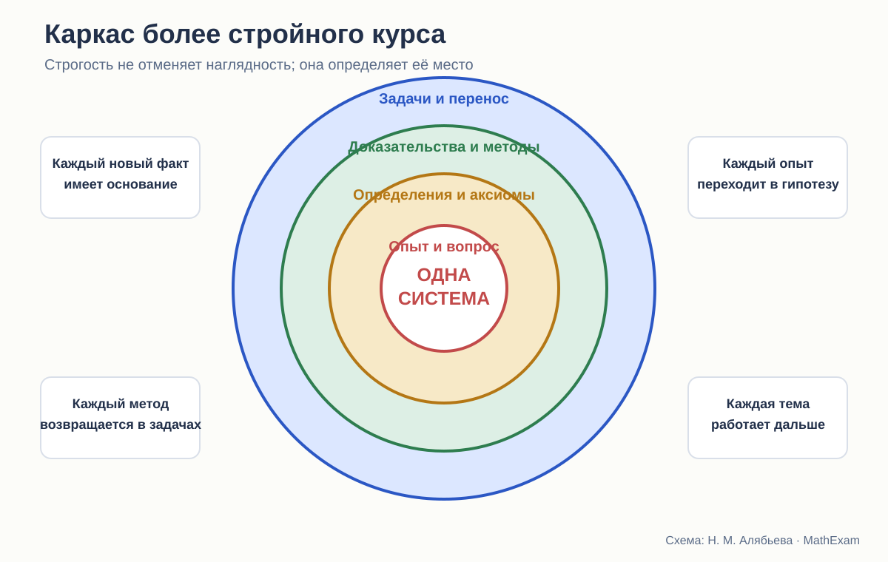

# Как собрать более стройный курс школьной планиметрии

Что стоит сохранить у трёх авторов и какие разрывы придётся устранить.

<aside class="series-note good"><h3>Не «смешать три учебника», а заново выстроить связи</h3>
Механическое соединение сильных фрагментов не даст стройного курса. Нужна единая система оснований, общий язык доказательства и заранее спроектированная лестница задач.
</aside>

<figure class="series-figure infographic">

<figcaption>Опыт, определения и аксиомы, доказательства и задачи должны быть слоями одной системы, а не отдельными блоками, которые случайно встречаются в учебнике.</figcaption>
</figure>

## Что показало сравнение

У трёх авторских линий разные центры тяжести.

**Погорелов** сильнее других предъявляет дедуктивную основу: основные свойства, аксиомы, запрет брать факты только из чертежа, явные зависимости в доказательствах.

**Атанасян** умеет вводить ученика в геометрию через понятные образы, компактные доказательства и классическую систему задач. Его курс хорошо приспособлен к живому школьному уроку.

**Мерзляк** наиболее заметно организует учебное движение: уровни задач, ключевые результаты, практические рубрики, итоги глав, специальный разговор о необходимых и достаточных условиях. Углублённая линия показывает, как тот же каркас расширяется новыми методами и связями.

Новый курс не должен выбирать одного победителя. Но и простое чередование «здесь возьмём Погорелова, здесь Атанасяна» не сработает. Сильные решения должны быть подчинены одной архитектуре.

## Принцип 1. Доказательная честность с первой главы

На старте ученик должен получить короткий и ясный договор.

1. Некоторые понятия мы принимаем исходными.
2. Определение сообщает, что означает новое слово.
3. Несколько исходных свойств принимаются без доказательства.
4. Все остальные общие утверждения доказываются.
5. Рисунок помогает понять условие, но не создаёт новых фактов.
6. Опыт и измерение дают основание для гипотезы, но не заменяют доказательство.

Не нужен длинный перечень аксиом наизусть в первый день. Нужна прозрачность статуса каждого утверждения.

Можно использовать удачную идею Мерзляка: сначала показать, что цепочка доказательств должна где-то начинаться. Затем — точность Погорелова: прямо назвать, чем разрешается пользоваться.

## Принцип 2. Наглядность должна предшествовать формализации, а не подменять её

Перегибание бумаги, калька, динамический чертёж и измерение нужны. Они дают ребёнку геометрическое чувство.

Но каждый опыт следует оформлять в три шага:

> **Наблюдаем.** Что происходит на модели?  
> **Предполагаем.** Какое общее свойство можно сформулировать?  
> **Доказываем.** Из каких определений и исходных фактов оно следует?

После доказательства полезно вернуться к опыту и объяснить, почему модель вела себя именно так.

Так сохраняется сильная сторона Атанасяна и Виленкина, но устраняется логическая двусмысленность.

## Принцип 3. Равенство фигур требует раннего прояснения

Не стоит ждать 9 класса, чтобы впервые объяснить, что физическое наложение — метафора движения без деформации.

В 7 классе достаточно ввести предварительный язык:

- перемещение фигуры не меняет расстояния между её точками;
- фигуры равны, если одну можно совместить с другой таким перемещением;
- подробную теорию движений мы построим позже.

Затем при доказательстве первого признака можно дать два слоя:

1. наглядный — наложение;
2. строгий — существование копии в заданном положении и единственность откладывания сторон и угла.

Это соединит доступность Атанасяна, аксиоматическую прозрачность Погорелова и мотивировку Мерзляка.

## Принцип 4. Каждая теорема должна иметь карту происхождения

Перед доказательством ученик должен понимать, откуда возник вопрос.

Например, первый признак равенства треугольников:

- шесть равенств явно гарантируют равенство;
- можно ли уменьшить число условий;
- двух сторон недостаточно;
- две стороны и угол между ними, вероятно, задают треугольник однозначно.

После такой постановки теорема отвечает на понятную задачу.

Рядом с доказательством полезно давать маленькую карту:

- что дано;
- что хотим доказать;
- какой промежуточный объект нужен;
- какие три ранее изученных факта используются;
- где завершается вывод.

Это не «разжёвывание». Это обучение устройству математического текста.

## Принцип 5. Вспомогательное построение нужно объяснять

Фраза «проведём диагональ» часто скрывает основную идею доказательства.

Новый курс должен несколько раз подробно показывать происхождение построения:

- хотим применить признак равенства — создаём два треугольника;
- не хватает общей стороны — проводим диагональ;
- хотим перенести угол — строим параллельную;
- нужна точка, равноудалённая от концов отрезка — обращаемся к серединному перпендикуляру.

Позднее объяснение можно сокращать. Но ученик уже будет знать, какие вопросы задавать себе.

## Принцип 6. Логика прямой и обратной теоремы должна быть сквозной

Удачный раздел Мерзляка «Необходимо и достаточно» стоит превратить в постоянный инструмент.

Возле свойств и признаков можно использовать стрелки:

- параллелограмм → диагонали делятся пополам;
- диагонали делятся пополам → параллелограмм.

Ученик должен регулярно:

- выделять условие и заключение;
- формулировать обратное;
- проверять его;
- искать контрпример;
- объединять взаимно обратные теоремы в критерий.

Так геометрия одновременно учит логике, не превращая её в отдельный отвлечённый курс.

## Принцип 7. Лестница доказательных задач обязательна для всех

Базовый уровень не должен означать отказ от доказательств.

Для слабого ученика можно уменьшить шаг:

1. выбрать верное основание;
2. расставить строки доказательства;
3. заполнить один пропуск;
4. доказать по плану;
5. выбрать вспомогательную линию;
6. записать полное доказательство;
7. применить идею в другом рисунке.

Сильный ученик проходит те же ступени быстрее и получает дополнительные ветви: альтернативный способ, обобщение, исследование числа решений, контрпример.

Дифференциация должна менять объём помощи, а не сущность предмета.

## Принцип 8. Повторение нужно проектировать по связям, а не по главам

В конце главы полезно повторить формулировки. Но владение проверяется позже.

Каждая основная идея должна возвращаться:

- в другой конфигурации;
- без названия метода;
- в новой теме;
- с изменённой ориентацией рисунка;
- как часть более длинного доказательства;
- в сравнении с другим методом.

Например, признак равенства треугольников не заканчивается после главы о треугольниках. Он должен работать в четырёхугольниках, окружности, построениях и движениях.

Для сайта и тренажёров здесь удобно использовать интервальные задания: старые методы появляются среди новых, и ученик выбирает их сам.

## Принцип 9. Чертёж должен быть вариативным

Для каждого важного свойства нужны несколько визуальных положений:

- стандартное;
- повёрнутое;
- зеркальное;
- не в масштабе;
- с точкой на продолжении;
- при необходимости — граничное.

Стоит давать задания, где отметки противоречат внешнему виду: равные стороны нарисованы разной длины, прямой угол выглядит косым. Это учит доверять условию и доказательству, а не силуэту.

## Принцип 10. Методы не должны жить отдельными главами

Координаты, векторы и движения имеют смысл, если возвращаются к старым задачам.

После введения каждого метода полезен раздел:

> «Решим знакомую задачу новым способом».

Например:

- свойство средней линии — синтетически и векторно;
- расстояние до прямой — геометрически и координатно;
- равенство фигур — через признаки и через движение;
- подобие — через признаки и через гомотетию.

Ученик начинает понимать достоинства языка: где он сокращает доказательство, где делает его прозрачнее, а где только усложняет.

## Рабочая последовательность курса

### 7 класс

- наглядный вход и дедуктивный договор;
- точка, прямая, отрезок, угол, измерение;
- равенство фигур и предварительное понятие движения;
- признаки равенства треугольников;
- равнобедренный треугольник;
- параллельность;
- сумма углов и соотношения в треугольнике;
- построения и геометрические места;
- симметрия как рабочий метод.

### 8 класс

- четырёхугольники как система классов;
- свойства, признаки, необходимые и достаточные условия;
- площади с явными исходными свойствами;
- подобие и гомотетический образ;
- теорема Пифагора и метрические соотношения;
- окружность;
- первые координатные доказательства.

### 9 класс

- решение треугольников;
- координатный метод;
- векторы;
- движения и преобразования как объединение ранних идей;
- правильные многоугольники и площади круга;
- сравнение синтетических, координатных и векторных методов;
- мост к стереометрии.

Это не окончательное поурочное планирование. Это каркас, который ещё нужно проверять на нагрузку и зависимости. Но в нём важные идеи появляются достаточно рано, чтобы успеть стать методами.

## Что должно быть на развороте учебника

Я вижу основной учебный разворот примерно так.

### Слева: возникновение и теория

- короткая задача или опыт;
- формулировка гипотезы;
- определение;
- теорема;
- идея доказательства;
- полное доказательство с указанием оснований.

### Справа: научение

- один разобранный пример;
- ошибка или незаконный вывод для проверки;
- две задачи на прямое применение;
- задача на выбор метода;
- доказательство по плану;
- задача на перенос;
- отметка, где эта идея понадобится дальше.

Учебник при этом не превращается в бесконечную инструкцию. Поддержка постепенно снимается.

## Что можно вынести в интерактивные материалы

Печатный текст хорошо хранит доказательство и связное рассуждение. Цифровой тренажёр удобен для динамических действий:

- менять положение точки;
- наблюдать инвариант;
- различать условие и рисунок;
- собирать доказательство;
- выбирать основания;
- получать подсказку именно в месте ошибки;
- возвращаться к старым темам по индивидуальной траектории.

Но финальная запись доказательства должна оставаться человеческим текстом. Геометрия не сводится к нажатию правильной кнопки.

## Что я сохраняю у каждого автора

### У Погорелова

- явный дедуктивный договор;
- строгий запрет брать факты из чертежа;
- аксиоматическую прозрачность;
- разбор чтения доказательства;
- раннюю интеграцию движений и преобразований.

### У Атанасяна

- естественный вход из знакомой практики;
- компактные содержательные доказательства;
- классическую синтетическую линию;
- большой задачный материал;
- пригодность для обычного школьного урока.

### У Мерзляка

- мотивировку понятий;
- визуальную организацию учебника;
- уровневую систему задач;
- ключевые задачи;
- явный язык необходимых и достаточных условий;
- модульные итоги;
- связь базовой и углублённой линий.

## Что придётся переработать

- скрытые основания наложения;
- позднее прояснение равенства фигур;
- слишком резкие переходы от образца к доказательной задаче;
- изолированность некоторых методов;
- недостаточное распределённое повторение;
- зависимость от стандартной ориентации чертежа;
- смешение понимания доказательства с его воспроизведением;
- разрыв между базовым и углублённым уровнем в самой культуре рассуждения.

## Вместо окончательного рейтинга

После сравнения мне всё меньше хочется расставлять учебники по местам.

Погорелов может быть логически прозрачнее в одном узле, но требовательнее к подготовке ученика. Атанасян может дать лучший образ идеи, но оставить основание неявным. Мерзляк может предложить лучшую навигацию, но не всякая маркировка обеспечивает реальную ступенчатость.

Полезнее другой результат: карта решений.

> Какой автор лучше ставит вопрос?  
> Кто точнее формулирует основание?  
> Где доказательство понятнее?  
> В каком учебнике сильнее серия задач?  
> Где идея возвращается и становится методом?

Именно из таких ответов может вырасти новый курс.

## Заключение серии

Стройность школьной геометрии — это не максимальная формальность и не максимальная простота.

Это состояние, при котором:

- ни одно существенное утверждение не висит в воздухе;
- наглядность занимает своё место;
- определения работают дальше;
- доказательства чему-то учат;
- задачи образуют путь;
- старые идеи возвращаются;
- новые методы связывают курс, а не дробят его;
- ученик постепенно получает право обходиться без готового маршрута.

Геометрия остаётся точной наукой не вопреки педагогике, а благодаря хорошо выстроенной педагогике. Строгость становится доступной тогда, когда к ней ведут, а не просто предъявляют.

<section class="source-list">
<h2>Какие издания сравниваются</h2>
<ul><li><a href="https://prosv.ru/product/geometriya-7-9-klass-uchebnik101/" rel="noopener">Л. С. Атанасян и др. «Математика. Геометрия. 7–9 классы. Базовый уровень»</a>. В работе использовано 14-е переработанное издание 2023 года.</li><li><a href="https://prosv.ru/product/geometriya-7-9-klass-uchebnik301/" rel="noopener">А. В. Погорелов. «Геометрия. 7–9 классы»</a>. В работе использовано 11-е стереотипное издание 2022 года.</li><li><a href="https://prosv.ru/catalog/geometriya-merzlyak-a-g-7-9-bazovii/" rel="noopener">А. Г. Мерзляк, В. Б. Полонский, М. С. Якир. «Геометрия. 7, 8, 9 классы»</a>. Сравнивается базовая линия.</li><li><a href="https://prosv.ru/product/geometriya-7-klass-uglublyonnii-uroven-elektronnaya-forma-uchebnika02/" rel="noopener">А. Г. Мерзляк, В. М. Поляков. Углублённая линия «Геометрия. 7–9 классы»</a>. Используется как внутренний контроль: что авторы считают настоящим углублением.</li><li><a href="https://prosv.ru/product/matematika-5-klass-uchebnik-v-2-ch-chast-101/" rel="noopener">Н. Я. Виленкин и др. «Математика. 5 класс»</a> и <a href="https://prosv.ru/product/matematika-6-klass-uchebnik-v-2-ch-chast-101/" rel="noopener">«Математика. 6 класс»</a>. Эти книги рассматриваются как предыстория систематического курса геометрии.</li></ul>

Ссылки ведут на официальные страницы издательства. Фрагменты страниц приведены в объёме, необходимом для методического и критического анализа; права на учебники и их оформление принадлежат авторам и издательствам.

</section>
