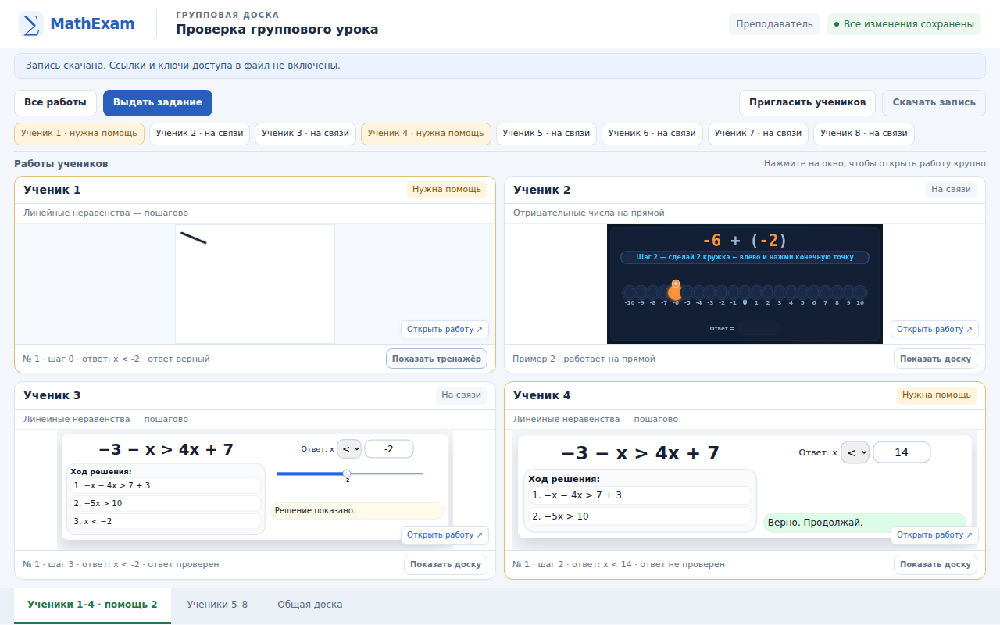
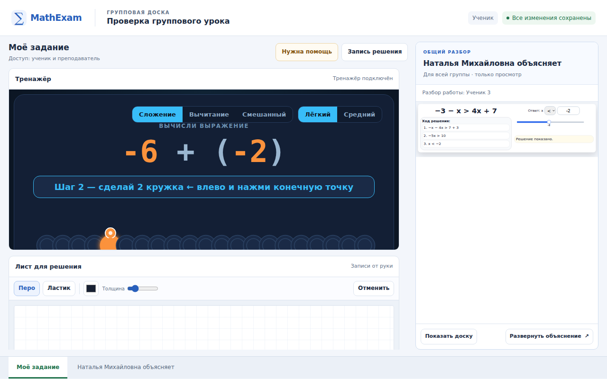

# Групповая доска: пилот для 1–8 учеников

Это руководство к новой странице `/trainers/group-board.html`. Владелец
разрешила публикацию пилота: «внешней проверки не нужно, публикацию разрешаю».
Фактическое слияние и работу опубликованной версии фиксируем в
[PR #183](https://github.com/ladynata-cloud/math-exam-fipi/pull/183); этот документ
сам по себе не подтверждает доступность сервера. Архитектура описана в
[ADR 0009](adr/0009-group-lessons.md) со статусом **Accepted**, требования и проверки — в
[задаче group-board-eight](tasks/group-board-eight.md).



На снимке — условные имена из браузерной проверки.

## Проведение занятия

1. Откройте групповую доску через сайт, введите название занятия и от одного до
   восьми имён, каждое с новой строки. Для реального совместного занятия нужен
   сервер с включённым постоянным хранением групповых уроков.
2. Нажмите «Создать урок». В окне приглашений скопируйте каждому ученику его
   личную ссылку. Кнопка «Сохранить ссылку учителя» копирует Вашу ссылку: сохраните
   её отдельно. Она открывает все работы. Ученическую ссылку передавайте только
   тому ученику, для которого она создана.
3. Выберите «Выдать задание»: всем ученикам, выбранному ученику или на общую
   доску. При выдаче всей группе исходный пример одинаков; дальше каждый
   проходит его самостоятельно. В пилоте доступны «Отрицательные числа на
   прямой» и «Линейные неравенства — пошагово».
4. Следите за четырьмя работами в обзоре. Для группы больше четырёх переключайте
   листы «Ученики 1–4» и «Ученики 5–8». На карточке можно выбрать просмотр
   тренажёра или рукописной доски. Имена и просьбы о помощи также видны в полосе
   учеников. Четыре работы не превращаются в восемь мелких окон.
5. Нажмите «Открыть работу», чтобы рассмотреть её крупно. «К обзору» возвращает
   к карточкам. При обычном просмотре переключение учителя меняет только его
   экран; ученики продолжают работать в своих заданиях. Для показа группе
   включите отдельный режим объяснения, описанный ниже.

**Повторная выдача задания создаёт новую работу:** текущий лист для решения
становится пустым, тренажёр начинает выданное задание. Предыдущие действия
остаются в истории этого рабочего места. Для обычного просмотра ученика заново
выдавать задание не нужно.

## Помощь и общая доска

Простой просмотр не забирает управление тренажёром. Чтобы самому нажимать его
кнопки, используйте «Подключиться к тренажёру». На время такого подключения
управляет преподаватель; после объяснения нажмите «Вернуть управление ученику».
Переход к другой карточке сам по себе управление не возвращает.

На листе для решения преподаватель и ученик могут писать одновременно. Цвет
преподавателя по умолчанию зелёный, цвет ученика — тёмный; цвета можно менять,
авторство сохраняется отдельно. Ластик удаляет собственный штрих целиком, а
«Отменить» убирает свой последний штрих. Чужие записи этими инструментами не
удаляются. Запись штриха отправляется после завершения движения пера; обзор не
является покадровой трансляцией курсора.

Ученик может нажать «Нужна помощь» и затем снять свой запрос. Статус «На связи»
означает недавнюю связь браузера с сервером, а не подтверждённую внимательность.
Номер задания, состояние ответа и этап тренажёра отражают его сохранённое
состояние. Доска не оценивает математическую правильность рукописного решения.

«Общая доска» у преподавателя предназначена для объяснения группе. На ней пишет
и управляет тренажёром преподаватель; ученики смотрят через окно объяснения.
Для общего разбора можно также показать текущую работу выбранного ученика.

## Два окна у ученика: своё задание и объяснение

На большом экране ученик видит **своё задание слева** и окно **«Наталья
Михайловна объясняет» справа**. В правом окне показывается именно та работа,
которую преподаватель сейчас разбирает: общая доска или решение одного из
учеников. Можно переключить просмотр тренажёра/рукописной доски и нажать
«Развернуть объяснение». Собственное задание при этом сохраняется.

На небольшом экране вместо двух тесных окон доступны вкладки «Моё задание» и
«Наталья Михайловна объясняет». Ученик может посмотреть разбор и вернуться к
своему решению с прежним состоянием.



На снимке используются условные ученики из браузерной проверки.

Чтобы начать объяснение:

1. Откройте крупно нужную работу ученика или общую доску.
2. Нажмите **«Объяснять группе»**. Появится индикатор «Группа видит: …», а у
   учеников — текущий тренажёр и записи выбранного рабочего места.
3. Во время активного объяснения переход к другому ученику переключает и
   показ группе. Следите за именем в индикаторе. Чтобы сначала посмотреть
   другую работу лично, завершите объяснение перед переключением.
4. Нажмите **«Завершить объяснение»**, когда разбор закончен. Возврат к обзору
   или открытие истории решения также останавливает показ.

Остальные ученики видят объяснение **только для просмотра**. Они не получают
права писать в чужой работе, открывать остальные личные работы или их историю.
Ученик, чьё решение разбирается, продолжает писать в своём левом окне;
преподаватель может одновременно оставлять свои пометки. Управление кнопками
тренажёра передаётся отдельно через «Подключиться к тренажёру» / «Вернуть
управление ученику»: включение показа само по себе его не забирает.

Показ не заменяет собственные задания учеников общей копией. Простое открытие
преподавателем личной работы вне режима объяснения не делает её видимой группе.
Завершайте объяснение кнопкой: его выбранная работа сохраняется сервером, и
закрытие вкладки преподавателя не является автоматической остановкой показа.

## Запись и сохранение

«Запись решения» открывает историю выбранного рабочего места. Ползунок
показывает последовательность выдачи заданий, действий тренажёра, штрихов,
стираний, запросов помощи и передач управления с временем и автором. Просмотр
записи не меняет текущую работу. «К текущей работе» возвращает в живое занятие;
«Обновить запись» загружает более свежую историю.

«Скачать запись» у преподавателя выгружает JSON всего занятия, общую доску,
историю, а также неотправленные/отклонённые действия из его текущей вкладки.
Ключей доступа в этом файле нет. В нём есть имена и решения учеников, поэтому
передавайте файл осмысленно. Импорт такого JSON обратно в доску пока не
реализован. Это запись действий, **без видео и звука**.

Ориентируйтесь на индикатор сохранения:

| Индикатор | Что означает и что сделать |
| --- | --- |
| «Все изменения сохранены» | Очередь текущей вкладки отправлена и подтверждена сервером; отдельно прочитайте сообщение об отклонённом действии, если оно появилось. |
| «Сохраняю…» | Есть действия, ожидающие подтверждения. Дождитесь завершения перед закрытием вкладки. |
| «Нет связи» | Отправка не подтверждена. Оставьте вкладку открытой; после восстановления связи она повторит отправку. |
| Сообщение об изменившемся задании/конфликте | Старое действие не применено поверх новой работы. Оно сохранено отдельно в очереди отклонённых действий текущей вкладки. |
| Сообщение о заполненном/недоступном хранилище | Новые действия не подтверждены. Сохраните доступную запись и обратитесь к администратору сервера. |

Очередь использует `sessionStorage`, а не бессрочное автономное хранилище.
Закрытие вкладки или очистка данных браузера может лишить Вас ещё неотправленной
работы. Экспорт преподавателя не забирает очереди из браузеров учеников. Не
считайте неподтверждённые действия сохранёнными на сервере.

После входа полный секретный фрагмент убирается из адресной строки; оставшийся
адрес без него не заменяет личную ссылку. Сохраните исходную ссылку. В пилоте
нет аккаунтов, восстановления утерянной учительской ссылки и перевыпуска
скомпрометированных ссылок. При необходимости создайте новое занятие с новыми
ссылками; старые ссылки от этого автоматически не отзываются.

## Сервер и эксплуатация

Групповая доска использует существующий `board-server` и отдельный маршрут
`/api/group-lessons`. Обычная доска остаётся на `/trainers/trainer-board.html`.
Разрешённый выпуск задаёт в Docker
`GROUP_LESSON_STORE_DIR=/data/group-lessons`, а в `amvera.yml` —
`run.persistenceMount: /data`. Это настройки репозитория; фактический том и
резервное копирование на рабочем сервере пока не проверены. До публикации
Amvera возвращала HTTP 503 на `/health` и `/api/group-lessons/status`; доступа
к управлению хостингом у выполняющего агента не было.

`GROUP_LESSON_STORE_DIR` должен явно указывать на приватный постоянный каталог
с правами записи. При пустом или отсутствующем значении статус сообщает
`GROUP_STORAGE_NOT_CONFIGURED`, а групповое занятие создать нельзя. Не
используйте временную файловую систему контейнера как постоянное хранилище.
Docker-образ задаёт эту переменную по умолчанию; при локальном запуске Node
её нужно задать самостоятельно. Базовый локальный запуск:

```bash
cd board-server
npm install
export GROUP_LESSON_STORE_DIR="$GROUP_BOARD_PERSISTENT_DIRECTORY"
npm start
```

В этом примере `GROUP_BOARD_PERSISTENT_DIRECTORY` — заранее заданный оператором
путь к подключённому постоянному каталогу, не значение по умолчанию. Адрес
сервера, `PORT`, `HOST` и разрешённые CORS origins задаются по существующему
[руководству сервера](../board-server/README.md). Публичный адрес сервера в
интерфейсе должен использовать HTTPS; HTTP допускается для localhost.

Перед разрешённым включением проверьте `GET /api/group-lessons/status`:
`available: true`, `durable: true`, `maxStudents: 8` и список двух пилотных
тренажёров. Эти флаги подтверждают открытие каталога процессом, но сами по себе
не доказывают правильность внешнего volume или наличие резервной копии.

Один каталог обслуживает **один процесс**. Файл блокировки не предназначен для
распределённой работы нескольких реплик. Не удаляйте его, пока процесс-владелец
работает. После ошибки записи хранилище групповых уроков закрывается для новых
операций; устраните причину и перезапустите единственный процесс. Повреждённые
данные не исправляйте удалением журналов «для успешного запуска».

Подтверждение действия приходит после записи и `fsync`. При перезапуске уроки
восстанавливаются из JSONL. Действуют пределы: 500 уроков, 64 MiB на урок,
512 MiB на всё хранилище, 100 000 событий на урок, 3 000 текущих штрихов на одно
рабочее место. Они ограничивают пилот, а не гарантируют бессрочное хранение.
Автоматического удаления уроков, архивирования или расширения квоты нет.

Для резервной копии остановите процесс или используйте согласованный снимок
тома; сохраните журнал целиком в приватном месте. Проверьте восстановление в
отдельном каталоге с одним тестовым процессом до эксплуатации. Каталог содержит
ученические токены и хеш учительского токена: не публикуйте его содержимое,
резервные копии, заголовки Authorization или реальные ссылки в логах и issue.
Настраиваемые резервные копии не создаются этим кодом автоматически.

API принимает секреты только в заголовке `Authorization: Bearer`. Частичный
опрос `GET /:id?after=<revision>` возвращает только изменившиеся рабочие места
и текущие статусы. Для режима объяснения отдельное поле `presentation` содержит
только показанное рабочее место; остановка показа очищает его у наблюдателей.
Выбор сохраняется действием `present`, доступным только преподавателю. Это не
открывает наблюдателям приглашения и историю выбранного ученика.
История `GET /:id/history` имеет формат `events-v1`, страницы
до 100 событий и границу `through`. Клиент повторяет ограниченные по частоте
запросы истории. Создание уроков также ограничено по частоте, но не требует
аккаунта учителя; это следует учитывать при решении о публичном включении.

## Проверки и отключение

Backend-тесты запускаются из `board-server`:

```bash
npm test
```

Browser gate запускается из корня репозитория, с установленными зависимостями
сервера и доступным Node-пакетом `playwright`:

```bash
node tools/group-board.browser.cjs
```

По умолчанию используется Chromium, доступный Playwright. Если браузер
предоставлен окружением отдельно, задайте `GROUP_BOARD_CHROMIUM` (или
`BROWSER_EXECUTABLE_PATH`) его исполняемым файлом. Не сохраняйте путь конкретной
машины в исходниках. `GROUP_BOARD_ARTIFACTS` выбирает каталог скриншотов; без
переменной создаётся временный каталог. Gate запускает локальный статический
сервер, отдельный backend и временное хранилище. Он не требует рабочего урока
или настоящих ученических ссылок.

Ожидаемый маркер успешного завершения — `GROUP_BOARD_BROWSER_OK`. Проверяются
восемь изолированных контекстов, независимость работ, управление, рукопись,
запись, повтор запросов и перезапуск. Расширенная проверка добавляет два окна
ученика, начало/переключение/остановку общего разбора и границы доступа к
выбранной работе. Итоговые результаты конкретного head
публикуются в задаче/PR; этот список не является утверждением о прохождении
ещё выполняющегося gate.

Для отключения групповой функции явно переопределите `GROUP_LESSON_STORE_DIR`
пустой строкой и перезапустите сервис. Простое удаление переопределения вернёт
значение `/data/group-lessons` из Docker-образа и не отключит функцию. При
наличии опубликованной ссылки на вход скройте её.
**Журналы и резервные копии сохраните.** Откат кода выполняется отдельно от
данных. Перед повторным включением нужен совместимый backend и проверка
восстановления; новая конфигурация не должна случайно создать пустой каталог
вместо прежнего хранилища.

Расширение на семейства тренажёров и режим наблюдения за неподдерживаемыми
тренажёрами отложены. Этот пилот не обещает запись любого тренажёра сайта.
